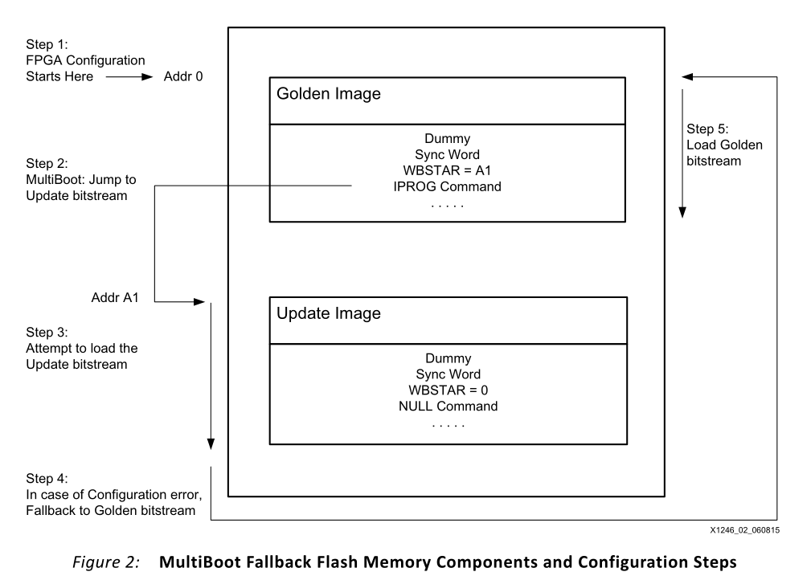

# FPGA Multiboot 配置文档

##  实现框图
MultiBoot功能使FPGA能够有选择地从flash存储器中的指定地址加载位流。一个内部生成的脉冲(IPROG)启动配置逻辑，在Golden bitstream WBSTAR(温启动启动地址)寄存器中指定的地址位置跳转到Update bitstream，并尝试加载Update bitstream。如果在Update bitstream加载期间检测到配置错误，则会触发Fallback以加载Golden bitstream。

- Fallback 或 Golden bitstream：原image
- Update/MultiBoot image:更新的image
- PROG:
- IPROG
- WBSTAR:温启动启动地址

>若更新到Multiboot image过程中错误或中断，需能够可靠的回退到golden image\

### 两种启动方式：

1. PROG嵌入在位流中。IPROG使用NEXT_CONFIG_ADDR位流选项启用。

> 此方法的IPROG是一个自动化选项，把设置嵌入到stream中，不在用户应用中跳转。(应用中不可控)

2. 使用ICAPE2的IPROG(在本应用程序说明中未涉及):将寄存器写命令应用于ICAPE2原语。

>特定在用户应用程序中，基于某种事件触发Multiboot

## 方式一：PROG嵌入在位流中

WBSTAR（warm boot start address） 和 IPROG（internal PROGRAM）嵌入在位流中。

Gold bitStream 存储在闪存地址0。 Update bitStream存储在Gold bitStream中的WBSTAR（next_config_addr）中的flash地址中，<strong style="color :red;">当WBSTAR被设置为除default之外的任何地址值时，IPROG将自动嵌入到位流中。</strong>

运行流程如下：

配置逻辑开始正常地在存储在闪存地址0的黄金位流中执行命令。一旦到达IPROG命令，控件跳转到黄金位流中的WBSTAR寄存器中指定的flash地址位置，配置逻辑尝试加载更新位流。如果配置逻辑由于错误条件而无法加载更新映像，则会发生回退，配置逻辑取出INIT_B和DONE Low，并清除配置内存，并通过加载flash地址0处的金比特流重新启动配置过程。在回退过程中，FPGA会忽略WBSTAR和IPROG命令。更多详细信息，请参考7系列fpga配置用户指南(UG470)中的第7章，重新配置和多引导。

