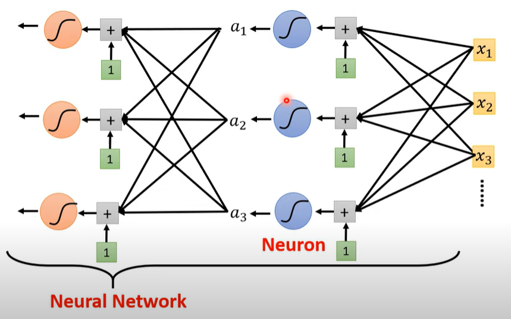
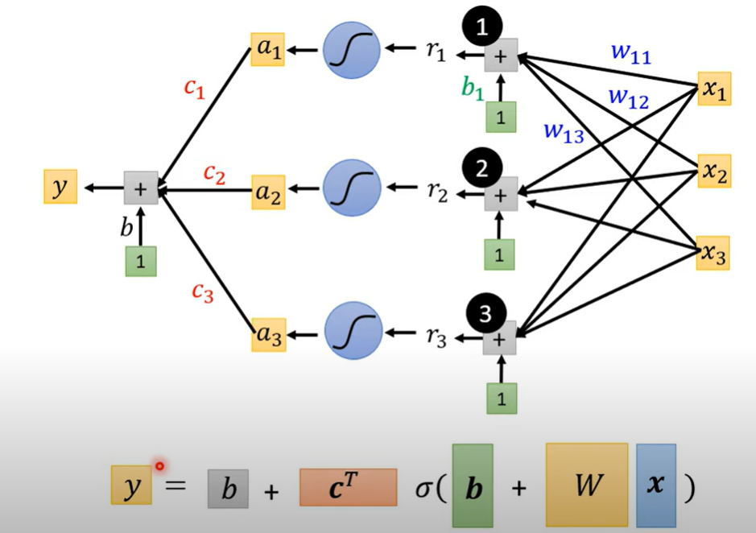

# 1. 深度学习

## 1.1. Sigmoid Function

$$
\begin{aligned}
y=c\frac{1}{1+e^{-(b+wx_1)}}\\
=c·sigmoid(b+wx_1)\\
=c·\sigma(b+wx_1) 
\end{aligned}
$$

>思想：用sigmoid function去逼近合理的模型

<strong style="color: red; opacity: 1;">\
$$\displaystyle y=b+\underset{i}{\sum}c_i·\sigma(b_i+\underset{j}{\sum}w_{ij}x_j)$$</strong>\
将两个$\sum$展开（假设$i,j=1,2,3$）：
$$
r_1 = b_1 +w_{11}x_1+w_{12}x_2+w_{13}x_3\\
r_2=b_2+w_{21}x_1+w_{22}x_2+w_{23}x_3\\
r_3 = b_3 +w_{31}x_1+w_{32}x_2+w_{33}x_3
$$

向量形式：
$$
\left[\begin{matrix}
r_1\\r_2\\r_3
\end{matrix}\right] =
\left[\begin{matrix}
b_1\\b_2\\b_3
\end{matrix}\right] +
\left[\begin{matrix}
w_{11}&w_{12}&w_{13}\\w_{21}&w_{22}&w_{23}\\w_{31}&w_{32}&w_{33}
\end{matrix}\right]
\left[\begin{matrix}
x_1\\x_2\\x_3
\end{matrix}\right]
$$
简写为：
$$
R=B+Wx
$$
sigmoid模型：

<strong style="color:red">
$$
y=b+C^T\sigma(B+Wx)\\
(b,C^T,B,W)\rightarrow\theta\\
y=f(\theta,x)
$$\
</strong>

## 1.2. LOSS

1. 设定一组$\theta(b,C^T,B,W)$
2. 用模型计算出预测值$y$
3. $L(\theta)=Loss(y,\overline{y})$

## Optimization
$$
\theta = \left[\begin{matrix}
\theta_1\\ \theta_2 \\ \theta3 \\ ...
\end{matrix}
\right]$$
目的：
$$
\theta^* = arg \underset{\theta}{min}L
$$
步骤：
1. 选择初始$\theta^0$(随机)
2. 计算梯度
$$
\begin{aligned}
\underset{gradient}{g}=\left[\begin{matrix}\frac{\partial L}{\partial \theta_1}|_{\theta=\theta_0}\\\frac{\partial L}{\partial \theta_1}|_{\theta=\theta_1}\\...
\end{matrix}\right]\\
G=\triangledown L(\Theta^0)
\end{aligned}
$$
3. 更新$\theta$
$$
\left[\begin{matrix}
\theta_1^1\\\theta_2^1\\...
\end{matrix}\right] = 
\left[\begin{matrix}
\theta_1^0\\\theta_2^0\\...
\end{matrix}\right] -
\left[\begin{matrix}
\eta \frac{\partial L}{\partial \theta_1}|_{\theta=\theta^0} \\\eta \frac{\partial L}{\partial \theta_2}|_{\theta=\theta^0} \\...
\end{matrix}\right]\\
\Theta^1=\Theta^0-\eta G
$$
>通常使用多个样本进行参数更新
1 epoch = 遍历一遍样本

## RELU
$$
\displaystyle y=b+\underset{i}{\sum}c_i·max(0,b_i+\underset{j}{\sum}w_{ij}x_j)
$$