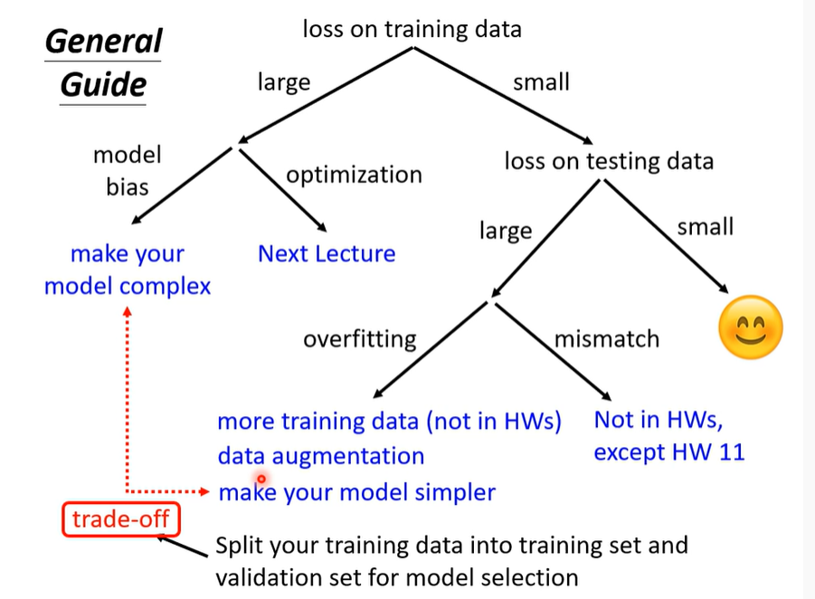
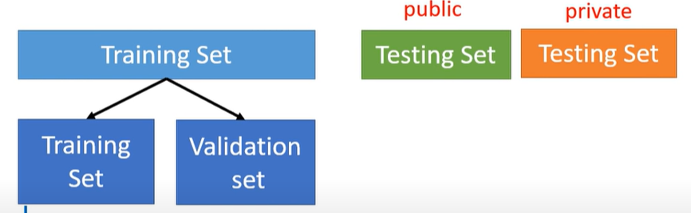
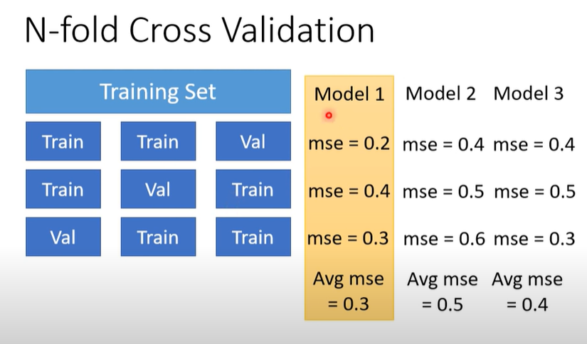

# Framework of ML
Training data:$\{(x^1,\overline{y}^1),(x^2,\overline{y}^2),...,(x^N,\overline{y}^N)\}$
Training:

1. $y=f_\theta(x)$
2. $L(\theta)$
3. $\theta^*=arg\underset{\theta}{min} L$

Testing data:$\{x^{N+1},x^{N+2},...x^{N+M}\}$
## 调整模型方法

1. 检查training data的loss
   1. LOSS过大：
      1. 考虑<strong style="color :red;">model 太简单（model bias）</strong>
        >1. 增加输入features
        >2. 增加 layers 和neurons
      2. optimization:找到了<strong style="color :red;">局部最小点</strong>\
        >1.  通过更改模型来对比loss
        >2.  首先使用浅层网络来计算loss
        >3.  使用深层网络来计算loss，若loss变大，则是optimization的问题。
        >4.  更换optimization方法
   2. training data 的 LOSS减小了，检查testing data的loss  
      1. Testing data的loss大，training data的loss小——<strong style="color :red;">overfitting</strong>
        >1. 增加训练资料
        >2. Data augmentation：图像左右翻转
        >3. 限制model,减少参数，共用参数
        >4. 减少features
        >5. Early stopping
        >6. Regularization
        >7. Dropout
     2. MISMATCH：偶然性
## Testing-Loss、Training-Loss和模型复杂度的关系

### 选择模型方法：

将训练集分成两部分一部分来训练，另一部分来进行模拟测试。

>1. 把训练集分成N等份，并将其中一份作为验证集,遍历,分成N种情况
>2. 把几个模型在N种情况中分别跑，并求平均LOSS
>3. 选择LOSS最小的那种模型