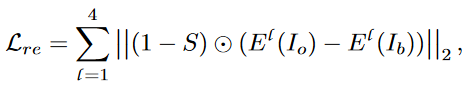

# Camouflaged Object Detection(COD)

> 伪装目标检测（COD），也称为去伪装，旨在从给定场景中发现隐藏的目标。

## 数据集

- CHAMELEON

- CAMO

- COD10K

- [x] [Camouflaged Object Detection](https://openaccess.thecvf.com/content_CVPR_2020/html/Fan_Camouflaged_Object_Detection_CVPR_2020_paper.html)[:page_facing_up:](C:\Users\smart-dsp\Zotero\storage\23SFUQ9L\Fan 等。 - 2020 - Camouflaged Object Detection.pdf)

  > CVPR 2020
  >
  > SINet

  

  - Search Module (SM)

    - 特征分层：

      - 低级特征：$X_0,X_1$
      - 中级特征：$X_2$
      - 高级特征：$X_3,X_4$

    - RF(receptive filed)

      > 用于强化中心区域的感受野

      

    - search attention (SA)

      使用注意力机制来减少不相关特征的干扰，使用SA对$X_2$进行增强，和低级特征重建再抽取后的$C_s$进行max运算得到$C_h$

      

      $g(\cdot)$为SA，实际为$\sigma=32,kernel\ size=4$的高斯核

      

  - Identification Module (IM)

    - partial decoder component (PDC)

      

      

      架构

      

      PDC通过将低级特征和高级特征分别重建，LOSS：

      

      

- [ ] [Concealed Object Detection](https://ieeexplore.ieee.org/document/9444794)[:page_facing_up:](C:\Users\smart-dsp\Zotero\storage\3BG3RLNZ\Fan 等。 - 2021 - Concealed Object Detection.pdf)

  > TPAMI 2021
  >
  > SINet v2

  

- [ ] Concealing-coloration in the Animal Kingdom: An Exposition of the Laws of Disguise Through Color and Pattern: Being a Summary of Abbott H. Thayer’s Discoveries.

- [ ] Adaptive coloratcottion in animals

- [ ] Mutual graph learning for camouflaged object detection

- [ ] Simultaneously localize, segment and rank the camouflaged objects

- [ ] Camouflaged object segmentation with distraction mining

- [ ] [Uncertainty-Guided Transformer Reasoning for Camouflaged Object Detection](https://openaccess.thecvf.com/content/ICCV2021/html/Yang_Uncertainty-Guided_Transformer_Reasoning_for_Camouflaged_Object_Detection_ICCV_2021_paper.html)[:page_facing_up:](C:\Users\smart-dsp\Zotero\storage\QC7V85ZP\Yang 等。 - 2021 - Uncertainty-Guided Transformer Reasoning for Camou.pdf)

  > ICCV 2021
  >
  > 贝叶斯推断、transformer

  

- Uncertainty Quantification Network

  

# 通用图像分割 GOS

- [x] [Panoptic segmentation](https://openaccess.thecvf.com/content_CVPR_2019/html/Kirillov_Panoptic_Segmentation_CVPR_2019_paper.html)[:page_facing_up:](C:\Users\smart-dsp\Zotero\storage\ZIPWRGR6\Kirillov 等。 - 2019 - Panoptic Segmentation.pdf)

  > CVPR 2019
  >
  > 提出全景分割 PS

  - 语义分割

    将每个像素点分配一个类标签

  - 实例分割

    检测每个对象并分别用边界框或分割对其进行描绘

  - 全景分割

    图像的每个像素必须分配一个语义标签和一个实例id

  - panoptic quality

    

    

    - TP：匹配的片段对；FP：未匹配的预测片段；FN：未匹配的地面真值

    - IoU：为置信度。比值为预测对的比上 GT和预测的与

      

    - 左侧为语义分割指标，对TP做了归一化；右侧为实例分割的置信度

- [ ] [Textonboost: Joint appearance, shape and context modeling for multi-class object recognition and segmentation](https://link.springer.com/content/pdf/10.1007%2F11744023_1.pdf)[:page_facing_up:](C:\Users\smart-dsp\Zotero\storage\5JGH35UL\Shotton 等。 - 2006 - TextonBoost Joint Appearance, Shape and Context M.pdf)

  > ECCV 2006

  - 任务Loss

    

    - $c$为像素的标签

    - 将输出的概率分为四部分

    - Shape-texture potentials

      

    - Edge potentials

      

      用$g_{ij}$来度量相邻像素之间的颜色差异

      

      $\beta=(2<\|x_i-x_j\|^2>)^{-1}$,$x_i,x_j$为两个位置的颜色，$<\cdot>$为平均处理

    - Color potentials

      可以更精确的捕获图像的外观

      

      k是随机变量，表示像素被赋值的分量

      

    - Location potentials

      

- [ ] [Sift flow: Dense correspondence across scenes and its applications](https://ieeexplore.ieee.org/stampPDF/getPDF.jsp?tp=&arnumber=5551153&ref=aHR0cHM6Ly9pZWVleHBsb3JlLmllZWUub3JnL2Fic3RyYWN0L2RvY3VtZW50LzU1NTExNTM=)[:page_facing_up:](C:\Users\smart-dsp\Zotero\storage\2IB2ZRCH\Liu 等。 - 2011 - SIFT Flow Dense Correspondence across Scenes and .pdf)

- [ ] [The PASCAL visual object classes challenge: A retrospective]

# 显著目标检测 SOD

- [ ] A model of saliency-based visual attention for rapid scene analysis

- [ ] Global contrast based salient region detection

- [ ] Highly efficient salient object detection with 100k parameters

- [ ] Deeply supervised salient object detection with short connections

- [ ] Salient objects in clutter

- [ ] Salient object detection: A benchmark

- [ ] Salient object detection in the deep learning era: An in-depth survey

- [ ] [Salient object detection: A survey](https://doi.org/10.1007/s41095-019-0149-9)[:page_facing_up:](C:\Users\smart-dsp\Zotero\storage\G76UGTWR\Borji 等。 - 2019 - Salient object detection A survey.pdf)

  - Block-based models with intrinsic cues

    显著目标检测被广泛定义为捕捉场景中的唯一性、独特性或稀有性。

    - 唯一性被定义为pixel-wise center–surround contrast 像素级 中心-环绕对比度

    ### frequency-tuned 去计算全分辨率的显著性map

    

    - $I_μ$为全局像素的平均值（RGB/LAB）
    - $I_ω{_{hc}}$为输入的高斯模糊版本（使用5*5的核）

    改进1：

    ​	使用金字塔模型，进行多尺度计算

    

    ​	$N(x)$为以x为中心的邻域

    - 缺点：

      1. 高对比度的边缘比显著对象更突出
      2. 突出对象的边界保持不好（使用大块时）

      

      

  - Region-based models with intrinsic cues

    基于区域的模型通常先将输入图像分割成与灰度边缘对齐的区域，然后计算出区域显著性图。

    显著性(Saliency)被定义为全局区域对比的唯一性(uniqueness)，

    ### A region-based saliency algorithm

    一种基于区域的显著性算法，通过测量目标区域与所有图像区域的全局对比度。

    将一副图像分割为N个区域$\{r_i\}^N_{i=1}$,区域$r_i$的显著性为

    

    - $D_r(r_i,r_j)$为两个区域间的外观对比，两个区域对比度越大，值越大
      - 如果$D_r$定义为欧式颜色距离，则可以用高效率的滤波来完成计算
      - 还需要考虑纹理、结构等
    - $w_{ij}$为连接区域$r_i,r_j$的权重，包含了空间距离和区域大小

    改进：

    - 将区域唯一性和斑块特殊性结合
    - 用直方图量化和GMM生成一组大规模的感知均匀区域，而不是为每个像素保持一个硬区域索引。
      - Efficient salient region detection with soft image abstraction
    - 多尺度
    - 构建超图（由超像素的非参数多尺度聚类构造，以捕捉区域的内部一致性和外部分离），显着目标检测被转换为在超图中寻找显着顶点和超边。
      - SLIC算法[29]、Turbopixel算法[82]
    - 突出对象的唯一性也可以定义为输入图像以低秩矩阵表示的某个特征空间中的稀疏噪声
      - 基本假设是，非显著区域(即背景)可以用低秩矩阵来解释，而显著区域用稀疏噪声来表示。
      - A unified approach to salient object detection via low rank matrix recovery.
      - Segmentation driven low-rank matrix recovery for saliency detection
      - Salient object detection via low-rank and structured sparse matrix decomposition
      - 将传统的低秩特征与更高层次的引导相结合，如中心先验、人脸先验和颜色先验，基于学习后的特征变换检测显著目标

    - 引入树结构稀疏诱导范数正则化对图像结构进行分层描述，以统一突出整个显著对象。Ref. [103],
    - 空间分布先验[25]意味着一种颜色在图像中分布得越广，显著性对象中包含该颜色的可能性就越小。
    - 中心先验假设在图像中心附近更容易发现显著物体，且背景倾向于远离图像中心。
    - 背景先验假设背景区域由图像的窄边构成，即伪背景。区域显著性可以计算为区域与“背景”的对比。
      - 在文献[98]中，显著性计算是根据伪背景的密集重构误差和稀疏重构误差来表述的。
        - 密集重构误差由背景模板的主成分分析(PCA)计算
        - 稀疏重构误差定义为背景模板稀疏表示后的残留
    - [99]利用吸收马尔可夫链进行显著性检测，其中瞬态和吸收节点分别为图像中心和边缘周围的超像素。
      - 每个超像素的显著性计算为瞬态节点与马尔可夫链吸收节点之间的吸收时间。
    - [92]提出了一种计算框架，将对象性和区域显著性融合到图形模型中。这两个项是通过迭代最小化一个能量函数来联合估计的，该函数编码了它们之间的相互作用。
    - [100]中，区域的对象度定义为区域内像素的对象度值的平均值;
    - 根据物体的先验性，将每个区域与“软”前景和背景进行比较，计算出每个区域的显著性。
    - (84、105)边界连通性先验。突出的物体与图像边界的联系要比背景中的物体少得多。因此，可以根据区域沿图像边界的长度与该区域跨越区域的长度之比来估算区域的边界连通性得分
    - Focus 先验
      - [100]通过焦距模糊度计算出焦距评分。将离焦建模为清晰图像与点扩散函数的卷积，用高斯核逼近，通过尺度空间分析可以将像素级的焦度估计为高斯核的标准差。区域焦点得分是通过在边界和内部边缘像素上传播焦点得分和/或清晰度来计算的。显著性得分最终由唯一性(全局对比)、客观度和焦点得分的非线性组合得到。
    - [96,108]贝叶斯框架。表示为在给定输入图像i的情况下，估计像素x为前景的后验概率。
    - [104]使用一种基于优化的框架来检测显著目标。

  - Models with extrinsic cues

# [Location-Free Camouflage Generation Network](http://arxiv.org/abs/2203.09845)[:page_facing_up:](C:\Users\smart-dsp\Zotero\storage\HU2X5S4R\Li 等。 - 2022 - Location-Free Camouflage Generation Network.pdf)

## 编解码器模块

- $M_d$ 代表下采样后的M
- Cat 表示通道维度上的连接操作。

- $F_{fb}$经过解码器（唯一训练的模块）获得图像$I_o$(原始图像大小)

- 将生成的图像扣出来和原始图像对齐叠加

## PSF（结构对齐）

由于$I_f$和$I_b$的相对位置已经确定，因此需要进行点位对比。前景和背景结构越相似，保留更多的前景特征用于识别，否则，保留更多的背景特征以保护背景结构不被破坏。

结构相似矩阵A：

- $f,g$是1×1可学习的卷积层
- $\bar{F}$是方差归一化的F
- 该操作可以去除Ff和Fb中的外观特征，只保留待比较的结构特征。(带探讨)
- Cos：通道方向的余弦距离相似性，通过它我们可以测量每个点对的结构相似性。
- Norm 缩放结果到[0,1]

- A 越大结构相似度越大，保留更多的前景特征。
- A作为前景系数矩阵，1-A作为背景系数矩阵
- e,h为可学习的1×1卷积层
- LAda 为局部AdaIN，引入Ff中每个点的背景对应位置的局部均值和方差作为外观特征。

- i 位置
- μ表示均值，σ表示方差。
- $F_i^{\omega \times \omega}$ 以 $F_i$ 为中心 大小为$\omega \times \omega$的窗口 ，$\omega=7$（默认）
- 将前景划分为小块，求出小块的方差，均值，加到对应的后景中，实现后景和前景融合。

## 总Loss

- 总loss由四项组成

### Immerse Loss

计算前景注意力

- k 通道索引
- $F^{-1}$为傅里叶逆变换
- L为对$f_k$傅里叶后的实部，P为虚部
- i为虚数单位
- S矩阵代表每个点对于识别的贡献（:question:）,值越大，信息量越大，越需要保留
- hn是大小为n×n的局部平均滤波器

loss

- 融合后，尽可能保留前景更重要的特征和结构
- $M_{d_i}\or M_{d_j}$表示，对比的两个点至少有一个在mask内，便需要考虑
- $S_i+S_j$ 则衡量前景中，信息的重要性。i，j两个点都重要则比重加大，都不重要则比重减小
- $\|(\bar F_{o_i}-\bar F_{o_j})-(\bar F_{f_i}-\bar F_{f_j})\|_2$则是归一化特征后，对应两点的对比度差异，在融合后目标上，和原前景上需相近

### Remove Loss

- 使前景中非关键的信息和背景一致
- $E^l$表示VGG编码器的第l层，文中只用到了VGG中前4层
- $(1-S)$为前景中非关键的结构信息
- 第二部分为 各层级特征中应保持一致

### Background Patch Appearance Loss

- 在$I_o,Ib$每个像素为中心的$\omega\times \omega$区域上，使生成图和背景图的均值，方差相似
- 并在每一层中计算

### Total  Variational Loss

- 使输出的图像平滑，限制突变

