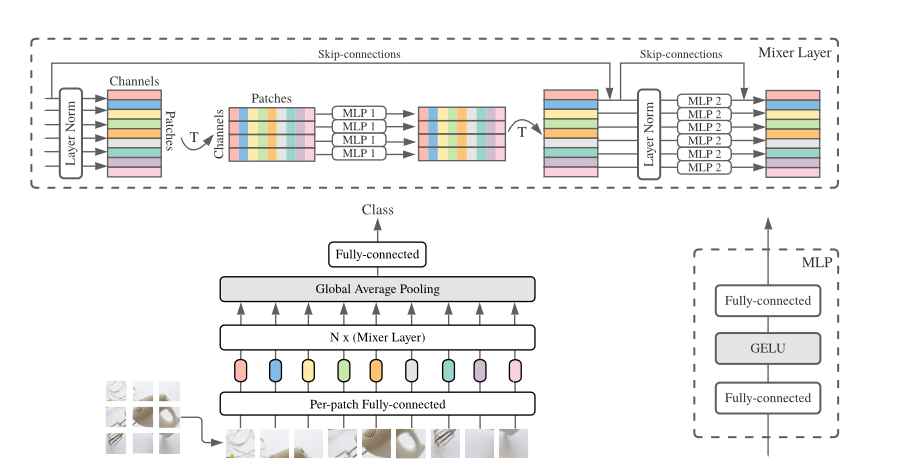
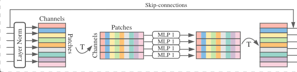
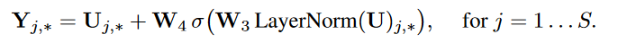
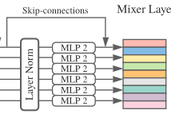
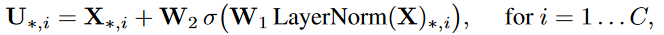
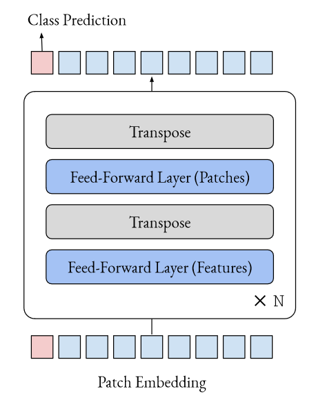

- [x] [MLP-Mixer: An all-MLP Architecture for Vision](https://proceedings.neurips.cc/paper/2021/hash/cba0a4ee5ccd02fda0fe3f9a3e7b89fe-Abstract.html)[:page_facing_up:](C:\Users\smart-dsp\Zotero\storage\82BJR64K\Tolstikhin 等。 - 2021 - MLP-Mixer An all-MLP Architecture for Vision.pdf)

  > NIPS 2021
  >
  > GOOGLE

  - Method

    - 架构

      

      - 通道混合（上图右边）
      - token混合（上图左边）

    - 输入处理

      1. 将图片(size=(H,W)),按照分辨率（P，P）分成$S=HW/P^2$个patches。
      2. 将patches投影到C个通道，作为输入$X\in R^{S\times C}$

    - 由多个相同的Mixer layer构成，每个层有两个MLP块，复杂度关于像素点是线性的

      1. token-mixing MLP：

         

         

         $\sigma$为GELU

         参数在所有列（token）共享

      2. channel-mixing MLP：

         

         

         $\sigma$为GELU

         参数在所有行（channel）共享

      

  - [x] [Do You Even Need Attention? A Stack of Feed-Forward Layers Does Surprisingly Well on ImageNet](https://arxiv.org/abs/2105.02723v1)[:page_facing_up:](C:\Users\smart-dsp\Zotero\storage\L5AL3YA4\Melas-Kyriazi - 2021 - Do You Even Need Attention A Stack of Feed-Forwar.pdf)

    > 2021
    >
    > Oxford
    >
    > 将attention 换为前馈神经网络

- 架构

  

- [ ] [Beyond Self-attention: External Attention using Two Linear Layers for Visual Tasks](https://arxiv.org/abs/2105.02358v2)[:page_facing_up:](C:\Users\smart-dsp\Zotero\storage\98BQSAVP\Guo 等。 - 2021 - Beyond Self-attention External Attention using Tw.pdf)

  > External Attention