# Open-Set Recognition

- A challenge faced by a potential solution to the OSR is estimating the correct probability of all known classes and maintaining the performance on them, along with a simultaneous precise prediction of unknown classes and optimizing the model for them.

  保持已知类分类性能，并精确预测未知类，并优化模型。

- 模型不仅必须能够区分训练类，还必须表明图像是否来自它尚未遇到的类

- OSR的关键是同时降低已知已知数据的经验分类风险和潜在未知数据的开放空间风险，其中开放空间风险是对任何已知类别[2]将开放空间标记为“正”的风险。

  

## 传统分类器问题

- 传统的决策边界，在已知类上，训练传统的最近类均值（NCM）分类器，当输入新类别时，就会发生错误。（a）
- 由于样本的类集合不可能被完全训练到，决策边界没有限制，所以决策边界会衍生到开放空间中，将封闭训练集中的类标签分配到一个无限的区域，未知类出现在较远处时，分类可能发生问题。（b）

- OSR对已知数据进行分类，并将决策边界做了限制。（c）

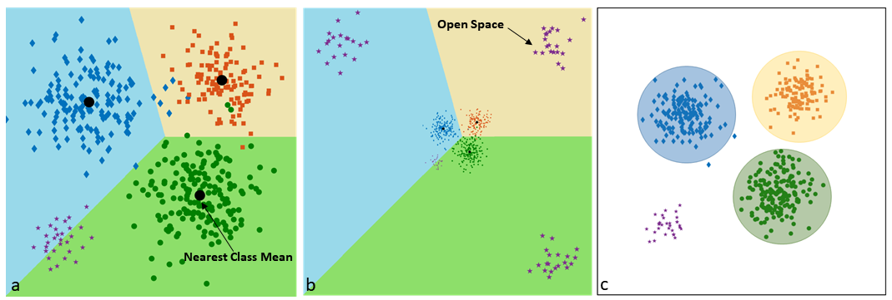

## 改进

### reject option

- 低于 rejection threshold，不分类。

- 设定阈值（rejection threshold）
  - 使用投票列表的排名中获得两个最高决策分数的比率来估计rejection threshold （结合了hashing function和分类方法）
  - 利用测试集到其类内和类间k近邻的距离，提取可信度值的分布

​	*设定阈值，对于同一类别不同域的数据，极其容易误判，阈值的取定非常重要*

## 异常检测（Anomaly detection）

- These techniques with a very long history in machine learning can model normal data, then find a distance from the class mean for each sample and place an optimal threshold for discovering abnormalities.

  对正常数据进行建模，找到每个样本和类平均值的距离，并于距离阈值进行对比

  - 可以对开放空间进行限制

### 李宏毅

- 计算输出的entropy，进行判断

## OSR 统计方法

### First formalization of OSR

- balancing open space risk $$R_O$$ and minimizing empirical(经验的) risk $$R_{\epsilon}$$

$$
R_O(f)=\frac{\int_O{f_k(x)dx}}{\int_{S_k}{f_{k}(x)dx}}
$$

- $O$ positively labeled open space 

- $S_k$ : known positive training samples space

  

## OSR 深度网络方法

- thresholding softmax
- background-class-based modeling, using a garbage or background class
- [x] [Abhijit Bendale and Terrance E Boult. Towards open set deep networks. In CVPR, pages 1563–1572, 2016.](https://www.cv-foundation.org/openaccess/content_cvpr_2016/html/Bendale_Towards_Open_Set_CVPR_2016_paper.html)[:page_facing_up:](C:\Users\smart-dsp\Zotero\storage\VFH6WFGT\Bendale 和 Boult - 2016 - Towards Open Set Deep Networks.pdf)

> Openmax
>
> cvpr 2016

- 使用倒数第二层（softmax前面的完全连接层）的分数来估计输入和已知训练数据的“远近”，称为激活向量（AV）

1. 计算每个训练样本X对应N个类别的激活向量（特征向量）（Activation Vector, AV）

2. 计算所有正确的样本，对应的激活向量的均值（MAV）

3. （EVT极值理论）选出训练样本中与MAV差别最大的几个极端例子，进行weibull分布拟合（可以拟合得出样本的AV和MAV的距离极值分布，根据极值分布来确定阈值）

4. 估计每一类weibull分布的参数，

5. 根据x的特征向量和MAV的差来rejection 

   *缺陷：1. 没有对未知做出进一步的表示  2.输入没有通过损失函数投影到MAV周围 3.距离函数的表示方式可能存在问题*

   - openmax相当于在网络输出乘了一个权重，然后做softmax

   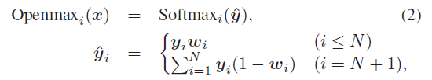

- EVT model(极值模型)

极值理论(EVT): n个独立同分布,累积分布函数为F(x)的随机变量的极值（这里以最小值为例)服从以下的分布：

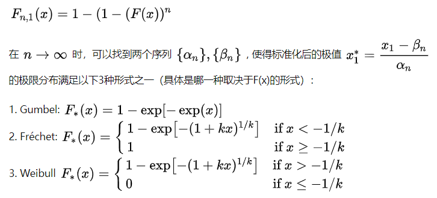

- [x] [Mehadi Hassen and Philip K Chan. Learning a neural-network based representation for open set recognition. arXiv preprint arXiv:1802.04365, 2018.](https://epubs.siam.org/doi/abs/10.1137/1.9781611976236.18)[:page_facing_up:](C:\Users\smart-dsp\Zotero\storage\F97MLYUB\Hassen 和 Chan - 2020 - Learning a Neural-network-based Representation for.pdf)

  > February 7, 2020

- 将同一类的实例更接近，让不同类的实例更远离。 
- [ ] fisher discriminant
  - 同类距离：方差（L2）
  - 类间距离：L2距离最小的两个中心向量的距离
- 在layer Z 特征空间 添加第二个Loss 完成上述目标

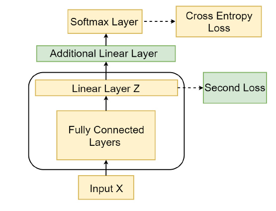

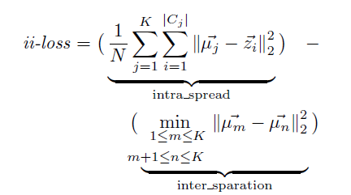

- 离群值：衡量开集样本的指标，样本特征和各类中心特征均值的距离最小值

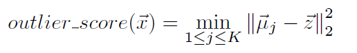

- 阈值选取：假设训练集中由污染的样本，阈值估计选取为 所有样本到对应类的距离的百分位（全局排序），如99%。 则取所有样本中到对应类的距离的前99%的距离，大于剩余1%的距离被认为为未知类

  *全局排序所得的阈值比在各对应类中排序所得的效果好*

- 判断流程

  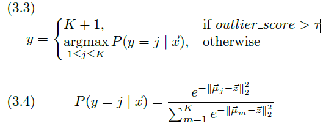

- 判断指标
  - TPR: true positive rate
  - FPR: flase positive rate
  - AUC

### OSR with GANs 

> GAN网络 由发生器（generator）（生成合成样本）和鉴别器（discriminator）（学习确定样本是从生成器还是从真实数据获得的）组成

- [ ] [Open set learning with counterfactual images](https://openaccess.thecvf.com/content_ECCV_2018/html/Lawrence_Neal_Open_Set_Learning_ECCV_2018_paper.html)[:page_facing_up:](C:\Users\smart-dsp\Zotero\storage\LTFUH2CP\Neal 等。 - 2018 - Open Set Learning with Counterfactual Images.pdf)

  > ECCV 2018 反事实图像

- 生成的图像与训练集中的图像相似，但不属于任何已知的类，并使用生成的图像来训练一个开放集分类器

- [ ] [Opengan: Open-set recognition via open data generation](https://arxiv.org/abs/2104.02939v3)[:page_facing_up:](C:\Users\smart-dsp\Zotero\storage\F7AHHIKC\Kong 和 Ramanan - 2021 - OpenGAN Open-Set Recognition via Open Data Genera.pdf)

  > ICCV 2021

- 通过使用对敌训练的鉴别器从开放集图像中描绘封闭图像，利用真实的开放集图像进行模型选择，实现了强大的OSR性能。

- 

:wavy_dash::wavy_dash::wavy_dash::wavy_dash::wavy_dash::wavy_dash::wavy_dash::wavy_dash::wavy_dash::wavy_dash::wavy_dash::wavy_dash::wavy_dash::wavy_dash::wavy_dash::wavy_dash::wavy_dash::wavy_dash::wavy_dash::wavy_dash::wavy_dash::wavy_dash::wavy_dash::wavy_dash::wavy_dash::wavy_dash::wavy_dash::wavy_dash::wavy_dash::wavy_dash::wavy_dash::wavy_dash::wavy_dash::wavy_dash::wavy_dash::wavy_dash::wavy_dash::wavy_dash::wavy_dash::wavy_dash:

- [ ] Sridhama Prakhya, Vinodini Venkataram, and Jugal Kalita. Openset deep learning for text classification. Machine Learning in Computer Vision and Natural Language Processing; ACM: New York, NY, USA, pages 1–6, 2017.

  - 将openMax里的MAV扩展为的K个中心点

  - 计算输入特征和k个中心点的距离，求平均，建立Weibull模型。

  - 1减去所有规定的闭集所占的概率和，则为开集概率

  - 比较总开集概率和最大闭集值，得出是否为开集数据

    

- [x] [Ryota Yoshihashi, Wen Shao, Rei Kawakami, Shaodi You, Makoto Iida, and Takeshi Naemura. Classification-reconstruction learning for open-set recognition. In Proceedings of the IEEE Conference on Computer Vision and Pattern Recognition, pages 4016–4025](https://openaccess.thecvf.com/content_CVPR_2019/html/Yoshihashi_Classification-Reconstruction_Learning_for_Open-Set_Recognition_CVPR_2019_paper.html)[:page_facing_up:](C:\Users\smart-dsp\Zotero\storage\PSG34EH9\Yoshihashi 等。 - 2019 - Classification-Reconstruction Learning for Open-Se.pdf)

  > 2019

  - 引入无监督学习的 分类重构模式
  - 网络由一个基本分类器和一个未知检测器（重构器）组成

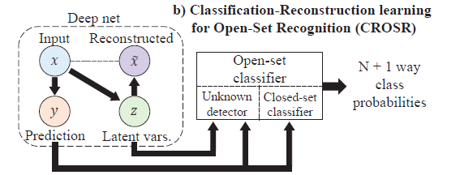

- 分层重建块和训练网络的神经网络结构
- 用于输入样本的联合分类和重建。

- x经过网络的输出分为两部分，1.prediction的分类 2.映射到特征空间中，后续进行重建

  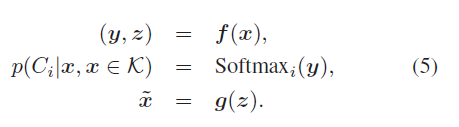

- 类归属度：每个类由 *激活向量* 和重建的 *特征向量* 的联合分布构成完整的特征表示

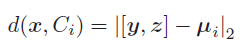

- DHRNets
  - 从网络的每一层中提取latent representations $z$，可以更多的保留低层次的特征信息（消失在推理链中的信息），可以理解为多level的x信息
  - 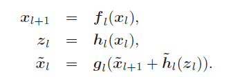
    - $\widetilde{x_l}$ 表示的是重构而来的特征，最上层由$z$ 升维而来，后续为上层重构和$z$升维向量 融合所得
    - $h_l$ 表示对$x_l$的非线性降维操作，由relu和convolution layers组成，获得compact representations（紧凑表征）z
    - $\widetilde{h_l}$ 指的是对$z_l$的升维操作，获得与$x_l$ 相同的维度
    - $g_l$是拼接操作（特征融合）
  - 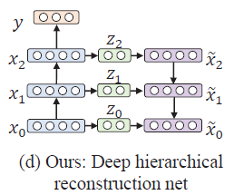
- 训练
  - 训练时对分类误差和重构误差做梯度下降
  - 在网络确定后，计算未知检测的weibull分布

- 推理
  - 与openmax差不多

- [x] [Deep CNN-based Multi-task Learning for Open-Set Recognition](http://arxiv.org/abs/1903.03161)[:page_facing_up:](C:\Users\smart-dsp\Zotero\storage\WTQQX2BV\Oza 和 Patel - 2019 - Deep CNN-based Multi-task Learning for Open-Set Re.pdf)

  >  2019

  - 特征提取网络 CNN；
  - classifier FCN 
  - decoder CNN 与FCN 共享特征

  - 训练后 使用EVT对 ***重构误差*** 进行建模，用来reject 的指标
  - 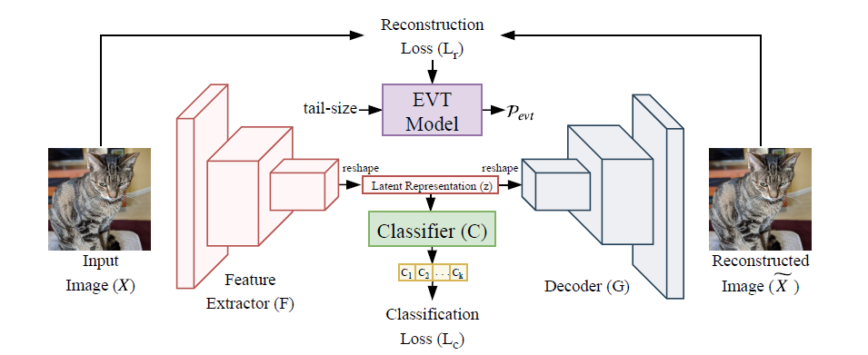
  - 重构误差

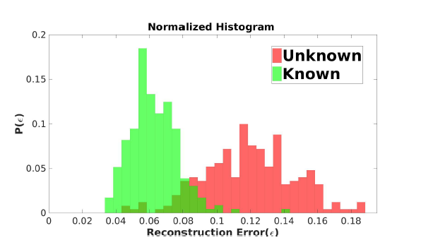

- [x] [Poojan Oza and Vishal M Patel. C2ae: Class conditioned autoencoder for open-set recognition. ](https://openaccess.thecvf.com/content_CVPR_2019/html/Oza_C2AE_Class_Conditioned_Auto-Encoder_for_Open-Set_Recognition_CVPR_2019_paper.html)[:page_facing_up:](C:\Users\smart-dsp\Zotero\storage\QEDJNKU6\Oza 和 Patel - 2019 - C2AE Class Conditioned Auto-Encoder for Open-Set .pdf)

>    cvpr 2019

- 一种使用类条件autoencoder的网络

- 第一部分，使用常规的闭集分类来学习，训练编解码器

- 第二部分，使用解码器获得的重构误差，使用ETV进行建模，并获得rejection threshold

- 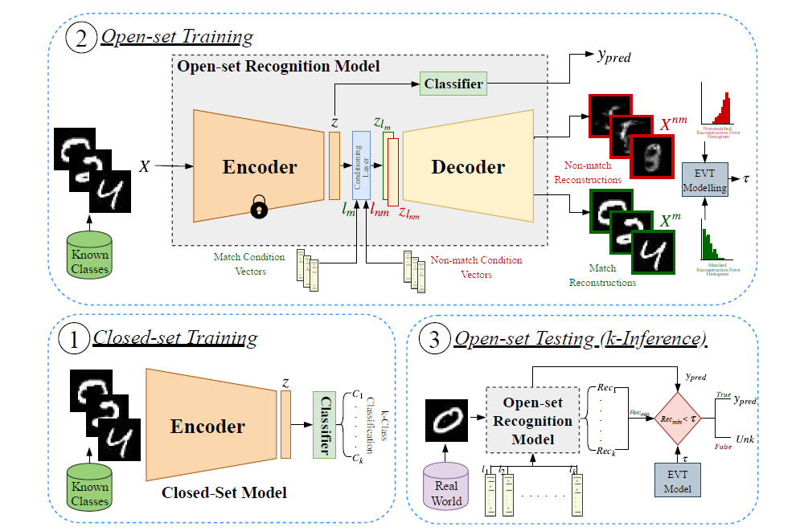

  - 第一步 在close-set上训练encoder和classifier网络权重，使用传统分类网络

    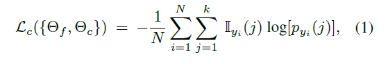

  - 第二部 openset训练，冻结encoder和classifier的网络权重

    - 前向过程

      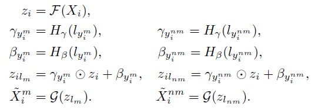

      $l_{y_i^m}$为标签条件向量

      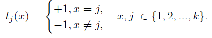

      $H_\gamma,H_\beta$为两个神经网络，用来学习条件$\gamma,\beta$，Film层为对$z$的一个仿射变换，$G$为重构器

    - Loss

      

      

      其中$L_r^m$是匹配的标签和样本来训练，重构误差应该尽可能小，$L_r^{nm}$的$X^{nm}$也从样本中采样得到，但是标签错误，使得生成器的输出与标签对应的原图像差异较大，从而模拟openset的情况。
    
    - EVT极值模型 GPD
    
    - 设定阈值
    
      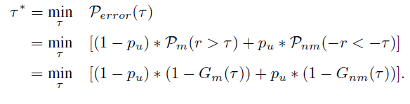
    
      $P_u$为观测信号的先验概率，离群的概率为$P_{error}$与阈值$\tau$相关

- 算法

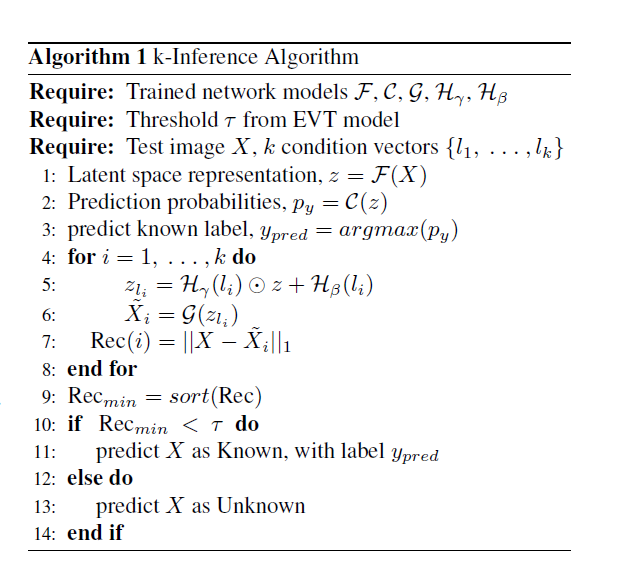

- [ ] Known-class Aware Self-ensemble for Open Set Domain Adaptation

- 基于熵测量区分已知类和未知类。
- :question: 分别为已知类和未知类指定一个低和高的交叉熵，使用加权平方差损失来指定是否为已知类

# Open-set semi-supervised learning

- 两种方法
  - （多步骤）首先使用鲁棒的SSL拒绝来自新类的实例，然后对拒绝的实例应用新的类发现方法来发现新类。
  - 可以将所有类视为“新颖的”，应用新类的发现方法，然后将其中一些类与标记数据集中可见的类进行匹配。

- [x] [OPEN-WORLD SEMI-SUPERVISED LEARNING](http://arxiv.org/abs/2102.03526)[:page_with_curl:](C:\Users\smart-dsp\Zotero\storage\6JB439TP\Cao 等。 - 2022 - Open-World Semi-Supervised Learning.pdf)

  > ICLR 2022

- 问题：模型在可视类上学习区分的特征比在不可视类上更快，与新类相比，可视类内部的差异更小。在标记数据上使用标准的交叉熵损失会造成已见类和新类之间的不平衡问题，即，梯度会更新为已见类c，但不会更新为新类Cn。这可能会导致为可见类学习一个具有更大量级的分类器，导致整个模型偏向于可见类。

- 不确定性自适应边际机制：根据未标记数据的不确定性来控制可见类的内部方差，缩小所见类和新类的类内方差之间的差距。

- 步骤

  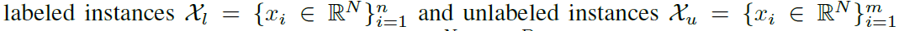

  1. 通过embedding function把输入变为特征表示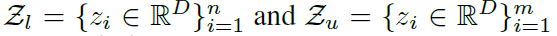

  2. 经过一个分类头（线性层和softmax），分类头的数量可以为已知类数量和预期的未知类数量，若不知道未知类的数量可以分配大量的分类头

     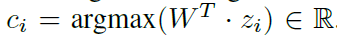

- Loss

  - 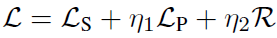

    $L_S$是监督学习的loss，$L_P$为pairwise objective，R为正则项,超参设置为1

  - 监督目标loss

    - 早期不确定性较大，这导致了较大的裕度，而随着培训的进行，不确定性变小，这导致较小的裕度。 

    

    使用输出概率的分布来，描述未知样本的不确定性

    

    - 1- 样本对应的最大概率 对同一类别中的样本求和 得到 不确定性

    同时对权重需要归一化约束

    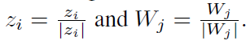

  - Pariwise objective

    - 将聚类学习问题转化为成对相似性预测任务 

    - 计算mini-batch中所有对应的特征表示$z_i$之间的余弦距离,对距离排序，并为每个实例a为其最相似的b生成伪标签

    -  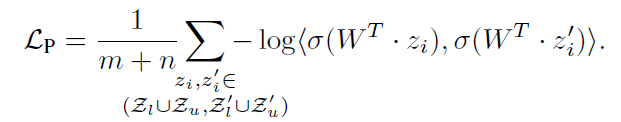

      $Z_l \cup Z_u$是样本的特征表示，$Z_l' \cup Z_u'$是与前面最相似的特征。$\sigma$为softmax函数

      通过优化，拉近伪标签中两个样本之间的特征。

  - 正则化部分

    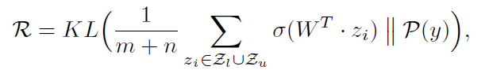

- 算法流程

  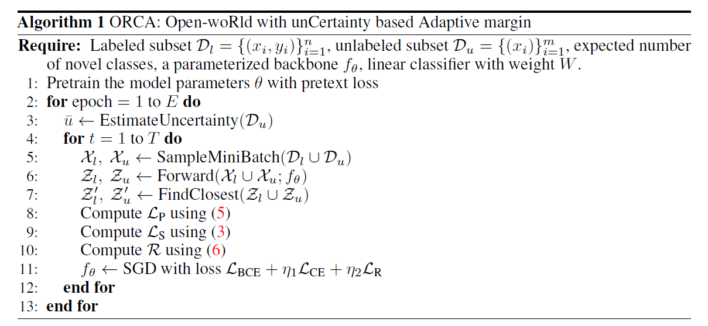

  - 预训练使用simCLR

:wavy_dash::wavy_dash::wavy_dash::wavy_dash::wavy_dash::wavy_dash::wavy_dash::wavy_dash::wavy_dash::wavy_dash::wavy_dash::wavy_dash::wavy_dash::wavy_dash::wavy_dash::wavy_dash::wavy_dash::wavy_dash::wavy_dash::wavy_dash::wavy_dash::wavy_dash::wavy_dash::wavy_dash::wavy_dash::wavy_dash::wavy_dash::wavy_dash::wavy_dash::wavy_dash::wavy_dash::wavy_dash::wavy_dash::wavy_dash::wavy_dash::wavy_dash::wavy_dash::wavy_dash::wavy_dash::wavy_dash::wavy_dash::wavy_dash::wavy_dash::wavy_dash:

- [ ] [OpenMix: Reviving known knowledge for discovering novel visual categories in an open world.](https://openaccess.thecvf.com/content/CVPR2021/html/Zhong_OpenMix_Reviving_Known_Knowledge_for_Discovering_Novel_Visual_Categories_in_CVPR_2021_paper.html)[:page_facing_up:](C:\Users\smart-dsp\Zotero\storage\V458HXDB\Zhong 等。 - 2021 - OpenMix Reviving Known Knowledge for Discovering .pdf)

  > CVPR 2021

- [x] [A novel deep metric learning model for imbalanced fault diagnosis and toward open-set classification](https://www.sciencedirect.com/science/article/abs/pii/S095070512100188X?casa_token=ydn37_5hPfkAAAAA:h26DV7HANAL1Mn3uCcZuUjVT5LS5B-e6Q9Olc9eaXQrOB0pwKM_0afLxsoBMPpKK8QyoheMT)[:page_facing_up:](C:\Users\smart-dsp\Zotero\storage\MKSJLW7L\Wang 等。 - 2021 - A novel deep metric learning model for imbalanced .pdf)

  > ELSEVIER 2021
  >
  > 度量学习、自适应角度裕度
  >
  > 样本不均衡

- hierarchal（体系的，层级的） classifier

- NSL-AAM

  > 在特征空间中对类内样本进行压缩，对类间样本进行分离；
  >
  > 平衡样本

  

  

  - softmax的变种

    

    - 将线性层的输出$y = W\cdot x +b \equiv \|W\|  \|x\|\cos{\theta}$

    - 将$W$标准化为$\|W\|=1,\|x\|=s$

      

  - $m_{y_i}$是自适应角度裕度

    

    - $m_o$是基准角裕度，$E$是该类的样本的有效数
      - 考虑到新加入的样本，$\beta$是超参，文中设了0.99
      - 
    - 增加$x_i$和$W_{y_i}$之间的角度
      - 对softmax的输入进行了加权$<1$样本越多的类，权值越小
      - 对于样本多的类，***梯度小***，更新的慢，从而达到防止模型产生偏向大样本的效果
    - 与类的有效样本大小成正比
      - 用于对多数类施加比少数类更强的限制
      - 减小了该大类的输出值

- 训练阶段和预测阶段解耦
  - 封闭集，使用cos相似度函数，对样本和各类特征进行计算，选出最相似的一个

- 不重新训练模型的情况下对新故障进行学习和分类

- [ ] [Evidential Deep Learning for Open Set Action Recognition](https://openaccess.thecvf.com/content/ICCV2021/html/Bao_Evidential_Deep_Learning_for_Open_Set_Action_Recognition_ICCV_2021_paper.html)[:page_facing_up:](C:\Users\smart-dsp\Zotero\storage\S2QTWFXD\Bao 等。 - 2021 - Evidential Deep Learning for Open Set Action Recog.pdf)

  > ICCV 2021
  >
  > 人体动作

- [ ] [Counterfactual Zero-Shot and Open-Set Visual Recognition](https://openaccess.thecvf.com/content/CVPR2021/html/Yue_Counterfactual_Zero-Shot_and_Open-Set_Visual_Recognition_CVPR_2021_paper.html)[:page_facing_up:](C:\Users\smart-dsp\Zotero\storage\8QFG7SKH\Yue 等。 - 2021 - Counterfactual Zero-Shot and Open-Set Visual Recog.pdf)

  > CVPR 2021

- [ ] [Open-Set Recognition: A Good Closed-Set Classifier is All You Need](https://arxiv.org/abs/2110.06207)[:page_facing_up:](C:\Users\smart-dsp\Zotero\storage\DLSMBLG3\Vaze 等。 - 2021 - Open-Set Recognition A Good Closed-Set Classifier.pdf)

  > ICLR 2022

- 封闭集和开放集的性能高度相关。
  - 通过提高分类器的闭集精度，可以提高分类器的开集性能
  - 在开集设置下，模型除了返回已知类上的分布$p(y|x, y∈C)$外，还返回一个分数$S(y∈C|x)$，表示测试样本是否属于任何已知类。

- [x] [Adversarial reciprocal points learning for open set recognition](https://arxiv.org/abs/2103.00953)[:page_facing_up:](C:\Users\smart-dsp\Zotero\storage\44BRUSHS\Chen 等。 - 2021 - Adversarial Reciprocal Points Learning for Open Se.pdf)

  > TPAMI 2021
  >
  > ARPL
  >
  > 在不损失已知分类精度的前提下，最小化已知分布和未知分布的重叠
  >
  > 通过生成混淆样本，来增强已知未知样本的能力

- 每个互反点由对应已知类别的类外空间学习，利用多个已知类别之间的对抗来降低经验分类风险。提出了一种对抗边界约束，通过限制由倒易点构成的潜在开放空间来降低开放空间风险。为了进一步估计开放空间的未知分布，基于互反点与已知类之间的对抗机制，设计了一种实例化的对抗增强方法，生成多样化且容易混淆的训练样本。这样可以有效地增强模型对未知类的可分辨性。

- 特征空间的划分

  - $\mathcal{D}_\mathcal{L}=\{(x_1,y_1),...,(x_n,y_n)\}$是来自N个类的n个有标签的样本

  - $\mathcal{D}_\mathcal{T}$是从$\{1,...,N\}\cup\{N+1,...,N+U\}$,开集中采集来的测试集样本，其中 $U$是未知类的数量

  - $\mathcal{S}_k$是第$k$类的$deep \ embedding \ space$

  - $\mathcal{O}_k$是在embedding space中除第$k$类的$\mathcal{S}_k$外的$space$
    $$
    \mathcal{O_k}=\mathcal{O_k^{pos}\cup O_k^{neg}}
    $$

    - $\mathcal{O_k^{pos}}$为除第$k$类外，其他known classes的$space$
    - $\mathcal{O_k^{neg}}$为unknown classes的$space$，潜在的未知类的空间

- 优化目标（二元任务）
  $$
  {\arg {min}}_{\psi_k}\{\mathcal{R^k|R_\epsilon(\psi_k,S_k\cup O_k^{pos})+\alpha\cdot R_o(\psi_k,O_k^{neg})}\}
  $$

  - $\mathcal{R^k}=\mathcal{R_\epsilon}+\alpha\cdot R_o$，为设定的预期误差
  - $\mathcal{R_\epsilon}$是一个empirical classification risk（经验分类风险），如cross entropy 
  - $\mathcal{\psi_k}:\R^d\to\{0,1\}$是一个网络将embedding $x$ 映射为label k（是label k 或 不是label k）
  - $\mathcal{R_o}$是$open\ space\ risk$
    - 
      - 分子为：unknown classes的样本经过网络在第$k$类上输出概率的积分
      - 分母为：known classes的样本经过网络在第$k$类上输出概率的积分，
      - unknown classes在类别输出上的概率最小化（距离各reciprocal point都近），让known classes的样本在类别输出上概率最大化（距离reciprocal point 远），由前一个约束共同作用可得，known classes中占比最大的应是label 为 $k$的样本
  - 目标：找到误差$\R^k$最小的网络$\psi_k$

- 优化目标（多分类任务）

  > 多分类任务拆为多个二元分类任务

  - $$
    \arg{\min}_{f\in \mathcal{H}}{R_\epsilon(f,\mathcal{D_L})+\alpha\cdot \sum_{k=1}^N{R_o(f,\mathcal{D}_U)}}\\
    $$

    - 其中，$f=\odot(\psi_1,\psi_2,...,\psi_k)$ ,是整合了k个分类的网络
    - $\mathcal{D}_\mathcal{L}=\{(x_1,y_1),...,(x_n,y_n)\}$是来自N个类的n个有标签的样本集
    - $\mathcal{D}_U$为unknown classes的样本空间

- Reciprocal Point

  > 用网络学一个距离自身类embedding feature最远的embedding feature，命名为Reciprocal Point，P
  >
  > 使用距离作为softmax层的输入，不再是两个向量（这一层权重，上一层神经网络的输出）的内积
  >
  > Loss为最大化输出类别的概率，起到了降低经验分类风险，实则优化了网络，使$P$距离$\mathcal{S_k}$进一步扩大，
  >
  > 开集分类SOTA

  - $P^k$被视为除自己类别外的训练数据子集和开集数据，即数据集$\mathcal{D_L^{\neq k}\cup D_U}$的特征表示，用$m$维的特征向量进行表示

  - - [ ] :question:（怎么实现的？）除k外的$embedding\ space$ :$\mathcal{O_k}$ ，应该比$k$类的特征向量$\mathcal{S_k}$ 距离$P^k$更近

    - 

  - 距离函数：欧式距离（空间）和点乘（角度）结合

    - 
      - 这里是网络对$x$的$embedding \ feature$和$reciprocal \ point$的距离
      - 欧式距离最大化，让$\mathcal{S_k,P_k}$“距离”最远
      - 夹角最小化，让同一类的feature聚合
        - [ ] :question:有没有对feature进行归一化？
    - x的预测类别判据为：距离$P^k$最远的那个类
      - 
    - 分类Loss
      - 
      - 等价于最大化$\mathcal{S_k}和P^k$的距离,最小化$\mathcal{S_k}和\mathcal{P^k}$的距离
        - 

- adversarial margin constraint term （对抗性边沿约束项）

  - 目的：

    - 将开放空间限制在有界范围内，来降低每个已知类别的开放风险

      

    - 由于开放空间的样本不可能考虑完全，所以通过将$embedding\ space \ \mathcal{S_k}与\mathcal{P_k}$的距离限制为小于R来间接实现上述条件

      

      - R是可学习的裕度
      - 只使用了欧式距离
      - [ ] :question:(通过限制已知类与P之间的关系如何约束到未知空间中？)
        - [ ] $P^k$是在$embedding\ space$中距离$k$类最远的相反类的特征，$P$点附近都为与$P$相似的未知类，当把多数$P$聚集在一起的时候达到未知类聚合的目的

  - 通过约束原型和reciprocal point将类外嵌入空间限制在一个有界范围内

    

  - 每个已知类都属于其他类的额外类空间。在各类相互作用时，已知类的原型会被自身的reciprocal point和其他类约束到一个有界的范围内

    

  - 所有已知类分布在bounded embedding space的外侧，未知的样本局限于内部有界的空间中

  - 有界约束防止神经网络对未知样本产生任意高的置信度。

  - Train and setting

    - Loss：

      

      - 超参：$\lambda$
      - 可学习参数：$\theta,P,R$
      - 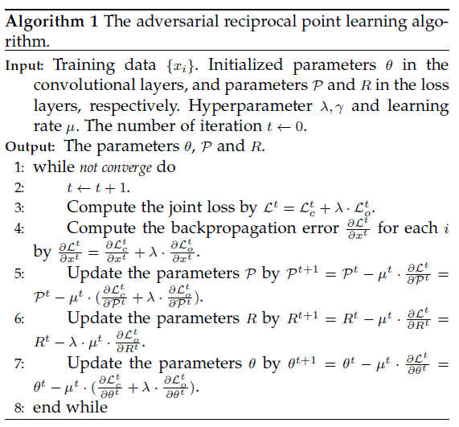

- Instantiated Adversarial Enhancement (实例化对抗增强机制)

  > 将开放空间约束在一个有界范围内（以known classes的embedding feature为”边界“的空间内）

  - 

  - 在生成器和鉴别器之间添加了一种对抗机制
    - 生成的样本应该让鉴别器认为是已知样本
    - 鼓励生成器生成的样本靠近reciprocal point
    - 意味着生成的样本在骗过鉴别器的同时，尽可能的靠近开放空间中未知部分（中间）

  - 网络架构

    

    - Genertor的图像让Discriminator鉴别为已知类

      - 鉴别器（区分生成的和原始的）

        

      - 生成器

        1. 骗过鉴别器

        

        2. 生成的图像的在$embedding\ space$中应该接近所有的P（unknown类），通过分类器来辨别，实质上将提取后的特征和各个P点的距离求和取最小。
        
           
        
           其中
        
           
        
        3. 生成器总目标
        
           
        
           其中
           $$
           H(z_i,\mathcal{P})=-\frac{1}{N}\sum_{k=1}^NS(z_i,\mathcal{P^k})\cdot log(S(z_i,\mathcal{P^k}))
           $$
           

  - 分类器通过生成的confusing samples进行优化（不优化生成器，所以没有鉴别器那项），实质是让网络把生成的样本拉近P点

    

    - 算法流程

      

  - [ ] :question:未知类预测选用什么标准

- 实验结果

  - 以AUROC为指标

    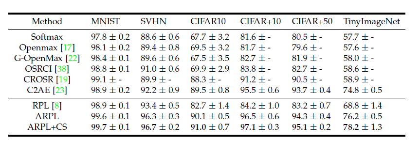

- [x] [CSI: Novelty Detection via Contrastive Learning on Distributionally Shifted Instances](https://proceedings.neurips.cc/paper/2020/hash/8965f76632d7672e7d3cf29c87ecaa0c-Abstract.html)[:page_facing_up:](D:\Chu\论文整理\openset\NeurIPS-2020-csi-novelty-detection-via-contrastive-learning-on-distributionally-shifted-instances-Paper.pdf)

  > NIPS 2020
  >
  > 用学习过的原型来表示已知的类，并根据到原型的距离来识别开放集图像。
  >
  > :question:没看懂修改后的loss，SAR图像上分类精度很差

- Tack等人提出使用样本与自身distributionally-shifted augmentations进行对比的方法，并将传统的余弦相似度与shifting transformations结合提出新的未知类评价分数$S_{CSI}$，将

- Tack等人提出一种新的方法CSI，使用distributionally-shifted augmentations对数据进行增强，将其看作anchor的负样本，进行对比学习，并将传统的余弦相似度与shifting transformations结合作为新的未知类评价分数。我们将MSTAR的十个类别划分为七个已知类与三个未知类，使用CSI进行学习，预训练训练700轮，线性分类器训练100轮，其已知类的分类精度Top1仅有20%-30%，将已知类误分为未知类的概率高达40%。

- 除了在传统的对比学习方法中，将给定的样本与其他实例进行对比之外，我们的训练方案还将样本与自身的分布位移增量进行对比。

- 建议将旋转等”hard“转换后的样本当作负样本,可以增加OOD的性能

- distribution-shifting transformation

  - contrasting shifted instances **Loss**

    > shift 增强实例间的对比

    

    - $\mathcal{S}$为包含原样本的增扩集（distributionally-shifted），$\mathcal{B}_S$为其中的一个正样本的multi-view-batch
    - 将每个分布偏移（DST增扩）后的样本视为原样本的一个OOD

  - Classifying shifted instances

    - 辅助任务，预测哪个shifting transformation的方法被用来增扩了，以方便$f_\theta$（encoder+projection layer）区分每个移位的实例
    - 在$f_\theta$ 添加了一层softmax classifier $P_{cls-SI}(y^S|x)$

    - 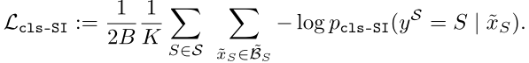

  - Total loss

    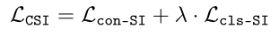

    - 文中$\lambda=1$

  - 如何选择shifting transformation

    - 使生成的样本脱离已知分布但富有语义意义的变换（’nearby‘ but ‘not too nearby’）
      - 使用增强前后的AUROC来判断

- score of OOD

  - Detection score for contrastive representation

    - 使用cosine等相似性函数

    - 使用feature的范数

      

  - shifting transformation

    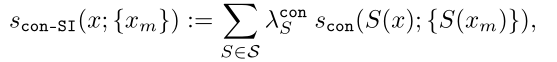

    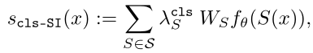

    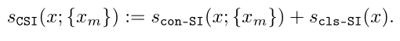

- [ ] [Learning open set network with discriminative reciprocal points](https://link.springer.com/chapter/10.1007/978-3-030-58580-8_30)[:page_facing_up:](C:\Users\smart-dsp\Zotero\storage\WLYY8HSZ\Chen 等。 - 2020 - Learning Open Set Network with Discriminative Reci.pdf)

  > ECCV 2020
