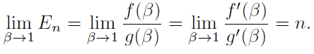
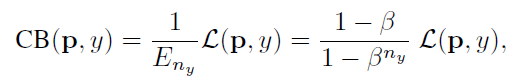
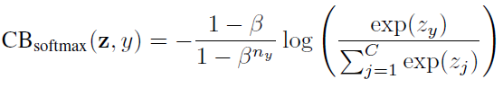
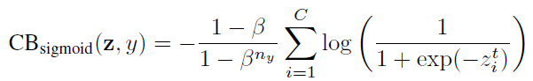
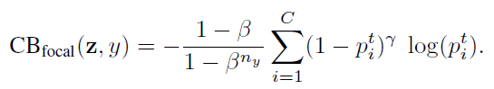

# Tricks

- [ ] [Batch Normalization: Accelerating Deep Network Training by Reducing Internal Covariate Shift](https://proceedings.mlr.press/v37/ioffe15.html)[:page_facing_up:](C:\Users\smart-dsp\Zotero\storage\7XGBITYF\Ioffe 和 Szegedy - 2015 - Batch Normalization Accelerating Deep Network Tra.pdf)
- 可以用更高的学习率
- 降低初始化的影响
- 某些情况下可以不用Dropout
- 
- [ ] LARS优化器
- [ ] cosine decay schedule
- 数据增强
- [ ] mixup
- [ ] cutmix
- [ ] randaugment
- [ ] random reasing
- 正则化
- [ ] Stochastic Depth
- [ ] Label Smoothing

## 不平衡数据集

- [x] [Class-Balanced Loss Based on Effective Number of Samples](https://openaccess.thecvf.com/content_CVPR_2019/html/Cui_Class-Balanced_Loss_Based_on_Effective_Number_of_Samples_CVPR_2019_paper.html)[:page_facing_up:](C:\Users\smart-dsp\Zotero\storage\K65C2NEH\Cui 等。 - 2019 - Class-Balanced Loss Based on Effective Number of S.pdf)

  > 将每个样本关联到一个小的相邻区域而不是单个点来测量数据重叠。

- 数据不平衡现有的解决方案

  - 重采样
    - 过度采样，可能会导致模型过度拟合。
    - 从相邻样本中插值新样本，或者为次要类合成新样本。然而，由于新样本中存在噪声，该模型仍然容易出错。
  - 重加权（cost sensitive learning）
    - 分配权重来调整决策边界以匹配给定目标

- 有效样本数

  - 预期样本量
    $$
    E_n=\frac{1-\beta^n}{1-\beta},\beta=\frac{N-1}{N}
    $$

    - $\beta$是超参数，$n$为样本数量，$N$为原型数

    - $\beta$越接近于1，表明原型$N$越大，上限为$n$，有效样本量接近n

      

    - $\beta$越接近0，表明原型$N$越小，下限为1，有效样本量接近1

    - 数据增强越强，在相同样本量下，数据对应的原型就越少，数据集的容量则越小

- Class-Balanced Loss

  

  - $n_y$是$y$类的样本数

  - Softmax

    

  - Sigmoid

    

  - Focal Loss

  

