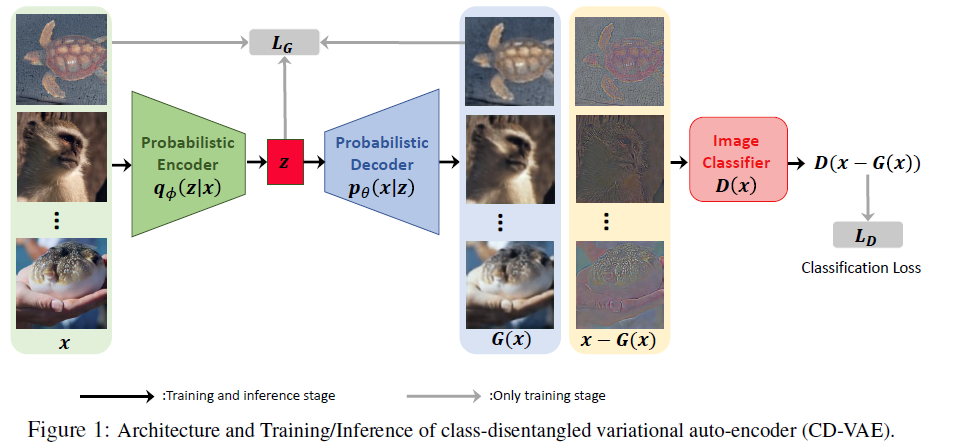
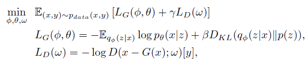

- [ ] [Class-Disentanglement and Applications in Adversarial Detection and Defense]

  > 类解纠缠
  >
  > CD－VAE

  用$G(\cdot)$重建$x$,并用$x-G(\cdot)$来进行分类，实现对抗。网络提取类相关信息$x-G(\cdot )$，实现类解耦。

  > 信息瓶颈理论
  >
  > 最大化$I(z;y)$，最小化$I(x;z)$
  >
  > 在监督分类模型中，最大化$I(z;y)$等于最小化分类误差
  >
  > 在VAE等无监督重建任务中，最大化$I(z;y)$相当于最小化重建误差

  本文目的：研究如何把$x$分解为$x=G(\cdot)+(x-G(\cdot))$，其中$G(x)$包含了所有与类冗余或无关的信息，$x-G(x)$捕捉到了预测$y$类的基本信息

  

  

  - $q_\phi(z|x)$给定$x$下对$z$的后验

  - :question:$p(z)=\mathcal{N}(0,I)$是$z$的先验，鼓励解纠缠;KL散度用来约束$q_\phi(z|x) \to \mathcal{N}(0,1)$

  - 超参$\beta$用来控制VAE中分离的程度，$\gamma$用来控制重建和分类的对抗强度

    

链接速度(接收/传输):	1000/1000 (Mbps)
本地链接 IPv6 地址:	fe80::3891:5798:b768:cd9f%22
IPv4 地址:	10.26.35.73
IPv4 DNS 服务器:	210.34.0.14
210.34.0.18
制造商:	Intel
描述:	Intel(R) Ethernet Connection (14) I219-LM
驱动程序版本:	12.19.1.37
物理地址(MAC):	C0-25-A5-70-F8-D3

- [ ] [$\beta$-vae: Learning basic visual concepts with a constrained variational framework]

  > 变分自编码器