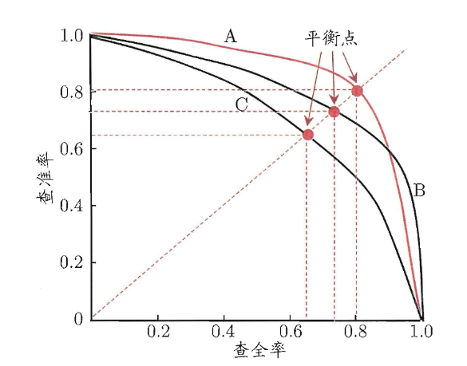
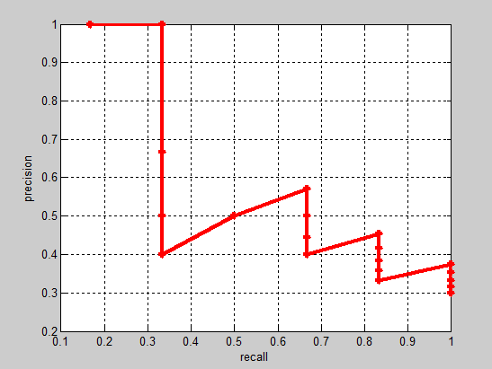
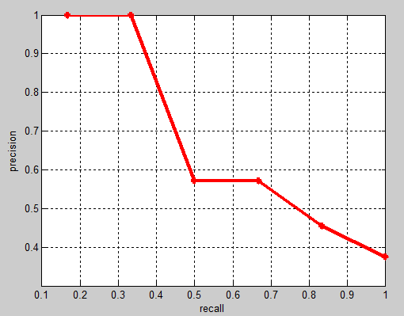
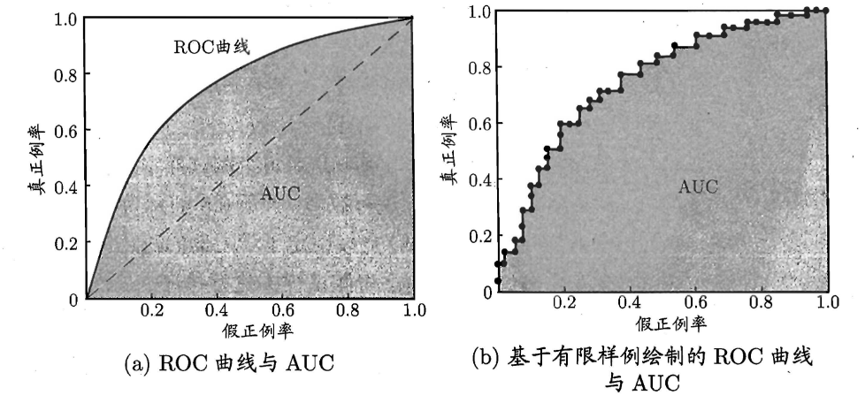

# 任务相关指标

### 分类任务

> 假如某个班级有男生**80**人,女生**20**人,共计**100**人.目标是找出所有女生.
> 现在某人挑选出**50**个人,其中**20**人是女生,另外还错误的把30个男生也当作女生挑选出来了.
> 作为评估者的你需要来评估(**evaluation**)下他的工作

|                                        | **相关(Relevant),正类**                | **无关(NonRelevant),负类**             |
| -------------------------------------- | -------------------------------------- | -------------------------------------- |
| **被检索到(Retrieved)**（判为P）       | true positives(**TP 正类判定为正类**,) | false positives(**FP 负类判定为正类**) |
| **未被检索到(Not Retrieved)**（判为N） | false negatives(**FN 正类判定为负类**) | true negatives(**TN 负类判定为负类**)  |

### 精确率（precision）(查准率)

$$
P=\frac{TP}{TP+FP}
$$

- 正确判为P的样本数 占 判为P的样本总数的比值
- 判断后的结果而言，准不准
- 找的对

### 召回率（recall）（查全率）

$$
R=\frac{TP}{TP+FN}
$$

- 正确判为P的样本数 占 真实P类样本总数的比值

- 以真实的样本而言，判断（P）到了多少
- 找的全

### $F1$-measure

$$
\frac{1}{F1}=\frac{1}{2}\cdot(\frac{1}{P}+\frac{1}{R})
\\F1=\frac{2PR}{P+R}\\=\frac{2TP}{2TP+FP+FN}
$$

- 准确率和召回率的调和平均

### $F_\beta$加权调和平均

$$
\frac{1}{F_\beta}=\frac{1}{1+\beta^2}\cdot(\frac{1}{P}+\frac{\beta^2}{R})\\
F_\beta=\frac{(1+\beta^2)\times P \times R}{(\beta^2\times P)+R}
$$

- $\beta=1$退化为标准的$F1$
- $\beta>1$查全率$R$有更大影响
- $\beta<1$查准率$P$有更大影响

### PR曲线

- 若一个学习器的 P-R 曲线被另一个学习器的曲线完全"包住 "， 则可断言后者的性能优于前者

### AP（Average Precision）和mAP（mean Average Precision）

> 一个典型的PR曲线

- 一个召回率下可能会有多个precision

- 做法

  1. 画出PR曲线

  2. 取大于等于自身recall下的最大precision，平滑曲线

     

  3. 计算平滑曲线下面积（求均值）
     $$
     AP=\frac{P_1+P_2+...+P_n}{n}
     $$
     其中P为平滑后的值,n为召回率取值点的个数

  4. mAP，所有类的AP值的平均

$$
mAP=\frac{AP_0+AP_1+...+AP_N}{N}
$$

​			其中N为类的总数

### TPR（True Positive Rate）（真正例率）

$$
TPR=\frac{TP}{TP+FN}
$$

- 以所有的正例为底，正确分类为正例的正例数为分子
- 能将正例分对的概率
- 同召回率
- 真正的正例

### FPR（False Positive Rate）（假正例率）

$$
FPR=\frac{FP}{FP+TN}
$$

- 以所有负例为底，误分类为正例的负例数为分子
- 负例错分为正例的概率
- 错误的正例

### ROC曲线（Receiver Operating Characteristic）

> 根据学习器的预测结果对样例进行排序，按此顺序逐个把样本作为正例进行预测（选择不同的位置进行截断）

> 绘图过程
>
> 1. 将预测结果进行排序
> 2. 将分类阈值取为最大，此时，所有的样本都预测为”负例“，FPR和TPR都为0
> 3. 以样本为步长，降低分类阈值，计算FPR和TPR
> 4. 将分类阈值取最小，此时，所有的样本都预测为”正例“，FPR和TPR都为1

- ROC空间中，X轴是FPR，Y轴是TPR
- 对角线对应为随机分类的结果
- 点（0，1）为将所有正例排在所有反例前面的理想模型，即有一个阈值可以完美分出正例和反例
- 曲线距离左上方越近，性能越好
-  若一个学习器的 ROC 曲线被另一个学习器的曲线完全"包住"， 则可断言后者的性能优于前者
- 若两个学习器的 ROC 曲线发生交叉，可比较 ROC 曲线下的面积，即 AUC

### AUC（AUROC）

> AUC为ROC曲线覆盖的面积
>
> 物理意义：任取一对（正、负）样本，正样本的score大于负样本的score的概率

- AUC越大，分类器分类效果越好。		
- AUC = 1，是完美分类器，采用这个预测模型时，不管设定什么阈值都能得出完美预测。绝大多数预测的场合，不存在完美分类器。
- 0.5 < AUC < 1，优于随机猜测。这个分类器（模型）妥善设定阈值的话，能有预测价值。
- AUC = 0.5，跟随机猜测一样（例：丢铜板），模型没有预测价值。
- AUC < 0.5，比随机猜测还差；但只要总是反预测而行，就优于随机猜测。

> 优点：
>
> 1. 不受正负样本比例的影响
> 2. 适合于排序业务，主要衡量一个模型的排序能力
>
> 缺点
>
> 1. 没有关注模型预测的具体概率值
> 2. 无法反应正样本内部的排序能力以及负样本内部的排序能力

