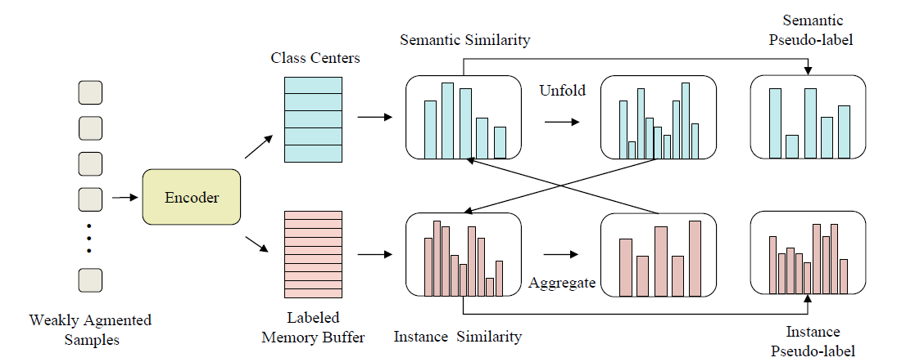

- [ ] [Selective-Supervised Contrastive Learning with Noisy Labels](https://arxiv.org/abs/2203.04181)

  > CVPR2022

- [ ] [SimMatch: Semi-supervised Learning with Similarity Matching](https://arxiv.org/abs/2203.06915)[:page_facing_up:](C:\Users\smart-dsp\Zotero\storage\8AZFRTNL\Zheng 等。 - 2022 - SimMatch Semi-supervised Learning with Similarity.pdf)

  > CVPR 2022
  >
  > 语义相似性和实例相似性，为不同的扩展同时匹配语义和实例级别的相似关系。
  >

  目前流行的方法直接将标记数据纳入伪标记[33]或一致性正则化[45]的联合特征学习范式

  - 部分带标签的监督分类损失（用语义去做）

    

  - 无监督分类损失（定义为两种语义之间的交叉熵）
  
    
  
    - $p^w$是弱数据增强的语义相似度预测（类别概率输出）
    - $p^s$是强数据增强的语义相似度预测（类别概率输出）
    - $\mu B$为unlabel的数据集大小，$DA(\cdot)$为分布对齐策略(见remixmatch，该策略平衡了伪标签分布)
    - $\tau$为置信阈值，只保留伪标签中最大类概率大于$\tau$的未标记样本
    - 将弱数据增强的输出分布作为伪标签

  - 实例级相似

    - 鼓励强增广视图与弱增广视图具有相似的相似分布。（低维嵌入）
  
      
  
      - 对弱增强和强增强的视图的相似性（infoNCE）进行交叉熵损失
  
      
  
      - $z_b^w$为实例i的弱增强视图的embedding
      - $z_i$为实例i的embedding
  
      
  
      - $z_b^s$为实例i的强增强视图的embedding
  
  - 总Loss
  
    
  
    
  
  语义伪标签和实例伪标签可以通过实例化一个带标签的内存缓冲区进行交互，该缓冲区保存所有被标记的示例。
  
  
  
  通过类中心和标签嵌入计算语义和实例相似度，然后利用展开和聚合操作融合这两个相似度，最终得到伪标签。
  
  

- [ ] [Robust Equivariant Imaging: a fully unsupervised framework for learning to image from noisy and partial measurements](https://arxiv.org/abs/2111.12855)[:page_facing_up:](C:\Users\smart-dsp\Zotero\storage\3NMGDRH5\Chen 等。 - 2022 - Robust Equivariant Imaging a fully unsupervised f.pdf)

  > CVPR2022

- [ ] [UniVIP: A Unified Framework for Self-Supervised Visual Pre-training](https://arxiv.org/abs/2203.06965)

  > CVPR2022

- [ ] [**Class-Aware Contrastive Semi-Supervised Learning**](https://arxiv.org/abs/2203.02261)

  > CVPR2022
  >
  > 

- [ ] [Comatch:Semi-supervised learning with contrastive graph regularization](https://openaccess.thecvf.com/content/ICCV2021/html/Li_CoMatch_Semi-Supervised_Learning_With_Contrastive_Graph_Regularization_ICCV_2021_paper.html)[:page_facing_up:](C:\Users\smart-dsp\Zotero\storage\RKMUVFJC\Li 等。 - 2021 - CoMatch Semi-Supervised Learning With Contrastive.pdf)

  > ICCV 2021