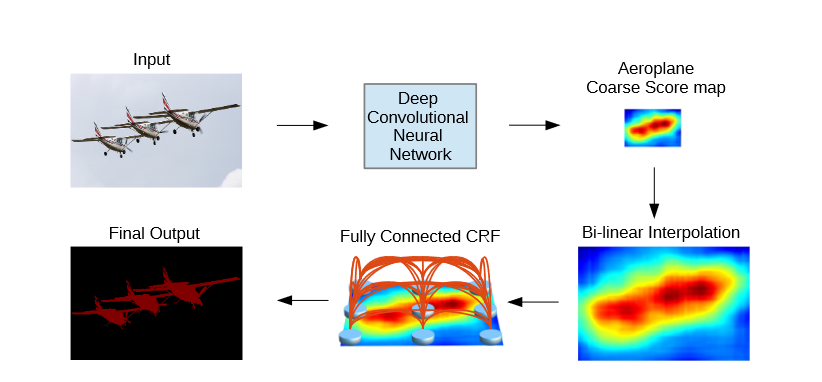
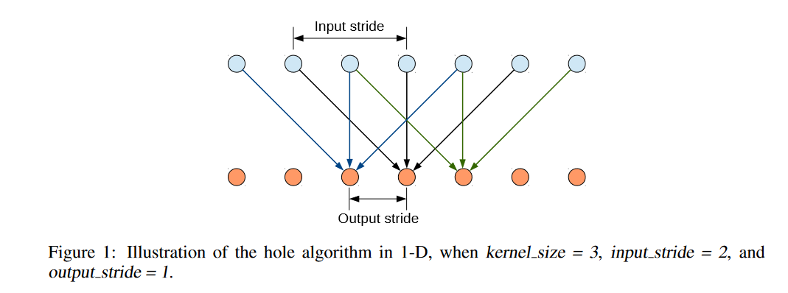
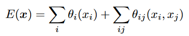
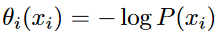
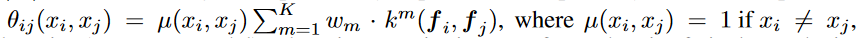
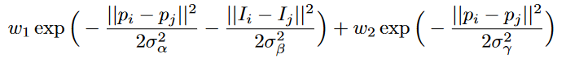
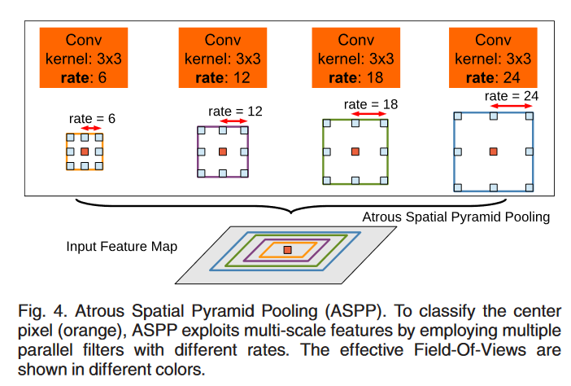

# 数据集

## PASCAL 

## VOC-2012

# 评价指标

## IOU

# 现有工作

## [SEMANTIC IMAGE SEGMENTATION WITH DEEP CONVOLUTIONAL NETS AND FULLY CONNECTED CRFS](http://arxiv.org/abs/1412.7062)[:page_facing_up:](C:\Users\smart-dsp\Zotero\storage\D5GWH4B3\Chen 等。 - 2016 - Semantic Image Segmentation with Deep Convolutiona.pdf)

> ICLR 2015
>
> deeplabv1

将最终DCNN层的响应与完全连接的条件随机场（CRF）相结合，克服了深度网络的这种不良局部化特性。

### 分类

- 将VGG-16的最后的全连接层改为卷积层，并在原始分辨率的图像上以卷积方式运行。并使用空洞卷积，不使用pooling损失信息的情况下增加感受野。

  

  - DCNN分数图可以可靠地预测图像中物体的存在和大致位置，但不太适合于精确定位其轮廓。它们的不变性增强和较大的感受野使得从最高输出级别的分数推断位置更加困难

### 优化边界

#### 现有方法

1. 利用卷积网络中多层的信息，以便更好地估计对象边界
2. 采用超像素表示，本质上是将定位任务委托给低级别的分割方法。

### CRF

- $x$是像素$i$的分类标签

  

  - $P(x_i)$是DCNN输出的像素i处的标签概率

  

  - $i,j$遍历整个图，模型的图是完全相通的

  - 当$i,j$的标签不相同时，$\mu(x_i,x_j)=1$

  - $k^m$是高斯核，由像素$i,j$的特征拟合，并通过$w_m$加权。文中采用的高斯核，为两个的加权和，具体形式如下：

    

    - 第一个高斯核：$p_i$为像素$i$的位置，$I_i$为像素的颜色强度。
    - 第二个高斯核：只取决于像素的位置。
    - **超参数** $\sigma_\alpha,\sigma_\beta,\sigma_\gamma$ 用来控制高斯核的方差

### 结果

## [DeepLab: Semantic Image Segmentation with Deep Convolutional Nets, Atrous Convolution, and Fully Connected CRFs](https://ieeexplore.ieee.org/abstract/document/7913730)[:page_facing_up:](C:\Users\smart-dsp\Zotero\storage\WPYQTDR9\Chen 等。 - 2018 - DeepLab Semantic Image Segmentation with Deep Con.pdf)

> Deeplabv2

