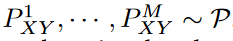
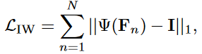

# 目标

​	给出了一个或多个不同但相关的领域，目标是学习一个可以泛化到一个看不见的测试领域的模型。

# 形式化

- 给出M个训练域，$S_{train}(S^i|i=1,..,M),S^i=\{(x_j^i,y_j^i)\}_{j=1}^{n_i}$.在每个域中联合概率分布不同：$P^i_{XY}\neq P^j_{XY},1\le i \neq j \leq M$. 

- 目标：学的一个鲁棒、可泛化的预测函数$h:X\to Y$，并在未见过的测试集$S_{test},P^{test}_{XY}\ne P^i_{XY}$中有最小的预测误差:

  

- 

# 相关工作及形式化 [:page_facing_up:](C:\Users\smart-dsp\Zotero\storage\R8A2B6UR\Wang 等。 - 2021 - Generalizing to Unseen Domains A Survey on Domain.pdf)

## 域适应（DA）

- DA的目标是使用现有的训练源域在给定的目标域上最大化性能。DA和DG之间的区别在于，DA可以访问目标域数据，而DG在训练期间无法看到它们。这使得DG比DA更具挑战性，但在实际应用中更为现实和有利。

### 形式化（二分类）

- 源域标记函数（标签）：$h^{*s}:X\to[0,1]$

- 目标域标记函数（标签）：$h^{*t}:X\to[0,1]$

- 分类器$h:X\to[0,1],h\in \mathcal{H,H}$为分类器的假设空间

- 在源域上的两个分类器 $h,h'$ 的分类误差：

  

- 在目标域上 两个分类器 $h,h'$ 的分类误差：
  $$
  \epsilon^t(h,h')=E_{x\sim P^t_X}[h(x)\ne h'(x)]=E_{x\sim P^s_X}[|h(x)-h'(x)|]
  $$

- 分类器$h$在源域上的risk：

  

  - 分类器$h$与源域标记$h^{*s}$的误差

- 分类器$h$在目标域上的risk：

  

  - 分类器$h$与目标域标记$h^{*t}$的误差

### **目标**：

​	最小化分类器$h$在目标域的risk: $\epsilon^t(h)$

### 通过源域risk,$\epsilon^s$估计目标域risk，$\epsilon^t$

- 由于没有目标域的标签信息$h^{*t}$ ，使用源域的risk $\epsilon^s(h)$去约束目标域的risk:$\epsilon^s(h)$

  

  - 第二项是两个分布间的差异
    - 
    - 表示两个分布的差异上界
    - 可能会导致过分放松
  - 第三项是两个分布间标记函数的差异

- 估计改进版：

  

  

  - 用两个risk差值的上界来估计

  

  - 两个risk和的下界来估计复杂度

- 域适应 误差边界

  

- DA based on domain-invariant representation (DA-DIR)

  将两个域的数据映射到同一个特征空间中拉近距离

## 域泛化（DG）

考虑度量所有可能目标领域的平均风险。

- 假设所有可能的target分布和source分布都服从同一个超分布P

  

  

- 超分布P的所有域的平均风险：

  

- 采样近似统计的经验估计：

  

  - $\mathcal{U}^i=\{x^i_j|(x^i_j,y^i_j)\}\in\mathcal{S^i}$为样本集里的监督数据集

# 三类算法

## data manipulation（数据操作）

### 数据增扩

- 使用不同的数据操作方法增加现有训练数据的多样性。

1. Domain randomization（域随机）

   - 改变位置、纹理、数量、形状、光照、视角、随机噪声

   - 结合场景结构

2. Adversarial data augmentation（对抗性增强）

   - CrossGrad，用贝叶斯网络对标签、域和输入实例之间的依赖性进行建模，在尽可能少地改变类别标签的同时，沿着最大域变化的方向扰动输入。
   - 训练一个用于数据增强的网络，对抗性训练，训练难度较大

### 数据生成

- VAE，GAN
- ComboGAN，应用领域差异度量，最小化真实图像和生成图像之间的分布差异
- 对抗性训练生成，Wasserstein Auto-Encoder (WAE)，用于帮助生成保留语义且具有大域传输的样本。
- 语义一致性下生成了新的分布，然后最大化了源分布和新分布之间的差异。
- [57]介绍了一种基于图像样式化的简单转换，以探索跨源可变性，从而更好地进行泛化，其中AdaIN[177]被用于实现对任意样式的快速样式化。
- [52]使用对抗性训练来生成域，而不是样本。
- Mixup，在原始空间或者特征空间中混合

## representation learning（表示学习）

- $g(\cdot)$为表示学习函数，$f(\cdot)$为分类函数

### Domain-invariant representation-based DG(域不变表示学习)

- [179]的工作从理论上证明，如果特征表示对不同的域保持不变，则表示是通用的，并可转移到不同的域
- 目标是减少特定特征空间中多个源领域之间的表示差异，使其保持领域不变，从而使学习的模型能够对未知领域具有泛化能力。

1. 核技巧

   - 将原始数据转换为高维特征空间，而无需计算数据在该空间中的坐标，只需计算特征空间中所有对样本之间的内积。
   - [60]他们采用半正定核学习从训练数据中学习一个域不变核。
   - [61]采用转移成分分析（TCA）[181]来缩短DG的多域距离。
   - 领域不变成分分析（DICA）[27]，找到一个特征转换核$k(\cdot,\cdot)$，该核可以最小化特征空间中所有数据之间的分布差异。[62]进一步添加了属性正则化。
   - [63]学习了一种具有域不变类条件分布的特征表示。
   - 分散成分分析（SCA）[64]采用Fisher判别分析，以最小化来自同一类别和同一领域的表征差异，并最大化来自不同类别和不同领域的表征差异。
   - [65]提出了一种椭圆摘要随机化（ESRand）,ESRand将每个域投影成一个椭圆来表示域信息，然后使用一些相似性度量来计算距离。
   - [66]提出了多域判别分析来对DG进行类核学习，

2. 域对抗性训练

   - [92]提出了用于 域自适应 的域对抗性神经网络（DANN），该网络对生成器和鉴别器进行对抗性训练。鉴别器被训练用来区分域，而生成器被训练用来欺骗鉴别器学习域不变的特征表示。
   - [93]通过在多个空间中逐渐减少领域差异，使用对抗性训练。
   - [94]提出了一种条件不变对抗网络（CIAN），用于学习DG的类级对抗网络。[95,99,103]
   - [100]使用单侧对抗性学习和asymmetric triplet loss来确保只有来自不同领域的同一类是不可区分的。在不同域上，扩大类间距离，拉近类内距离。
   - [96]还通过最小化不同训练领域的条件分布之间的KL差异，引入了额外的熵正则化，以推动网络学习领域不变特征。还提出了一些其他基于GAN的方法[45、98、

3. 域间显式特征对齐

   - 一些方法通过最小化域的最大平均差异（MMD）[188,181,189,190]，二阶相关[191,192,193]，均值和方差（矩匹配）[183]，Wasserstein距离[182]等，显式地最小化了特征分布差异
   - 特征规范化技术来增强领域泛化能力[185 186]。
   - [185]将实例规范化（IN）层引入CNN，以提高模型的泛化能力。其中图像的样式由IN参数反映，即每个特征通道的均值和方差。IN layers[196]可用于消除实例特定的风格差异，以增强泛化[185]。
   - [70,71]提出了一种风格规范化和恢复（SNR）模块，以同时确保网络的高泛化和识别能力。在通过IN进行样式规范化之后，执行恢复步骤，从剩余特征（即原始特征和样式规范化特征之间的差异）中提取与任务相关的鉴别特征，并将其添加回网络，以确保高鉴别度。恢复的思想被扩展到其他基于对齐的方法中，以恢复对齐丢失的有用鉴别信息[83]。
   - [80]将其应用于训练域中没有标签的无监督DG，以获取不变和可转移的特征。[81]中介绍了不同规范化技术的组合，以表明自适应学习规范化技术可以改善DG。这类方法更灵活，可以应用于其他类别。

4. 不变风险最小化

   - 不寻求匹配所有域的表示分布，而是使表示空间的最上层分类器的表现在所有域中都相同

     

     - $g$为特征提取网络
     - $f\in \mathcal F$是表示空间最上层的分类器
     - 目的是，在各个域中的使用分类器训练，使得和误差最小，即为学习到更鲁棒的特征网络$g$

   - 代理任务

     

     - 将分类器$f=1$，梯度的范数衡量最优性，让梯度=0，使得取得极值点
     - 在强线性假设下的泛化理论，即对于足够多的源域，可以识别地面真值不变分类器。

   - Krueger等人[106]通过最小化源域之间的外推风险来促进这种不变性，这从本质上最小化了源域风险的方差。

   - Mitrovic等人[107]的目标是在自我监督的环境中学习这种表示，其中第二个域是通过显示各种语义无关变化的数据扩充来构建的。

   - Ahuja等人[105]发现仅仅f的不变性是不够的。他们发现，如果g捕捉到“完全信息不变的特征”，IRM仍然会失效。

     - 引入了信息瓶颈正则化，以仅维护部分信息特征。

### Feature disentanglement(特征分解)

- 尝试将特征分解为域共享和特定于域的部分，以便更好地泛化。优化目标：

  

  - $g_c(x)$为域共享特征，$g_s(x)$为域特有的特征
  - 第一项为，域共享特征的分类误差

  - $l_{reg}$为鼓励分离域共享和特定特征
  - $l_{recon}$为防止信息丢失的重建误差

1. Multi-component analysis

   - 使用域共享和域特定的网络参数来提取域共享和域特定的特征。

     

     - $W_i$表示第i个域的参数
     - $W_0$表示域共享参数，$\Delta_i$表示对第$i$个域特定的参数

   - Niu等人[116]提出使用多视图学习进行领域泛化。

   - Ding和Fu[122]为每个域设计了特定于域的网络，并为所有域设计了一个共享域不变网络，以学习解纠缠表示，其中采用低秩重构以结构化低秩方式对齐两种类型的网络。

   - Zunino等人[123]通过手动比较不同领域特定区域的注意力热图，学习了解构表征。还有其他一些研究采用多组分分析进行解纠缠[118、113、114、117、121、198、199、200、119]。

2. Generative modeling

   - 域不变变分自动编码器（DIVA）[124]将特征分解为域信息、类别信息和其他信息，这些信息在VAE框架中学习。
   - Peng等人[125]对在VAEs中学习到的细粒度域信息和类别信息进行了梳理。乔等人[40]也使用VAE进行解纠缠，他们提出了一个统一的特征解纠缠网络（UFDN），将感兴趣的数据域和图像属性都视为待解纠缠的潜在因素。
   - Zhang等人[126]对样本的语义和变化部分进行了梳理。
   - Nam等人[127]提出使用生成模型来分解风格和其他信息，他们的方法既适用于领域适应，也适用于领域泛化。

3. Causality-inspired methods（因果启发式）

   - 因果关系是统计（联合分布）之外的变量关系的更好描述。因果关系给出了系统在干预下的行为信息，因此它自然适用于迁移学习任务，因为领域转移可以被视为一种干预。
   - 在因果关系的考虑下，所需的表示是标签（例如，物体形状）的真正原因，因此预测不会受到相关但语义无关特征（例如，背景、颜色、风格）干预的影响。
   - [136]重新加权输入样本，使加权相关性反映因果效应。
   - [134]将傅立叶特征作为图像的成因，并加强了这些特征之间的独立性。
   - 使用对象标识的附加数据（它是一个比类标签更详细的标签），[206]在给定相同对象的情况下，实现了表示与域索引的条件独立性。
   - 当此类对象标签不可用时，[76]在单独的阶段进一步学习了基于标签的对象特征。
   - 对于单源域泛化，[107，135]使用数据扩充来呈现因果因素的信息。增强操作被视为在不相关特征的干预下产生结果，这是基于特定领域知识实现的。
   - Zhang等人[131]明确地建模了一个导致域转移的操纵变量，这可能是未观察到的。
   - Liu等人[132]利用因果不变性进行单源泛化，即基于因子生成（x，y）数据的过程的不变性，这比现有方法隐含依赖的推理不变性解释得更普遍。允许这两个因素相互关联，这更现实。他们从理论上证明了因果因素的可识别性是可能的，这种识别有利于推广。
   - Sun等人[133]将该方法和理论扩展到多个源域。随着信息量的增加，不相关的因素也可以识别。

## learning strategy（学习策略）

### 集成学习

- Mancini等人[139]提出使用可学习权重来聚合来自不同源特定分类器的预测，其中域预测器用于预测样本属于每个域的概率（权重）。
- [69]在共享所有其他参数的同时，维护了不同源域的依赖域批量规范化（BN）统计数据和BN参数。在推断中，最终的预测是领域相关模型的线性组合，以及通过测量测试样本的实例归一化统计数据与每个领域的累积总体统计数据之间的距离推断出的组合权重。
- [137]的工作提出了不同源域的特定于域的层，并学习这些层的线性聚合来表示测试样本。
- [8]提出了域自适应集成学习（DAEL），其中DAEL模型由跨域共享的CNN特征提取器和多个特定于域的分类器头组成。每个分类器都是自己域的专家，而是其他域的非专家。DAEL的目标是通过与专家一起教授非专家来合作学习这些专家，从而鼓励团队学习如何处理来自未知领域的数据。

### Meta-learning

- 通过基于优化的方法[207]、基于度量的学习[208]或基于模型的方法[209]从多个任务中学习通用模型。

- 将来自多源域的数据划分为元训练集和元测试集，以模拟域转移。

  

  - $\phi^*=MetaLearn(\mathcal S_{mtrn})$表示在meta-train set $\mathcal S_{mtrn}$上训练的元学习参数。然后将$\phi^*$在meta-test set $\mathcal{S_{mte}}$上训练参数$\theta^*$
  - 两个函数$Learn(\cdot), MetaLearn(\cdot)$由不同的元学习算法实现

- 梯度更新

  

- [207]提出了模型不可知元学习（MAML）。受MAML的启发，Li等人[17]提出了MLDG（用于领域泛化的元学习）来使用元学习策略进行DG。MLDG将来自源域的数据分解为元训练和元测试，以模拟域转移情况，学习一般表示。

- Balaji等人[18]提出学习分类器的元正则化器（MetaReg）。[19] 通过设计一个元优化器，为特征提取器提供特征批评家培训。Dou等人[143]使用了MLDG的类似想法，并另外引入了两个互补损失，以明确地规范特征空间的语义结构。

- Du等人[20]提出了一种信息瓶颈的扩展版本，称为元变分信息瓶颈（MetaVIB）。他们将来自不同领域的同一类别样本的潜在编码分布之间的Kullback–Leibler（KL）发散规律化，并学习使用随机神经网络生成权重。

- 最近，一些研究还对半监督DG或歧视性DG采用了元学习[144 145 147 44 210]。

### Gradient operation 操作梯度

- Huang等人[150]提出了一种自我挑战的训练算法，旨在通过操纵梯度来学习一般表示法。他们**迭代地丢弃在训练数据上激活的主要特征，并迫使网络激活与标签相关的剩余特征**。这样，网络就可以被迫从更多的不良案例中学习，从而提高泛化能力。

- Shi等人[151]提出了一种梯度匹配方案，他们的假设是**两个域的梯度方向应该相同**，以增强共同表征学习。为此，他们提出了最大化梯度内积（GIP）的建议，以使梯度方向跨域对齐。通过这种操作，网络可以找到权重，使得输入输出对应关系在域之间尽可能接近。GIP可表述为：

  

  - $G_i,G_j$是两个域的梯度均值，$G=E\frac{\part l(x,y;\theta)}{\part \theta}$

- 梯度不变性是通过在[152]中的梯度之间添加CORAL[192]损失来实现的，而Tian等人[153]通过原始样本和增强样本之间的梯度相似性正则化，最大化了DNN的神经元覆盖率。

### Distributionally robust optimization（分布鲁棒化）

- 学习训练域的最坏分布情况
- [212]提出了一种GroupDRO算法，该算法需要对样本进行显式的组注释。这种注释后来被缩小到[154]中验证集的一小部分，他们在那里制定了一个两阶段加权框架。
- 通过风险外推（VRex）[106]或减少类条件下的Wasserstein-DRO[157]来减少训练领域风险的方差。
- 最近，Koh等人[156]提出了亚种群转移的设置，并将DRO应用于该问题。特别是，Du等人[79]提出了AdaRNN，这是一种类似于DRO精神的算法，不需要显式的组注释；相反，他们通过解决一个优化问题来了解最坏的分布情况。总而言之，DRO关注的是也可用于DG研究的优化过程。

### 自监督学习

几乎所有的自监督学习都可以用来DG

## Others

- [166]中采用了度量学习来探索DG更好的成对距离。
- Ryu等人[162]使用随机森林来提高卷积神经网络（CNN）的泛化能力。

# Domain Generalized Semantic Segmentation (DGSS)

## [Semantic-Aware Domain Generalized Segmentation](http://arxiv.org/abs/2204.00822)[:page_facing_up:](C:\Users\smart-dsp\Zotero\storage\3HBLZX39\Peng 等。 - 2022 - Semantic-Aware Domain Generalized Segmentation.pdf)

### 现有处理DGSS的方法

- 域随机化，通过将源图像增加到多个域样式来增加训练数据的多样性。

- Instance Normalization (IN):标准化了各个图像通道中的特征，以减轻样式变化导致的特征不匹配。IN仅实现中心级对齐（见图1（a）），而忽略了不同通道之间的联合分布。

  

  - $n$代表第n个批次，$k$代表第k个通道

  - $\epsilon$为小值，防止被0除

    

  - 即使每个通道的特征都集中在中心，并按标准分布进行缩放，通道之间的联合分布也可能不匹配。

- Instance Whitening (IW)：标准化不同样本的特征分布。可以消除通道之间的线性相关性，从而形成均匀分布的良好聚集特征（见图1（b））。

  - 优化目标如下：消除通道间的线性相关性

  

  - $\Psi(F_n)$为通道相关性，定义为第n个批次的通道协方差$Cov(X,Y)=E[(X-\mu_x)(Y-\mu_y)]$

    

    

  - 能够通过每个样本的通道去相关来统一联合分布形状。

- 将IN和IW结合起来实现联合分布式特征对齐（见图1（c））。这种全局对齐策略缺乏对局部特征分布一致性的考虑。属于不同对象类别的特征最初被很好地分离，在标准化后被映射到一起，导致类别之间的混淆，尤其是在泛化到看不见的目标域时。

  

### Method

SAN侧重于不同图像样式的功能之间的类别级中心对齐，而SAW则对已经中心对齐的功能实施分布式对齐。在SAN和SAW的帮助下，我们鼓励类别内的紧凑性和类别间的可分性。

#### Semantic-Aware Normalization (SAN)

将不同类别的标准化特征调整到不同的空间，从而使特征空间更具区分性，小批量中的不同样本共享相同的仿射参数，以便将相同类别的特征投射到相同的特征空间中，从而确保类别级别的中心对齐。

- $c$表示第$c$类，$F_{n,k}^c$表示第n个样本，第k个通道，第c类的特征映射（输入特征）

- $F_{obj}$是目标特征

- $\mu^c_{n,k},\sigma^c_{n,k}$为第n个样本，第k个通道，第c类样本的均值和方差

  

- $\gamma^c,\beta^c$是第c类的缩放和偏移因子，每个类别具有不同的参数，即映射到不同的空间中，保证每个类内的特征中心对齐

因为在目标域上标签不可用，使用SAN来模拟上式的分类别中心对齐的$F_{obj}$

> $F_{obj}$在训练时，标签可见，可通过归一化和仿射计算得到
>
> 由于网络在目标域上进行预测时，没有标签信息，所以无法对特征进行中心化处理。所以在训练阶段对中心化操作也进行网络模拟，对类标签进行脱离。

1. 通过分割器生成每一类的分割模板，来突出相应类所对应的特征，抑制其他类的特征

   

2. :question: （maxpooling、avgpooling的作用，怎么做到特征细化）由于分割模板过于粗糙，引入类别级特征细化（CFR）模块，将$F'\to F''$

   

   - $f^{3\times 3}$为卷积核为3的卷积层

3. 区域标准化（RN），对类别内的特征进行聚类筛选，形成更精细的mask，选取$F''$中的部分特征进行归一化。

   1. 对通过CFR的特征 :question:（通道avgpooling，具体做法，作用？）沿通道轴进行avgpooling，并进行k-means聚类。分为k个簇之后，从第一个簇到第t个簇被视为类别区域，其余簇被视为忽略区域。
      - k为超参数，决定了特征的保留度，文中为5
      - 保留下来的区域称为$\Phi_{high}$
   2. 对特征进行标准化

4. 通过仿射变换，把各个类的特征给统一到一个特征空间中

   

   - $RN(F_c'',\Phi_{high})$为清洗后的归一化特征
   - $\gamma,\beta$为各个类可学习的放缩和偏移。:question: （类间和类内的特征约束？）

用到的两个约束

- 第一个约束，确保类mask的正确性
- 第二个约束，保证SAN网络的特征输出一范数逼近$F_{obj}$。

#### SemanticAwareWhitening (SAW)

直接使用IW，会严格消除所有通道之间的相关性，可能导致语义信息丢失。

SAW，将决定每个分类类别的通道的权重顺序排列，把对于每个分类，权重（重要性）相同（权重号第一，第二，第n）的通道分为一个组，进行去相关。

