# 对比学习

> 综述1:[:page_facing_up:](C:\Users\smart-dsp\Zotero\storage\AJ5NTHEI\Jaiswal 等。 - 2021 - A Survey on Contrastive Self-Supervised Learning.pdf) –2021

- 可探寻的问题：
  - 应对不同任务，数据集的自动增强方式

- 目的：aims at grouping similar samples closer and diverse samples far from each other
- 相似度：度量两个embeddings的距离
- 步骤
  - 采样得到一个样本，使用数据增强，获得该样本的增广版本
  - 将原始样本的增广版本视为正样本，将其余样本视为负样本
  - 使用一些pretext task，对模型进行训练，学习区分正负样本

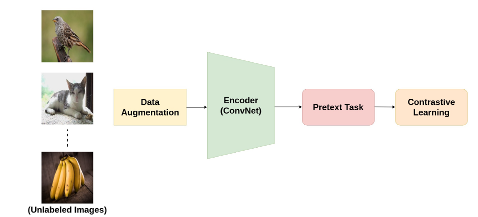

### Pretext Tasks

- 定义：Pretext Task 是使用伪标签来学习数据特征表示的自监督学习的策略
  - pseudolabels：抽象意义的标签，根据数据中发现的属性自动生成。

- 在对比学习中，原始图像作为锚点，其增强(变换)后的图像作为正样本，批处理或训练数据中剩余的图像作为负样本。

#### 		图像增强策略

- Color Transformation

- Geometric Transformation（几何变换）

- Context-Base

  - Jigsaw Puzzle（拼图）
    - 通过训练编码器来识别图像中被打乱的patch的正确位置。对比学习中以原始图像为锚点，对原始图像中的patch进行置乱后形成的增强图像作为正样本。将数据集/批处理中的其余图像视为负样本

  - Frame Order Based（帧顺序）
    - 一个图像帧序列打乱顺序的视频作为正样本，而批处理/数据集中的所有其他视频都是负样本。
    - 一个较长的视频中随机取样两个相同长度的视频片段，或对每个视频片段应用空间扩展。目标是使用对比损耗来训练模型，使来自同一视频的剪辑被安排得更近，而来自不同视频的剪辑在嵌入空间中被推离。

  - Future Prediction
  - View Prediction
    - 适用于具有同一场景的多个视图的数据
  - Identifying the Right Pre-Text Task

- Pre-Test Task in NLP

  -  Center and NeighborWord Prediction
  - Next and Neighbor Sentence Prediction
  - Autoregressive Language Modeling
  - Sentence Permutation

### 结构

> 访问负样本可以被视为字典查找任务，其中字典有时是整个训练集，或者是数据集的某个子集。

- end-to-end

  - 代表
    - [ SimCLR）](https://arxiv.org/abs/2002.05709v3)[:page_facing_up:](C:\Users\smart-dsp\Zotero\storage\PGZU9HX5\Chen 等。 - 2020 - A Simple Framework for Contrastive Learning of Vis.pdf)

  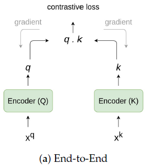

  - 网络
    - 两个编码器，Query encoder ，Key encoder 
    - Query encoder：在原始样本上进行训练
    - Key encoder：在数据增强后的正样本和负样本一起训练
    - 将两个编码器生成的features q 和 k 计算相似度矩阵（cosine similarity（内积））
  - 思想
    - 生成同一样本的不同表示，使用对比损失，使正样本更接近，使负样本原离原始样本。
  - 正负样本划分
    - 原始数据和其数据增强为正样本，其余数据视为负样本
  - 特点
    - 大批量的数据,更长的训练周期效果更好
  - 问题
    - 负样本特征会在每个批次积累，需要强大的运算资源
    - 对于较大的小批量优化问题，需要有效的优化策略

- [x] [Chen, T.; Kornblith, S.; Norouzi, M.; Hinton, G. A Simple Framework for Contrastive Learning of Visual Representations. arXiv
  2020, arXiv:2002.05709.](https://arxiv.org/abs/2002.05709v3)[:page_facing_up:](C:\Users\smart-dsp\Zotero\storage\PGZU9HX5\Chen 等。 - 2020 - A Simple Framework for Contrastive Learning of Vis.pdf)

  > SimCLR

- SimCLR有效的原因

  - 数据增益非常重要

  - 在表征和对比损失之间引入可学习的非线性变换，能显著提高学习表征的质量

  - 归一化embeddings 和 合适的温度参数

  - 与监督学习相比，对比学习网络更深，训练时间更长，效果更好

- key idea：通过在latent space中 **最大化**  **相同数据的不同增强版本（正样本）之间的一致性**来进行学习表示

- 框架

  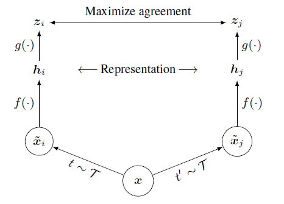

  - 数据增强：经过两次数据增强，产生一对正样本对
    - 随机裁剪，随机颜色变换，随机高斯模糊
    - 随机裁剪和颜色变换更为重要
    - - [ ] :question: 对同个来源的两个数据同时随机裁剪，但只对其中一个数据进行其他数据增扩，性能不好

  - Encoder $f(\cdot)$：用于提取特征，
    - 正样本对的两个编码器使用相同架构，不共享参数
    - $h_i$为下游任务使用的特征，为一个average pooling layer的输出
    - ResNet
    - 增加深度和宽度都可以增强性能

  - projection head $g(\cdot)$：一个非线性变换将特征投影到另一个空间,获得特征向量$z$，

    - 在$z$上进行对比损失的计算
    - $z_i=g(h_i)=W^{(2)}\sigma(W^{(1)}h_i),\sigma 是 RELU$

  - contrastive loss function：对比预测任务

    - 给定一个正样本对$\widetilde{x_i},\widetilde{x_j}$,给定$\widetilde{x_i}$，在$\{\widetilde{x_k}\}_{k \ne i}$中找到$\widetilde{x_j}$

  - 相似度函数

    - $sim(u,v)=u^Tv/\|u\| \|v\|$     (cosine similarity)

  - Loss function

    - 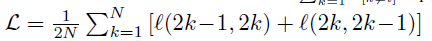

    - 正例子的损失函数

      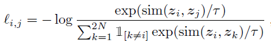

      - $i,j$为正样本对
      - $1$为指示函数，$k\ne i$的时候为1，其余为0
      - $\tau$为温度系数
      - 分母上有2N-1项
      - 

  - 正负样本选择

    - 正样本：原始数据增扩后，互为正样本
    - 负样本：其余的2（N-1）个为负样本

- 算法流程

  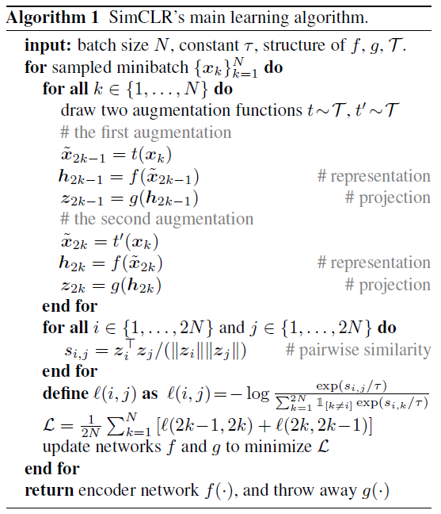

- 训练设置

  - 使用随机裁剪、颜色变换、高斯模糊进行数据增扩
  - 使用ResNet-50作为编码器
  - 使用2层MLP作为projection head，投影到128维向量空间
  - batch_size:4096,epochs:100
  - optimized：LARS
  - learning rate：4.8（=0.3 x batch_size/256）

- [x] [Big Self-Supervised Models are Strong Semi-Supervised Learners](https://arxiv.org/abs/2006.10029)[:page_facing_up:](C:\Users\smart-dsp\Zotero\storage\64CJDR4P\Chen 等。 - 2020 - Big Self-Supervised Models are Strong Semi-Supervi.pdf)

  > SimCLR v2 NIPS2020
  >
  > 知识蒸馏

- 解决的问题：充分利用大量未标签的数据和少量标签数据学习网络

- key idea: 

  - 在pretraining和fine-tuning的时候要用宽而深的网络
    - 标签越少越好
  - 大的微调网络（teacher network）可以蒸馏成一个更小的网络（student network）
    - 使用无标签的数据让student network去模拟teacher network的预测输出

- 在使用task-specific的fine-tuning之后，大网络能进一步提升。第二次使用无标签的数据通过大网络，可以蒸馏出一个更小但精度不会损失很多的小网络

- :flags: ***自监督学习的三步***：

  - 自/无监督预训练
    - task-agnostic（任务无关）
    - 使用无标签的数据
    - 学习一般的表征
  - 有监督的fine-tuning
    - task-specific（任务相关）
    - 少量有标签的样本
    - 提高预测性能，获得紧凑的模型
  - 蒸馏小模型
    - 使用无标签的样本对fine-tuning后的网络（具有task-specific的知识）进行提炼
    - 利用微调教室网络中的未标记数据和输入标签来训练学生网络

- Method

  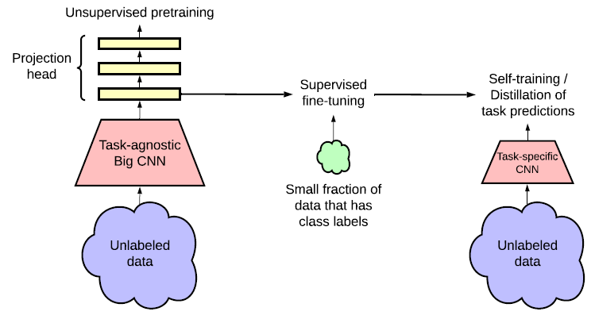

  - Self-supervised pretraining with SimCLRv2（相较于SimCLR的提升）
    - 使用更大的网络
      - ResNet-50 —> ResNet-152 with (3x wider channels + SK（selective kernels)）一种通道注意力机制
      - top-1 涨点29%
    - 使用更深的non-linear network $g(\cdot)$(projection head),并参与fine-tuning
      - 2 layers —> 3 layers
      - 并从第一层开始fine-tuning（不再是丢弃整个$g(\cdot)$）
      - 4 layers 表现的比3 layers 好
    - 使用MOCO的记忆机制
      - [x] 待学习
  
  - fine-tuning
    - 将$g(\cdot)$的第一层合并到encoder中，参与fine-tuning
  
  - 蒸馏（distillation）
  
    - 采用无标签的数据
  
    - 使用fine-tuning后的网络作为教师网络为训练学生网络 *估算标签*
  
    - 蒸馏loss函数使用的是cross entropy的形式
  
      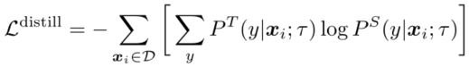
  
      P类似与softmax的输出
  
      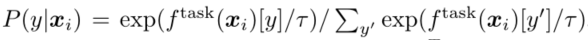
  
      教师网络$P^T$在蒸馏过程中不变，优化$P^S$
  
      当使用带有标签的数据进行训练时，可以把交叉熵和蒸馏loss加权
  
      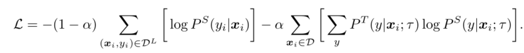
  
    - 学生网络不带$g(\cdot)$，直接进行监督分类
    - 自蒸馏（t=0.1）
    - 大到小蒸馏（t=1.0）

- [ ] [Lorre, G.; Rabarisoa, J.; Orcesi, A.; Ainouz, S.; Canu, S. Temporal Contrastive Pretraining for Video Action Recognition. In Proceedings of the IEEEWinter Conference on Applications of Computer Vision, Snowmass Village, CO, USA, 1–5 March 2020;
  pp. 662–670.](https://openaccess.thecvf.com/content_WACV_2020/html/LORRE_Temporal_Contrastive_Pretraining_for_Video_Action_Recognition_WACV_2020_paper.html)[:page_facing_up:](C:\Users\smart-dsp\Zotero\storage\CNLX8FIQ\Lorre 等。 - 2020 - Temporal Contrastive Pretraining for Video Action .pdf)

> Hjelm, R.D.; Fedorov, A.; Lavoie-Marchildon, S.; Grewal, K.; Bachman, P.; Trischler, A.; Bengio, Y. Learning deep representations by mutual information estimation and maximization. arXiv 2018, arXiv:1808.06670.
>
> Ye, M.; Zhang, X.; Yuen, P.C.; Chang, S.F. Unsupervised Embedding Learning via Invariant and Spreading Instance Feature. arXiv 2019, arXiv:1904.03436.
>
> Bachman, P.; Hjelm, R.D.; Buchwalter, W. Learning representations by maximizing mutual information across views. In Advances in Neural Information Processing Systems; Vancouver, Canada, 8–14 December 2019; pp. 15535–15545.
>
> Henaff, O. Data-efficient image recognition with contrastive predictive coding. In Proceedings of the International Conference on Machine Learning, Vienna, Austria, 12–18 July 2020; pp. 4182–4192.
>
> Khosla, P.; Teterwak, P.; Wang, C.; Sarna, A.; Tian, Y.; Isola, P.; Maschinot, A.; Liu, C.; Krishnan, D. Supervised Contrastive
> Learning. arXiv 2020, arXiv:2004.11362

- Using a Memory Bank

  - 维护一个字典Memory Bank，通过替换负样本的特征，来解决训练批次变大的问题

    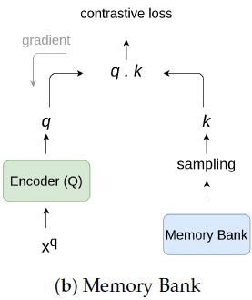

  - 问题
    - 维护复杂

- [ ] [Misra, I.; Maaten, L.V.D. Self-supervised learning of pretext-invariant representations. In Proceedings of the IEEE/CVF Conference on Computer Vision and Pattern Recognition, Seattle, WA, USA, 14–19 June 2020; pp. 6707–6717.](https://openaccess.thecvf.com/content_CVPR_2020/html/Misra_Self-Supervised_Learning_of_Pretext-Invariant_Representations_CVPR_2020_paper.html)[:page_facing_up:](C:\Users\smart-dsp\Zotero\storage\BCK374Z5\Misra 和 Maaten - 2020 - Self-Supervised Learning of Pretext-Invariant Repr.pdf)

  > PIRL

- Using a Momentum Encoder for Contrastive Learning

  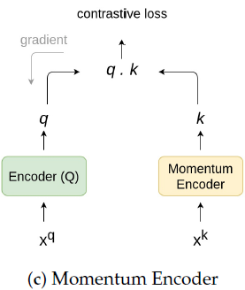

  - 使用动量编码器替代Memory Bank，动量编码器生成一个队列，让新的keys入列，并让旧的keys出列。

  - Momentum encoder与encoder（Q）共享参数

  - 参数动量更新

    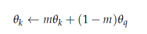

  - 优势
    - 它不需要训练两个单独的模型。此外，不需要维护计算和内存效率低下的内存库。 

- [x] [He, K.; Fan, H.; Wu, Y.; Xie, S.; Girshick, R. Momentum contrast for unsupervised visual representation learning. In roceedings
  of the IEEE/CVF Conference on Computer Vision and Pattern Recognition, Seattle, WA, USA, 13–19 June 2020; pp. 9729–9738.](https://openaccess.thecvf.com/content_CVPR_2020/html/He_Momentum_Contrast_for_Unsupervised_Visual_Representation_Learning_CVPR_2020_paper.html)[:page_facing_up:](C:\Users\smart-dsp\Zotero\storage\ZEK9ZKGX\He 等。 - 2020 - Momentum Contrast for Unsupervised Visual Represen.pdf)

  > MOCO

- Method

  > 将对比学习的任务，看作训练编码器完成字典查找任务的过程

  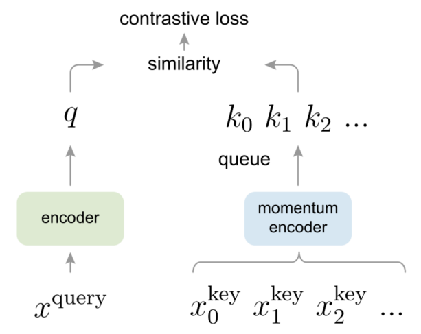

  - key 是从一组数据 通过编码器 *动态* 表示的 特征，

    - 字典被构建为一个队列，当前批进入队列，最老的一批退出队列

    - key encoder是一个动量更新（平滑）的编码器，由query encoder的参数来动量更新，整个网络只有$\theta_q$在反向传播更新

      > 为了防止key 编码器变化过快导致key表征的不一致性

      

      - m较大时，表现较好

    - 字典大小与batchsize 大

  - query 是 样本$x^q$ 的 特征表示，通过与所有的key计算相似度，应与对应的 key 相似

  - k、q两个编码器结构一致

  - 学习被定义为减少对比损失（InfoNCE）

    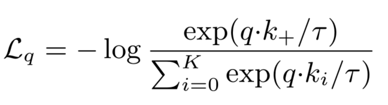

- 代码流程

  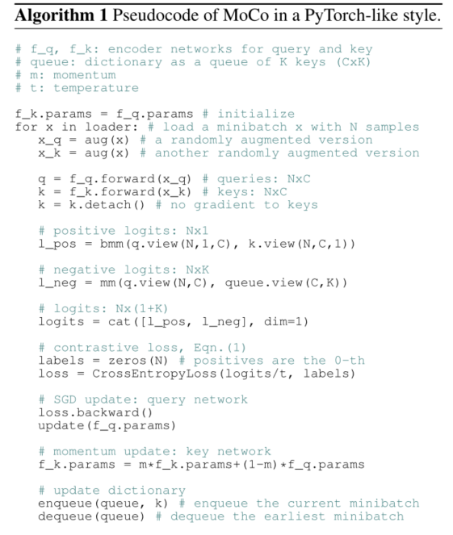

  - positive 是默认放到了第一个位置。

- [x] [Improved Baselines with Momentum Contrastive Learning](https://arxiv.org/abs/2003.04297)[:page_facing_up:](C:\Users\smart-dsp\Zotero\storage\W2LTIZTM\Chen 等。 - 2020 - Improved Baselines with Momentum Contrastive Learn.pdf)

  > MOCO v2

  增加MLP、更强的aug、大epoch都能够大幅度的提升MoCo的精度

- [ ] [An Empirical Study of Training Self-Supervised Vision Transformers](https://openaccess.thecvf.com/content/ICCV2021/html/Chen_An_Empirical_Study_of_Training_Self-Supervised_Vision_Transformers_ICCV_2021_paper.html)[:page_facing_up:](C:\Users\smart-dsp\Zotero\storage\HHFN7AN9\Chen 等。 - 2021 - An Empirical Study of Training Self-Supervised Vis.pdf)

  > MOCO v3
  >
  > Transformer 引入对比学习中

- Clustering Feature Representations

  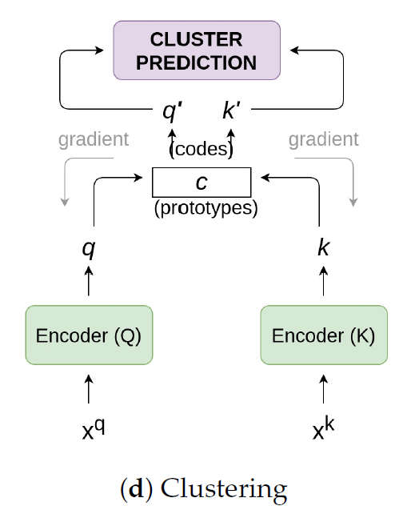

  - 不是使用基于实例的对比方法，而是使用 **聚类算法** 将相似的特征组合在一起
  - 在前面的方法中，每个样本都被视为数据集中的一个离散类。 当处理来此同一个类的样本对时，迫使模型分开两个相似的样本对。
    - 在这个方法是用聚类解决的

- [ ] [Caron, M.; Misra, I.; Mairal, J.; Goyal, P.; Bojanowski, P.; Joulin, A. Unsupervised Learning of Visual Features by Contrasting Cluster Assignments. arXiv 2020, arXiv:2006.09882.](https://proceedings.neurips.cc/paper/2020/hash/70feb62b69f16e0238f741fab228fec2-Abstract.html)[:page_facing_up:](D:\Chu\论文整理\unsupervised learning\NeurIPS-2020-unsupervised-learning-of-visual-features-by-contrasting-cluster-assignments-Paper.pdf)

  > SwAV
  >
  > 不需要大的memory bank或者动量网络，内存利用率高

- 对数据的不同增强之间，强行聚类

  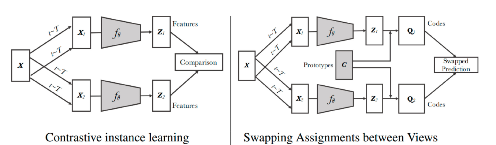

- 让一对样本彼此接近的同时，让相似类别的实例对的特征彼此也更接近

### Encoder

- 负责将输入样本映射到潜在空间 

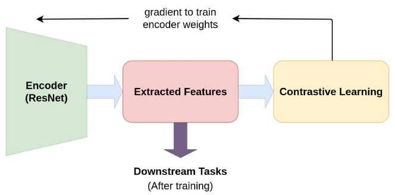

- 一般使用resnet50，上采样和下采样两种结构，并将其中某个特定层的输出合并为特征向量供下游任务使用
- [ ] Misra, I.; Maaten, L.V.D. Self-supervised learning of pretext-invariant representations. In Proceedings of the IEEE/CVF Conference on Computer Vision and Pattern Recognition, Seattle, WA, USA, 14–19 June 2020; pp. 6707–6717.

- 将res5的特征输出平均池化，获得2048维特征，使用线性层，投影到128维，作为下游使用的特征向量
- 编码器后级提取的特征比较前级的特征更能表示样本

### Train

- 中心思想：bring similar instances closer and push away dissimilar instances far from each other

- 相似度度量函数

  - 余弦相似度

    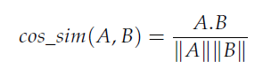

- Loss：

  - 使用Noise Contrastive Estimation (NCE)来对比两个embedding

    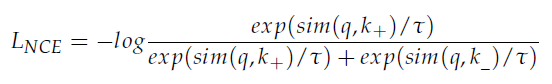

    $q$是原始样本，$k_+$是正样本，$k_{-}$是负样本，$\tau$是温度参数（超参），

  - 如果**负样本更多** :question: ，采用变体$L_{infoNCE}$

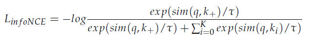

​				$k_i$是负样本

### 任务迁移

- 下游任务
  - classification, detection,segmentation（分割）, future prediction

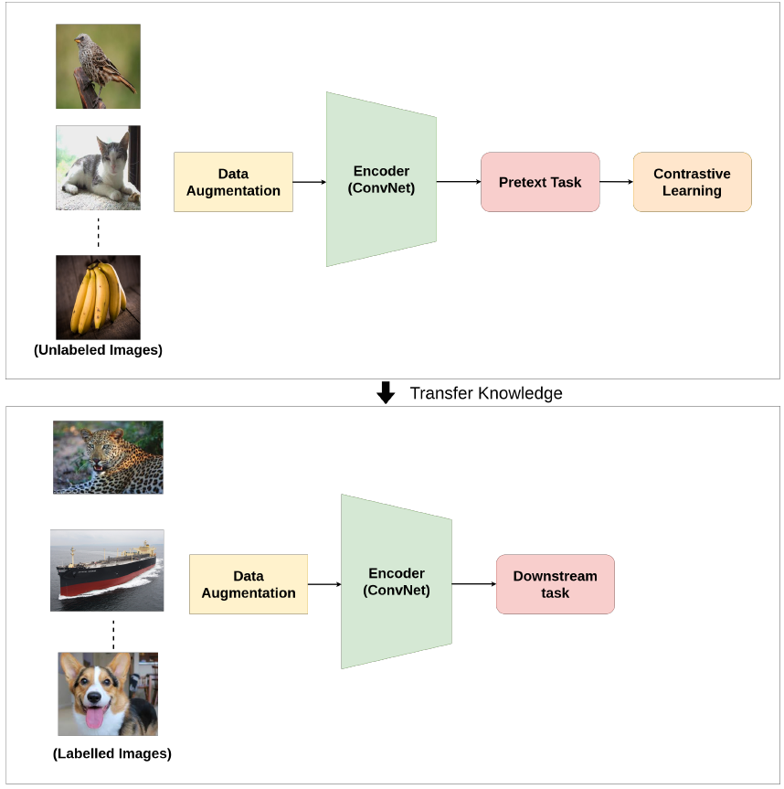

### 可视化

- [ ] [Unsupervised Representation Learning by Predicting Image Rotations](https://arxiv.org/abs/1803.07728)[:page_facing_up:](C:\Users\smart-dsp\Zotero\storage\2NNNUBF3\Gidaris 等。 - 2018 - Unsupervised Representation Learning by Predicting.pdf)

:wavy_dash::wavy_dash::wavy_dash::wavy_dash::wavy_dash::wavy_dash::wavy_dash::wavy_dash::wavy_dash::wavy_dash::wavy_dash::wavy_dash::wavy_dash::wavy_dash::wavy_dash::wavy_dash::wavy_dash::wavy_dash::wavy_dash::wavy_dash::wavy_dash::wavy_dash::wavy_dash::wavy_dash::wavy_dash::wavy_dash::wavy_dash::wavy_dash::wavy_dash::wavy_dash::wavy_dash::wavy_dash::wavy_dash::wavy_dash::wavy_dash::wavy_dash::wavy_dash::wavy_dash::wavy_dash::wavy_dash:

- [ ] [What makes for good views for contrastive learning](https://arxiv.org/abs/2005.10243)[:page_facing_up:](C:\Users\smart-dsp\Zotero\storage\B4LLVCNB\Tian 等。 - 2020 - What Makes for Good Views for Contrastive Learning.pdf)

  > InfoMin NIPS2020 
  >
  > **提出InfoMin假设，探究对比学习有效的原因**

- [x] [Bootstrap your own latent: A new approach to self-supervised Learning](https://arxiv.org/abs/2006.07733)[:page_facing_up:](C:\Users\smart-dsp\Zotero\storage\YR2FWYCJ\Grill 等。 - 2020 - Bootstrap your own latent A new approach to self-.pdf)

  > **BYOL **NIPS2020
  >
  > BYOL依赖于两个神经网络，即online和target网络，它们相互作用并相互学习
  >
  > 训练在线网络预测同一图像在不同增强视图下的目标网络表示
  >
  > 用online network滑动平均更新target network
  >
  > 不依赖负样本

- 核心动机

  从一个给定的表征，即目标表征，我们可以通过预测目标表征来训练一个新的、潜在增强的表征，即在线表征。从那里，我们可以期望通过迭代这个过程来构建一系列质量不断提高的表示，使用后续的在线网络作为进一步培训的新目标网络。在实践中，BYOL通过迭代细化其表示来推广这种自举过程，但使用在线网络的缓慢移动指数平均值作为目标网络，而不是固定的检查点。

- method

  > target network 和 online network具有相同的架构，但使用不同的权重集

  - 数据增强与$SimCLR$一致

  - 网络架构

    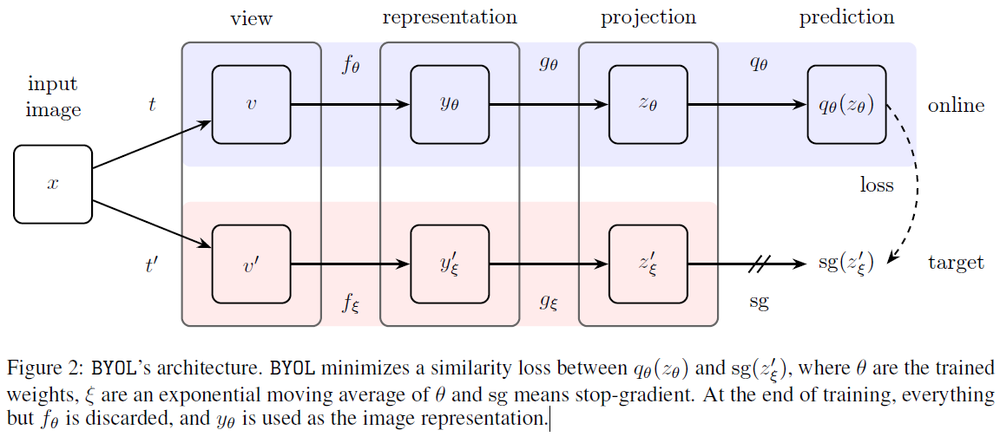

    - encoder $f_\theta$，projector $g_\theta$，predictor $q_\theta$(仅用于online网络)

    - 步骤

      1. 将样本进行两个不同的数据增强$t,t'$，生成两个不同的视图$v,v'$

      2. 通过两个网络，生成各自的$representation$、$projection$

      3. 在online network中$projection$会通过$prediction$网络去拟合$target\ network$的输出，并建立loss函数

         1. 对$online\ network中的prediction$的输出$q_\theta(z_\theta)$进行归一化，对$target\ network中projection的输出z'_\xi$进行归一化

            

            

         2. 建立预测的损失函数

            

         3. 为了使结构对称，将两个生成的视图交换输入网络生成，对称的$ \widetilde{ \mathcal{L_{\theta,\xi} }}$,二者结合为网络的$Loss\ function$

            

      4. 更新参数时，只更新$online \ network$的参数$\theta$，$target\ network$的参数$\xi$由$online \ network$进行更新

         

         - $\tau_{base}=0.996$
         - $\tau=1-(1-\tau_{base})\cdot(cos(\pi k/K)+1)/2 $
           - k是当前的训练轮数
           - K是总的训练轮数

         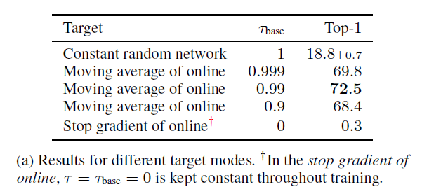

    - 算法流程

      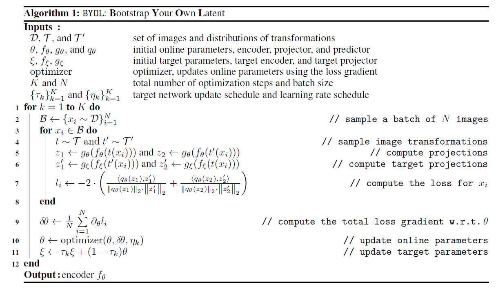

- [ ] [Exploring Simple Siamese Representation Learning](https://arxiv.org/abs/2011.10566)[:page_facing_up:](C:\Users\smart-dsp\Zotero\storage\VRK65ZKV\Chen 和 He - 2020 - Exploring Simple Siamese Representation Learning.pdf)

  > **SimSiam** 孪生网络

- [ ] [Prototypical Contrastive Learning of Unsupervised Representations](https://arxiv.org/abs/2005.04966)[:page_facing_up:](C:\Users\smart-dsp\Zotero\storage\TYAY5XMZ\Li 等。 - 2021 - Prototypical Contrastive Learning of Unsupervised .pdf)

  > **PCL** ICLR2021
  >
  > **图像领域，提出原型对比学习，效果远超MoCo和SimCLR**

- [ ] [Exploring Balanced Feature Spaces for Representation Learning](https://openreview.net/forum?id=OqtLIabPTit)[:page_facing_up:](C:\Users\smart-dsp\Zotero\storage\VWQQILPH\Kang 等。 - 2020 - Exploring Balanced Feature Spaces for Representati.pdf)

  > **BalFeat** ICLR2021
  >
  > **图像领域，提出k-positive对比学习，主要解决类别分布不均匀的问题**

- [ ] [MiCE: Mixture of Contrastive Experts for Unsupervised Image Clustering](https://arxiv.org/abs/2105.01899)[:page_facing_up:](C:\Users\smart-dsp\Zotero\storage\PN37Q2YT\Tsai 等。 - 2021 - MiCE Mixture of Contrastive Experts for Unsupervi.pdf)

  > ICLR2021
  >
  > **图像领域，对比学习结合混合专家模型MoE，无需正则化**

- [ ] [i-Mix: A Strategy for Regularizing Contrastive Representation Learning](https://arxiv.org/abs/2010.08887)[:page_facing_up:](C:\Users\smart-dsp\Zotero\storage\GBHUVKGW\Lee 等。 - 2021 - i-Mix A Domain-Agnostic Strategy for Contrastive .pdf)

  > **ICLR2021**
  >
  > **图像领域，少样本+MixUp策略来提升对比学习效果**

- [ ] [Contrastive Learning with Hard Negative Samples](https://arxiv.org/abs/2010.04592)[:page_facing_up:](C:\Users\smart-dsp\Zotero\storage\EP5NXBDB\Robinson 等。 - 2020 - Contrastive Learning with Hard Negative Samples.pdf)

  > ICLR2021
  >
  > **图像&文本领域，研究如何采样优质的难负样本**

- [ ] [What Should Not Be Contrastive in Contrastive Learning](https://arxiv.org/abs/2008.05659)[:page_facing_up:](C:\Users\smart-dsp\Zotero\storage\HVWLDVND\Xiao 等。 - 2021 - What Should Not Be Contrastive in Contrastive Lear.pdf)

  > **LooC** ICLR2021
  >
  > **图像领域，探讨对比学习可能会引入偏差**

- [ ] [Pre-training Text-to-Text Transformers for Concept-centric Common Sense](https://openreview.net/forum?id=3k20LAiHYL2)[:page_facing_up:](C:\Users\smart-dsp\Zotero\storage\Z77BX2YV\Zhou 等。 - 2020 - Pre-training Text-to-Text Transformers for Concept.pdf)

  > **CALM** ICLR2021
  >
  > **文本领域，利用对比学习和自监督损失，在预训练语言模型中引入常识信息**

- [ ] [Support-set bottlenecks for video-text representation learning](https://arxiv.org/abs/2010.02824)[:page_facing_up:](C:\Users\smart-dsp\Zotero\storage\F5EIBTMZ\Patrick 等。 - 2021 - Support-set bottlenecks for video-text representat.pdf)

  > ICLR2021
  >
  > **多模态领域（文本+视频），提出了cross-captioning目标**

- [ ] [Self-paced Contrastive Learning with Hybrid Memory for Domain Adaptive Object Re-ID](https://arxiv.org/abs/2006.02713)[:page_facing_up:](C:\Users\smart-dsp\Zotero\storage\5MHTZZLL\Ge 等。 - 2020 - Self-paced Contrastive Learning with Hybrid Memory.pdf)

  > **SpCL** NIPS2020
  >
  > **目标重识别，提出自步对比学习，在无监督目标重识别任务上显著地超越最先进模型高达16.7%**

- [ ] [Hard Negative Mixing for Contrastive Learning](https://arxiv.org/abs/2010.01028)[:page_facing_up:](C:\Users\smart-dsp\Zotero\storage\J3LFCR8Q\Kalantidis 等。 - 2020 - Hard Negative Mixing for Contrastive Learning.pdf)

  > NIPS2020
  >
  > **图像和文本领域，通过在特征空间进行 Mixup 的方式产生更难的负样本**

- [x] [Supervised Contrastive Learning](https://arxiv.org/abs/2004.11362)[:page_facing_up:](C:\Users\smart-dsp\Zotero\storage\DWZD7T8T\Khosla 等。 - 2021 - Supervised Contrastive Learning.pdf)[:computer:](https://github.com/HobbitLong/SupContrast)

  > NIPS2020
  >
  > **提出了监督对比损失**

- 监督对比：将同一类的样本都当作正样本，其余类的当作负样本

  - > 自监督对比：把自己和增强后的样本当作正样本，其余的当作负样本

  - 使同一类的样本特征更接近

- method

  1. 进行两次数据增强，获得两个副本

  2. 两个副本通过encoder，获得2048维的normalized embedding $r$

     - $r = Enc(\cdot)$ 位于2048维的单位超球体上的向量

  3. 通过projection network $Proj(\cdot)$，投影到对比损失的特征空间

     - 一个单层线性层 $2048\times 128$
     - 规范输出到一个单位超球体上
     - 推理时不用

  4. 计算 **监督对比损失**

     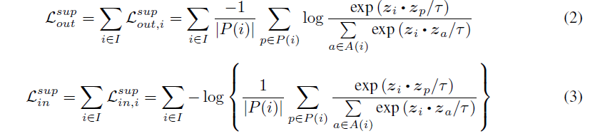

     - 其中$P(i)=\{p\in A(i):\widetilde{y}_p=\widetilde{y}_i\} \ \ A{(i)}\equiv I \}$ 是包含了所有正样本的multiviewed batch（增扩后的）

     - out指 $\sum$在log外面，in指在 $\sum$里面

       - > ### $L_{out}^{sup}$效果更好

     - 分子指的是anchor和所有的正样本（增扩后同一类的样本）

     - 分母上对于除anchor外的所有样本（正负）都进行计算

     - 基于正样本的大小做了规范化

  5. 使用交叉熵，冻结backbone，训练分类头

- Train

  - 预训练
    - ResNet-200 700轮
    - ResNet-50 200轮
  - fine-tuning
    - 冻结backbone
    - 10 epoch
  - batchsize
    - 2048
  - temperature
    - 0.1
    - 与梯度呈反比，用于放缩梯度

- 性能

  - 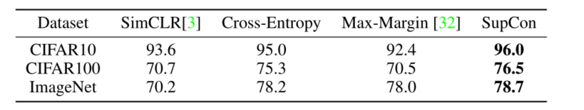

  

- [ ] [Contrastive Learning with Adversarial Examples](https://arxiv.org/abs/2010.12050)[:page_facing_up:](C:\Users\smart-dsp\Zotero\storage\SY4U927A\Ho 和 Vasconcelos - 2020 - Contrastive Learning with Adversarial Examples.pdf)

  > NIPS2020
  >
  > **对抗样本+对比学习**

- [ ] [LoCo: Local Contrastive Representation Learning](https://arxiv.org/abs/2008.01342)[:page_facing_up:](C:\Users\smart-dsp\Zotero\storage\YVGP44F4\Xiong 等。 - 2020 - LoCo Local Contrastive Representation Learning.pdf)

  > **LoCo** NIPS2020
  >
  > **利用对比学习对网络进行各层训练**

- [ ] [Graph Contrastive Learning with Augmentations](https://arxiv.org/abs/2010.13902)[:page_facing_up:](C:\Users\smart-dsp\Zotero\storage\8HDCCKAC\You 等。 - 2020 - Graph Contrastive Learning with Augmentations.pdf)

  > **GraphCL** NIPS2020
  >
  > **图+对比学习**

- [ ] [ContraGAN: Contrastive Learning for Conditional Image Generation](https://arxiv.org/abs/2006.12681)[:page_facing_up:](C:\Users\smart-dsp\Zotero\storage\K2K6ANZI\Kang 和 Park - 2021 - ContraGAN Contrastive Learning for Conditional Im.pdf)

  > **ContraGAN** NIPS2020
  >
  > **条件图像生成领域**

- [ ] [SynCLR: A Synthesis Framework for Contrastive Learning of out-of-domain Speech Representations](https://openreview.net/forum?id=S-sYYe0P0Hd)[:page_facing_up:](C:\Users\smart-dsp\Zotero\storage\BP5DVSQV\Huang 等。 - 2021 - SynCLR A Synthesis Framework for Contrastive Lear.pdf)

  > ICLR 2021

- [ ] [How Does SimSiam Avoid Collapse Without Negative Samples? Towards a Unified Understanding of Progress in SSL](https://openreview.net/forum?id=bwq6O4Cwdl)[:page_facing_up:](C:\Users\smart-dsp\Zotero\storage\YG3DXHR9\Zhang 等。 - 2021 - How Does SimSiam Avoid Collapse Without Negative S.pdf)

  > ICLR 2021

