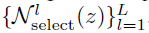
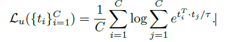

# 对比学习

> 综述1:[:page_facing_up:](C:\Users\smart-dsp\Zotero\storage\AJ5NTHEI\Jaiswal 等。 - 2021 - A Survey on Contrastive Self-Supervised Learning.pdf) –2021

- 理解
  尽管对比学习的概念适用于任何领域，但学习表征的质量取决于特定领域的归纳偏差：由于锚和正样本来自同一数据实例，数据增强引入了语义上有意义的方差，以便更好地概括。
  - 归纳偏差：（策略：奥卡姆剃刀），对于一些数据，加入一定的约束，使其倾向于选择某一些模型。
    - 起到模型选择的作用

- 可探寻的问题：

  - 应对不同任务，数据集的自动增强方式

- 目的：aims at grouping similar samples closer and diverse samples far from each other

- 相似度：度量两个embeddings的距离

- 步骤
  - 采样得到一个样本，使用数据增强，获得该样本的增广版本
  - 将原始样本的增广版本视为正样本，将其余样本视为负样本
  - 使用一些pretext task，对模型进行训练，学习区分正负样本

### Pretext Tasks

- 定义：Pretext Task 是使用伪标签来学习数据特征表示的自监督学习的策略
  - pseudolabels：抽象意义的标签，根据数据中发现的属性自动生成。

- 在对比学习中，原始图像作为锚点，其增强(变换)后的图像作为正样本，批处理或训练数据中剩余的图像作为负样本。

#### 		图像增强策略

- Color Transformation

- Geometric Transformation（几何变换）

- Context-Base

  - Jigsaw Puzzle（拼图）
    - 通过训练编码器来识别图像中被打乱的patch的正确位置。对比学习中以原始图像为锚点，对原始图像中的patch进行置乱后形成的增强图像作为正样本。将数据集/批处理中的其余图像视为负样本

  - Frame Order Based（帧顺序）
    - 一个图像帧序列打乱顺序的视频作为正样本，而批处理/数据集中的所有其他视频都是负样本。
    - 一个较长的视频中随机取样两个相同长度的视频片段，或对每个视频片段应用空间扩展。目标是使用对比损耗来训练模型，使来自同一视频的剪辑被安排得更近，而来自不同视频的剪辑在嵌入空间中被推离。

  - Future Prediction
  - View Prediction
    - 适用于具有同一场景的多个视图的数据
  - Identifying the Right Pre-Text Task

- Pre-Test Task in NLP

  -  Center and NeighborWord Prediction
  - Next and Neighbor Sentence Prediction
  - Autoregressive Language Modeling
  - Sentence Permutation

### 结构

> 访问负样本可以被视为字典查找任务，其中字典有时是整个训练集，或者是数据集的某个子集。

- end-to-end

  - 代表
    - [ SimCLR）](https://arxiv.org/abs/2002.05709v3)[:page_facing_up:](C:\Users\smart-dsp\Zotero\storage\PGZU9HX5\Chen 等。 - 2020 - A Simple Framework for Contrastive Learning of Vis.pdf)

  

  - 网络
    - 两个编码器，Query encoder ，Key encoder 
    - Query encoder：在原始样本上进行训练
    - Key encoder：在数据增强后的正样本和负样本一起训练
    - 将两个编码器生成的features q 和 k 计算相似度矩阵（cosine similarity（内积））
  - 思想
    - 生成同一样本的不同表示，使用对比损失，使正样本更接近，使负样本原离原始样本。
  - 正负样本划分
    - 原始数据和其数据增强为正样本，其余数据视为负样本
  - 特点
    - 大批量的数据,更长的训练周期效果更好
  - 问题
    - 负样本特征会在每个批次积累，需要强大的运算资源
    - 对于较大的小批量优化问题，需要有效的优化策略

- [x]  [ Chen, T.; Kornblith, S.; Norouzi, M.; Hinton, G. A Simple Framework for Contrastive Learning of Visual Representations. arXiv2020, arXiv:2002.05709.](https://arxiv.org/abs/2002.05709v3)[:page_facing_up:](C:\Users\smart-dsp\Zotero\storage\PGZU9HX5\Chen 等。 - 2020 - A Simple Framework for Contrastive Learning of Vis.pdf)
  
  > SimCLR
  
- SimCLR有效的原因

  - 数据增益非常重要

  - 在表征和对比损失之间引入可学习的非线性变换，能显著提高学习表征的质量

  - 归一化embeddings 和 合适的温度参数

  - 与监督学习相比，对比学习网络更深，训练时间更长，效果更好

- key idea：通过在latent space中 **最大化**  **相同数据的不同增强版本（正样本）之间的一致性**来进行学习表示

- 框架

  

  - 数据增强：经过两次数据增强，产生一对正样本对
    - 随机裁剪，随机颜色变换，随机高斯模糊
    - 随机裁剪和颜色变换更为重要
    - - [ ] :question: 对同个来源的两个数据同时随机裁剪，但只对其中一个数据进行其他数据增扩，性能不好

  - Encoder $f(\cdot)$：用于提取特征，
    - 正样本对的两个编码器使用相同架构，不共享参数
    - $h_i$为下游任务使用的特征，为一个average pooling layer的输出
    - ResNet
    - 增加深度和宽度都可以增强性能

  - projection head $g(\cdot)$：一个非线性变换将特征投影到另一个空间,获得特征向量$z$，

    - 在$z$上进行对比损失的计算
    - $z_i=g(h_i)=W^{(2)}\sigma(W^{(1)}h_i),\sigma 是 RELU$

  - contrastive loss function：对比预测任务

    - 给定一个正样本对$\widetilde{x_i},\widetilde{x_j}$,给定$\widetilde{x_i}$，在$\{\widetilde{x_k}\}_{k \ne i}$中找到$\widetilde{x_j}$

  - 相似度函数

    - $sim(u,v)=u^Tv/\|u\| \|v\|$     (cosine similarity)

  - Loss function

    - 

    - 正例子的损失函数

      

      - $i,j$为正样本对
      - $1$为指示函数，$k\ne i$的时候为1，其余为0
      - $\tau$为温度系数
      - 分母上有2N-1项
      - 余弦相似度对其进行了$l2\ normalized$，使其约束到一个归一化的超球体上

  - 正负样本选择

    - 正样本：原始数据增扩后，互为正样本
    - 负样本：其余的2（N-1）个为负样本

- 算法流程

  

- 训练设置

  - 使用随机裁剪、颜色变换、高斯模糊进行数据增扩
  - 使用ResNet-50作为编码器
  - 使用2层MLP作为projection head，投影到128维向量空间
  - batch_size:4096,epochs:100
  - optimized：LARS
  - learning rate：4.8（=0.3 x batch_size/256）

- [x] [Big Self-Supervised Models are Strong Semi-Supervised Learners](https://arxiv.org/abs/2006.10029)[:page_facing_up:](C:\Users\smart-dsp\Zotero\storage\64CJDR4P\Chen 等。 - 2020 - Big Self-Supervised Models are Strong Semi-Supervi.pdf)

  > SimCLR v2 NIPS2020
  >
  > 知识蒸馏

- 解决的问题：充分利用大量未标签的数据和少量标签数据学习网络

- 

- key idea: 

  - 在pretraining和fine-tuning的时候要用宽而深的网络
    - 标签越少越好
  - 大的微调网络（teacher network）可以蒸馏成一个更小的网络（student network）
    - 使用无标签的数据让student network去模拟teacher network的预测输出

- 在使用task-specific的fine-tuning之后，大网络能进一步提升。第二次使用无标签的数据通过大网络，可以蒸馏出一个更小但精度不会损失很多的小网络

- :flags: ***自监督学习的三步***：

  - 自/无监督预训练
    - task-agnostic（任务无关）
    - 使用无标签的数据
    - 学习一般的表征
  - 有监督的fine-tuning
    - task-specific（任务相关）
    - 少量有标签的样本
    - 提高预测性能，获得紧凑的模型
  - 蒸馏小模型
    - 使用无标签的样本对fine-tuning后的网络（具有task-specific的知识）进行提炼
    - 利用微调教室网络中的未标记数据和输入标签来训练学生网络

- Method

  

  - Self-supervised pretraining with SimCLRv2（相较于SimCLR的提升）
    - 使用更大的网络
      - ResNet-50 —> ResNet-152 with (3x wider channels + SK（selective kernels)）一种通道注意力机制
      - top-1 涨点29%
    - 使用更深的non-linear network $g(\cdot)$(projection head),并参与fine-tuning
      - 2 layers —> 3 layers
      - 并从第一层开始fine-tuning（不再是丢弃整个$g(\cdot)$）
      - 4 layers 表现的比3 layers 好
    - 使用MOCO的记忆机制
      - [x] 待学习
  
  - fine-tuning
    - 将$g(\cdot)$的第一层合并到encoder中，参与fine-tuning
  
  - 蒸馏（distillation）
  
    - 采用无标签的数据
  
    - 使用fine-tuning后的网络作为教师网络为训练学生网络 *估算标签*
  
    - 蒸馏loss函数使用的是cross entropy的形式
  
      
  
      P类似与softmax的输出
  
      
  
      教师网络$P^T$在蒸馏过程中不变，优化$P^S$
  
      当使用带有标签的数据进行训练时，可以把交叉熵和蒸馏loss加权
  
      
  
    - 学生网络不带$g(\cdot)$，直接进行监督分类
    - 自蒸馏（t=0.1）
    - 大到小蒸馏（t=1.0）

- [ ] [Lorre, G.; Rabarisoa, J.; Orcesi, A.; Ainouz, S.; Canu, S. Temporal Contrastive Pretraining for Video Action Recognition. In Proceedings of the IEEEWinter Conference on Applications of Computer Vision, Snowmass Village, CO, USA, 1–5 March 2020;
  pp. 662–670.](https://openaccess.thecvf.com/content_WACV_2020/html/LORRE_Temporal_Contrastive_Pretraining_for_Video_Action_Recognition_WACV_2020_paper.html)[:page_facing_up:](C:\Users\smart-dsp\Zotero\storage\CNLX8FIQ\Lorre 等。 - 2020 - Temporal Contrastive Pretraining for Video Action .pdf)

> Hjelm, R.D.; Fedorov, A.; Lavoie-Marchildon, S.; Grewal, K.; Bachman, P.; Trischler, A.; Bengio, Y. Learning deep representations by mutual information estimation and maximization. arXiv 2018, arXiv:1808.06670.
>
> Ye, M.; Zhang, X.; Yuen, P.C.; Chang, S.F. Unsupervised Embedding Learning via Invariant and Spreading Instance Feature. arXiv 2019, arXiv:1904.03436.
>
> Bachman, P.; Hjelm, R.D.; Buchwalter, W. Learning representations by maximizing mutual information across views. In Advances in Neural Information Processing Systems; Vancouver, Canada, 8–14 December 2019; pp. 15535–15545.
>
> Henaff, O. Data-efficient image recognition with contrastive predictive coding. In Proceedings of the International Conference on Machine Learning, Vienna, Austria, 12–18 July 2020; pp. 4182–4192.
>
> Khosla, P.; Teterwak, P.; Wang, C.; Sarna, A.; Tian, Y.; Isola, P.; Maschinot, A.; Liu, C.; Krishnan, D. Supervised Contrastive
> Learning. arXiv 2020, arXiv:2004.11362

- Using a Memory Bank

  - 维护一个字典Memory Bank，通过替换负样本的特征，来解决训练批次变大的问题

    

  - 问题
    - 维护复杂

- [ ] [Misra, I.; Maaten, L.V.D. Self-supervised learning of pretext-invariant representations. In Proceedings of the IEEE/CVF Conference on Computer Vision and Pattern Recognition, Seattle, WA, USA, 14–19 June 2020; pp. 6707–6717.](https://openaccess.thecvf.com/content_CVPR_2020/html/Misra_Self-Supervised_Learning_of_Pretext-Invariant_Representations_CVPR_2020_paper.html)[:page_facing_up:](C:\Users\smart-dsp\Zotero\storage\BCK374Z5\Misra 和 Maaten - 2020 - Self-Supervised Learning of Pretext-Invariant Repr.pdf)

  > PIRL

- Using a Momentum Encoder for Contrastive Learning

  

  - 使用动量编码器替代Memory Bank，动量编码器生成一个队列，让新的keys入列，并让旧的keys出列。

  - Momentum encoder与encoder（Q）共享参数

  - 参数动量更新

    

  - 优势
    - 它不需要训练两个单独的模型。此外，不需要维护计算和内存效率低下的内存库。 

- [x] [He, K.; Fan, H.; Wu, Y.; Xie, S.; Girshick, R. Momentum contrast for unsupervised visual representation learning. In roceedings
  of the IEEE/CVF Conference on Computer Vision and Pattern Recognition, Seattle, WA, USA, 13–19 June 2020; pp. 9729–9738.](https://openaccess.thecvf.com/content_CVPR_2020/html/He_Momentum_Contrast_for_Unsupervised_Visual_Representation_Learning_CVPR_2020_paper.html)[:page_facing_up:](C:\Users\smart-dsp\Zotero\storage\ZEK9ZKGX\He 等。 - 2020 - Momentum Contrast for Unsupervised Visual Represen.pdf)

  > MOCO

- Method

  > 将对比学习的任务，看作训练编码器完成字典查找任务的过程

  

  - key 是从一组数据 通过编码器 *动态* 表示的 特征，

    - 字典被构建为一个队列，当前批进入队列，最老的一批退出队列

    - key encoder是一个动量更新（平滑）的编码器，由query encoder的参数来动量更新，整个网络只有$\theta_q$在反向传播更新

      > 为了防止key 编码器变化过快导致key表征的不一致性

      

      - m较大时，表现较好

    - 字典大小与batchsize 大

  - query 是 样本$x^q$ 的 特征表示，通过与所有的key计算相似度，应与对应的 key 相似

  - k、q两个编码器结构一致

  - 学习被定义为减少对比损失（InfoNCE）

    

- 代码流程

  

  - positive 是默认放到了第一个位置。

- [x] [Improved Baselines with Momentum Contrastive Learning](https://arxiv.org/abs/2003.04297)[:page_facing_up:](C:\Users\smart-dsp\Zotero\storage\W2LTIZTM\Chen 等。 - 2020 - Improved Baselines with Momentum Contrastive Learn.pdf)

  > MOCO v2

  增加MLP、更强的aug、大epoch都能够大幅度的提升MoCo的精度

- [ ] [An Empirical Study of Training Self-Supervised Vision Transformers](https://openaccess.thecvf.com/content/ICCV2021/html/Chen_An_Empirical_Study_of_Training_Self-Supervised_Vision_Transformers_ICCV_2021_paper.html)[:page_facing_up:](C:\Users\smart-dsp\Zotero\storage\HHFN7AN9\Chen 等。 - 2021 - An Empirical Study of Training Self-Supervised Vis.pdf)

  > MOCO v3
  >
  > Transformer 引入对比学习中

- Clustering Feature Representations

  

  - 不是使用基于实例的对比方法，而是使用 **聚类算法** 将相似的特征组合在一起
  - 在前面的方法中，每个样本都被视为数据集中的一个离散类。 当处理来此同一个类的样本对时，迫使模型分开两个相似的样本对。
    - 在这个方法是用聚类解决的

- [ ] [Caron, M.; Misra, I.; Mairal, J.; Goyal, P.; Bojanowski, P.; Joulin, A. Unsupervised Learning of Visual Features by Contrasting Cluster Assignments. arXiv 2020, arXiv:2006.09882.](https://proceedings.neurips.cc/paper/2020/hash/70feb62b69f16e0238f741fab228fec2-Abstract.html)[:page_facing_up:](D:\Chu\论文整理\unsupervised learning\NeurIPS-2020-unsupervised-learning-of-visual-features-by-contrasting-cluster-assignments-Paper.pdf)

  > SwAV
  >
  > 不需要大的memory bank或者动量网络，内存利用率高
  >
  > 在线计算code，允许对比不同的图像视图，而不依赖于显式的成对特征比较。
  >
  > 从另一个视图的表示中预测一个视图的代码。我们通过在同一图像的多个视图（SwAV）之间交换指定来学习特征。这些特性和代码是在线学习的，允许我们的方法扩展到可能无限量的数据。

- tricks

  - 裁剪形成多个较小尺寸的图像来增加视图，

- key point：一种通过比较多个图像视图的聚类分配而不是特征来对比多个图像视图的方法。

  - 从图像的增强版本计算code，并从同一图像的其他增强版本预测之前计算的code。

- [ ] :question:“CODE”

- 对数据的不同增强之间，强行聚类

  

- 让一对样本彼此接近的同时，让相似类别的实例对的特征彼此也更接近

### Encoder

- 负责将输入样本映射到潜在空间 

- 一般使用resnet50，上采样和下采样两种结构，并将其中某个特定层的输出合并为特征向量供下游任务使用
- [ ] Misra, I.; Maaten, L.V.D. Self-supervised learning of pretext-invariant representations. In Proceedings of the IEEE/CVF Conference on Computer Vision and Pattern Recognition, Seattle, WA, USA, 14–19 June 2020; pp. 6707–6717.

- 将res5的特征输出平均池化，获得2048维特征，使用线性层，投影到128维，作为下游使用的特征向量
- 编码器后级提取的特征比较前级的特征更能表示样本

### Train

- 中心思想：bring similar instances closer and push away dissimilar instances far from each other

- 相似度度量函数

  - 余弦相似度

    

- Loss：

  - 使用Noise Contrastive Estimation (NCE)来对比两个embedding

    

    $q$是原始样本，$k_+$是正样本，$k_{-}$是负样本，$\tau$是温度参数（超参），

  - 如果**负样本更多** :question: ，采用变体$L_{infoNCE}$

​				$k_i$是负样本

### 任务迁移

- 下游任务
  - classification, detection,segmentation（分割）, future prediction

### 可视化

- [ ] [Unsupervised Representation Learning by Predicting Image Rotations](https://arxiv.org/abs/1803.07728)[:page_facing_up:](C:\Users\smart-dsp\Zotero\storage\2NNNUBF3\Gidaris 等。 - 2018 - Unsupervised Representation Learning by Predicting.pdf)

:wavy_dash::wavy_dash::wavy_dash::wavy_dash::wavy_dash::wavy_dash::wavy_dash::wavy_dash::wavy_dash::wavy_dash::wavy_dash::wavy_dash::wavy_dash::wavy_dash::wavy_dash::wavy_dash::wavy_dash::wavy_dash::wavy_dash::wavy_dash::wavy_dash::wavy_dash::wavy_dash::wavy_dash::wavy_dash::wavy_dash::wavy_dash::wavy_dash::wavy_dash::wavy_dash::wavy_dash::wavy_dash::wavy_dash::wavy_dash::wavy_dash::wavy_dash::wavy_dash::wavy_dash::wavy_dash::wavy_dash:

- [x] [What makes for good views for contrastive learning](https://arxiv.org/abs/2005.10243)[:page_facing_up:](C:\Users\smart-dsp\Zotero\storage\B4LLVCNB\Tian 等。 - 2020 - What Makes for Good Views for Contrastive Learning.pdf)

  > InfoMin NIPS2020 
  >
  > **提出InfoMin假设，探究对比学习有效的原因**
  >
  > 应该减少观点(不同视图)之间的互信息，同时保持任务相关信息的完整性。

- 提出问题：在多视图中，我们应该对那些条件保持不变？

  - 视图的最佳选择在很大程度上取决于下游任务
  - 对于许多生成视图的常见方法，在下游性能方面存在一个最佳点，即视图之间的互信息（MI）既不太高也不太低。

- InfoMin Principle：一组好的视图是在保证下游任务的性能的前提下，拥有最少互信息的视图。

- 衡量编码器是否足够

  - 对同一输入的两个视图$v_1,v_2$中的一个视图$v_1$，使用编码器$f$，获得的特征$z_1$与$v_2$的互信息等于$v_1,v_2$的互信息，代表编码器对于两个视图之间的不变性是无损过滤的
    $$
    I(v_1,v_2)=I(f_1(v_1),v_2)=I(v1,f_2(v_2))
    $$

- 优化分类任务的特征表示指的是：在一个输入$x$预测输出$y$的任务中，其中的优化目标便是$x$经过编码器的特征$z$，使其变为关于$y$的最小充分统计量

- 视图间互信息量和任务所需信息量的关系

  

  - a：将$x$分为两个视图，并作为正样本对，经过两个encoder，输出特征
  - b：$I(x;y)$为任务所需的互信息量，左边为欠信息，导致任务可能不能很好完成；右边为过信息（过度噪声），会影响泛化
  - c：b中的性能示意图，只有在两个视图间找到恰当的信息量，才能让整个系统工作更好

  - [ ] :question:如何找到合适的折衷点，阅读information bottleneck相关论文

- [ ] [Visual Representations: Defining Properties and Deep Approximations](https://arxiv.org/abs/1411.7676)[:page_facing_up:](C:\Users\smart-dsp\Zotero\storage\FM6T3GJB\Soatto 和 Chiuso - 2016 - Visual Representations Defining Properties and De.pdf)

> ICLR, 2016.
>
> 表征学习

- 提出的问题？

  - 如何衡量一种表现有多有用?它的设计应该遵循哪些准则或原则？有没有最佳表示法？

- 视觉表示是根据视觉数据的最小充分统计信息来定义的，对于一类任务来说，视觉数据的可变性也是不变的

  - 最小充分性保证了我们可以以最小的复杂性存储一个表示形式来代替原始数据，并且不会对手头的任务造成性能损失。
  - 不变性保证了统计对于数据的非信息性变换是恒定的。
  - 最小充分统计量，对于干扰因素不变

- 充分统计量

  - 设$x=(x_1,...,x_n)$是来自分布函数$F(x|\theta)$的一个样本，$T=T(x)$是统计量，假如在给定$T(x)=t$的条件下，$x$的条件分布与$\theta$无关的话，则称统计量$T$为$\theta$的充分统计量
    - 可以直接计算条件分布，若相除结果没有参数$\theta$，则表明这个统计量已经把$\theta$完全表达了，用已知把随机性给“去除“了。
    - 因子分解定理

- [x] [Bootstrap your own latent: A new approach to self-supervised Learning](https://arxiv.org/abs/2006.07733)[:page_facing_up:](C:\Users\smart-dsp\Zotero\storage\YR2FWYCJ\Grill 等。 - 2020 - Bootstrap your own latent A new approach to self-.pdf)

  > **BYOL **NIPS2020
  >
  > BYOL依赖于两个神经网络，即online和target网络，它们相互作用并相互学习
  >
  > 训练在线网络预测同一图像在不同增强视图下的目标网络表示
  >
  > 用online network滑动平均更新target network
  >
  > 不依赖负样本

- 核心动机

  从一个给定的表征，即目标表征，我们可以通过预测目标表征来训练一个新的、潜在增强的表征，即在线表征。从那里，我们可以期望通过迭代这个过程来构建一系列质量不断提高的表示，使用后续的在线网络作为进一步培训的新目标网络。在实践中，BYOL通过迭代细化其表示来推广这种自举过程，但使用在线网络的缓慢移动指数平均值作为目标网络，而不是固定的检查点。

- method

  > target network 和 online network具有相同的架构，但使用不同的权重集

  - 数据增强与$SimCLR$一致

  - 网络架构

    

    - encoder $f_\theta$，projector $g_\theta$，predictor $q_\theta$(仅用于online网络)

    - 步骤

      1. 将样本进行两个不同的数据增强$t,t'$，生成两个不同的视图$v,v'$

      2. 通过两个网络，生成各自的$representation$、$projection$

      3. 在online network中$projection$会通过$prediction$网络去拟合$target\ network$的输出，并建立loss函数

         1. 对$online\ network中的prediction$的输出$q_\theta(z_\theta)$进行归一化，对$target\ network中projection的输出z'_\xi$进行归一化

            

            

         2. 建立预测的损失函数

            

         3. 为了使结构对称，将两个生成的视图交换输入网络生成，对称的$ \widetilde{ \mathcal{L_{\theta,\xi} }}$,二者结合为网络的$Loss\ function$

            

      4. 更新参数时，只更新$online \ network$的参数$\theta$，$target\ network$的参数$\xi$由$online \ network$进行更新

         

         - $\tau_{base}=0.996$
         - $\tau=1-(1-\tau_{base})\cdot(cos(\pi k/K)+1)/2 $
           - k是当前的训练轮数
           - K是总的训练轮数

         

    - 算法流程

      

- [x] [Exploring Simple Siamese Representation Learning](https://arxiv.org/abs/2011.10566)[:page_facing_up:](C:\Users\smart-dsp\Zotero\storage\VRK65ZKV\Chen 和 He - 2020 - Exploring Simple Siamese Representation Learning.pdf)

  > **SimSiam** 孪生网络

- 不需要负样本对，大的batch，动量编码器

- 

  - 一个输入的两个增强视图，输入两个编码器，其中一个编码器$f_1$再通过一个投影层$h$与第二个编码器$f_2$的输出进行相似度对比。
  - 两个编码器共享参数，第二个编码器不参与梯度回传

- 算法

  

  - 距离使用余弦相似度

- 四种siamese方法比较

  

- [x] [Prototypical Contrastive Learning of Unsupervised Representations](https://arxiv.org/abs/2005.04966)[:page_facing_up:](C:\Users\smart-dsp\Zotero\storage\TYAY5XMZ\Li 等。 - 2021 - Prototypical Contrastive Learning of Unsupervised .pdf)

  > **PCL** ICLR2021
  >
  > **图像领域，提出原型对比学习，效果远超MoCo和SimCLR**
  >
  > 将对比学习和聚类联系起来的无监督表征学习方法
  >
  > 不仅学习用于实例识别任务的底层特征，更重要的是，它将通过聚类发现的语义结构编码到学习的嵌入空间中

- 提出的问题

  实例对比学习不鼓励对数据的语义结构进行编码的表征形式，这个问题的产生是因为实例对比学习将两个样本视为一个负对，只要它们来自不同的实例，而不管它们的语义相似性如何。

- 原型对比学习（PCL），这是一种新的无监督表征学习框架，它将数据的语义结构隐式编码到嵌入空间中。

  - 基于MOCO，聚类的负样本来自k-encoder中的数据

  

  - EM 算法详见部分数学理论

- LOSS

  

  - 第一项为传统的infoNCE，实例级对比

  - 第二项为原型级对比，$c_s$为$v_i$所属的簇。M为总共M个量级的簇数量（进行几次不同细粒度的聚类），M次聚类的结果

  - $\phi$为第二项中的温度参数

    

    - 对每组原型进行规范化

- [x] [HCSC: Hierarchical Contrastive Selective Coding](https://arxiv.org/abs/2202.00455)[:page_facing_up:](C:\Users\smart-dsp\Zotero\storage\V5EYCQFU\Guo 等。 - 2022 - HCSC Hierarchical Contrastive Selective Coding.pdf)

  > 层次语义结构
  >
  > CVPR2022
  >
  > HCSC

- 多个语义相关的图像簇可以进一步集成到具有粗粒度语义的更大簇中。用图像表示法捕捉这些结构可以极大地促进对各种下游任务的语义理解。

- 实例对比是指在潜在空间中映射附近的相似实例，同时映射相距较远的不同实例，从而保证不同图像表示之间合理的局部结构。

- 原型对比的目的是获得聚集在相应聚类中心周围的紧凑图像表示，它捕获一些可以由单个聚类层次表示的基本语义结构。

- 数据选择与LOSS

  > 在与负样本对比时，希望消除那些与查询具有高度相似语义的候选项，同时保留那些与查询语义相关性较低的候选项。

  

  - 实例级数据选择编码

    - 图像与语义簇的相似度

      

      - $z$为图像的特征表示
      - $c$为某一个原型

    - 在每个语义层次上进行相似度计算，检索语义最相似的簇

      

      - $c^l(z)$为第$l$层和图像表示$z$语义最相似的簇

    - 伯努利参数计算

      

      - $z$为query的图像特征（anchor）
      - $z_j\in \mathcal{N,N}$即负样本集合
      - $c^l(z)$为 在$l$层，与query的特征 相似度最高的簇
      - $p^l(z_j;z)$即为在第$l$层原型中，当query为$z$时，负样本集合中$z_j$被选中当负样本去计算的概率
      - 当$z_j$与$z$相似度最高的簇 相似度小，和其余的簇相似度高时，$p$越大

    - 伯努利计算

      

      - 在所有的样本上计算生成 *清洗后的* 负样本集

        

    - 使用 *清洗后的* 负样本集，定义实例对比loss（普通 infoNCE）

      

      - 在各个层级上计算LOSS，进行加和
      - $p_d$表示数据的分布
      - 正实例样本仍是增扩后的样本的各级语义$z'$，负样本由以上步骤清洗所得，温度参数为超参数（0.2）

  - 原型级选择编码（Prototypical Contrastive Selective Coding）

    > 目标是与语义上距离$c^l{(z)}$更远的候选簇进行原型对比，因为其中一些候选负样本簇可能与正样本簇$c^l(z)$具有相似的语义。
    >
    > 与更高层级的簇进行比较，因为更高层级的簇是当前簇以及相关簇的一致特征的原型。

    - 在每个语义层次上进行相似度计算，检索语义最相似的簇

      

      - 将$c^l(z)$当作$z$的正样本（簇），其余的当作候选的负样本簇

    - 伯努利参数计算

      

      - $c_j$：候选的负样本簇
      - $\mbox{Parent}(c^l(z))$：为正样本簇所在的父节点簇，即在$l+1$层的簇
      - 因为更高等级的簇是将相似的低等级簇提取一致语义的原型，相当于是远离了$c^l(z)$的附近邻域

    - 伯努利计算

      

      - 在所有层进行计算，在顶层时，选取所有的簇（除了正样本簇）当作负样本，默认最高层级语义相关性很弱

    - 定义LOSS

      

      - $p_d$为数据样本分布，L为层级数，做归一化
  
      - 正样本为对应的最相似的各级簇，负样本为清洗后的簇

      - 温度参数如下

        
  
        - $Z_c$由簇c包含的图像表示组成的集合
        - $\epsilon$是一个平滑因子，用来平衡各簇的温度参数
  
  - 总LOSS
  
    
  
  - Exp
  
    - 聚类SOTA
  
    
  
    - 迁移学习
  
      
  
    - 分类
  
      
  
  - Future
  
    在预训练期间发现的分层原型在下游任务中被丢弃。然而，这些原型包含丰富的语义信息，它们应该在某种程度上有助于下游应用程序的语义理解。因此，我们未来的工作将主要集中在通过充分利用分层原型来提高模型在下游任务上的性能。

- [x] [Exploring Balanced Feature Spaces for Representation Learning](https://openreview.net/forum?id=OqtLIabPTit)[:page_facing_up:](C:\Users\smart-dsp\Zotero\storage\VWQQILPH\Kang 等。 - 2020 - Exploring Balanced Feature Spaces for Representati.pdf)

  > **BalFeat** ICLR2021
  >
  > **图像领域，提出k-positive对比学习，主要解决类别分布不均匀的问题**
  >
  > 追求平衡的表征学习
  >
  > 分层K-Means

- 使用对比损失训练的表征模型能够生成平衡的特征空间，具有很强的泛化性。

- 与从有监督的交叉熵损失中学习到的性能迅速下降的模型不同，从无监督的对比损失中学习到的表示模型性能稳定，无论训练实例分布有多大程度的不平衡

  

- k-正对比学习方法利用了可用的实例语义标签，将同一标签的k个实例与锚实例相结合，将语义嵌入到对比学习中。

- 该方法继承了平衡特征空间学习中对比损失的优点，同时提高了特征空间的语义识别能力

- 利用提供的语义标签自适应地计算实例对比损失。

- method

  - 从每个类中提取相同样本数量的实例，进行对比学习，与监督对比（每个类的实例依赖于数据集，与监督学习相同的是模型会偏向实例较多的类）不同的是，正样本对的数量是相同的，一定程度上避免了因为样本不均衡带来的问题。

  - LOSS

    

    - N为数据集样本数量，k为多少个正样本为一组的个数，第一项根据选定的样本大小对Loss进行了自适应的放缩
    - $\widetilde{v}_i$为锚$v_i$增扩的样本，$V_{i,k}^+$为与$v_i$相同的k个实例构成的集合，

  - 使用$L_{CE}和L_{CL}$在预训练集上进行表征学习

  - 在下游任务上训练分类器

  - 对表征进行估计

- [ ] [MiCE: Mixture of Contrastive Experts for Unsupervised Image Clustering](https://arxiv.org/abs/2105.01899)[:page_facing_up:](C:\Users\smart-dsp\Zotero\storage\PN37Q2YT\Tsai 等。 - 2021 - MiCE Mixture of Contrastive Experts for Unsupervi.pdf)

  > ICLR2021
  >
  > **图像领域，对比学习结合混合专家模型MoE，无需正则化**

- [x] [mixup: Beyond Empirical Risk Minimization](http://arxiv.org/abs/1710.09412)[:page_facing_up:](C:\Users\smart-dsp\Zotero\storage\93Q5KBR9\Zhang 等。 - 2018 - mixup Beyond Empirical Risk Minimization.pdf)

  > ICLR 2018
  >
  > mixup：与数据无关的数据增扩

  部分讨论的博客：https://blog.csdn.net/u013841196/article/details/81049968

- Empirical Risk Minimization (ERM) principle(经验风险最小化原则)

  - ERM允许大型神经网络记忆（而不是从中概括）训练数据（过拟合），即使在存在强正则化的情况下，或在标签随机分配的分类问题中
  - 使用ERM训练的神经网络在训练分布之外的示例上进行评估时（即使略有差别），会大幅改变其预测，也称为对抗性示例

- 传统的数据增扩，需要依赖专家经验，并且，其假设邻近区域中的示例共享同一类，并且不在不同类的示例之间建模邻近关系。

- MIXUP

  - 构建了虚拟训练示例

    

    - $(x_i,y_i),(x_j,y_j)$是训练数据中随机抽取的两个数据
    - 给两个数据间进行线性插值
    - 
      - [ ] Beta分布（待学习）

  - 一种邻域分布

    

    - $\alpha \to 0$退化为ERM

- 代码

  

- 结果图

  

  - 混合导致决策边界从一个类线性过渡到另一个类，从而提供更平滑的不确定性估计。

  

- [x] [Hard Negative Mixing for Contrastive Learning](https://arxiv.org/abs/2010.01028)[:page_facing_up:](C:\Users\smart-dsp\Zotero\storage\J3LFCR8Q\Kalantidis 等。 - 2020 - Hard Negative Mixing for Contrastive Learning.pdf)

  > NIPS2020
  >
  > **图像和文本领域，通过在特征空间进行 Mixup 的方式产生更难的负样本**
  >
  > MoCHi

- 硬否定混合，即直接在嵌入空间中动态合成硬否定，并适应每个positive query。

- 随着训练的进行，负样本提供对比损失的信息越来越少（效果越来越差）。

- 通过对moco 队列中与正样本相同样本的“伪负样本”的丢弃，性能获得了很大提升

  78.0 (MoCo-v2,200 epochs) $\to$ 81.8 (MoCo-v2 oracle, 200 epochs) $\to$ 86.2 (supervised).

- Method

  1. 对query和所有负样本进行相似度计算

  2. 并按相似度从大到小排序，选出K个最相似的样本，集合$\hat Q^K$

  3. $\hat Q^K$中随机采样两个样本$n_i,n_j$，生成新的样本$h$，重复s次，形成生成负样本集$H=\{h_1,...,h_s\}$

     

  - 这种方式，在训练初期，类特征没分离的时候效果注定不会很好
  - 在特征分离后，由于是仿射变换，形成的特征，必定是在最靠近的负嵌入之外，但可以平滑周围的特征空间
  - 特征进行归一化，将其约束在超球面的表面，而不是内部

  4. 可以将query混入$\hat Q_K$ 进行 3. 的特征生成，产生更加“hard”的特征
     $$
     h_k=\frac {\widetilde h_k}{\|\widetilde h_k\|_2},\widetilde h_k=\beta_k q+(1-\beta_k)n_j,\beta_k\in(0,0.5)
     $$

- [ ] [i-Mix: A Strategy for Regularizing Contrastive Representation Learning](https://arxiv.org/abs/2010.08887)[:page_facing_up:](C:\Users\smart-dsp\Zotero\storage\GBHUVKGW\Lee 等。 - 2021 - i-Mix A Domain-Agnostic Strategy for Contrastive .pdf)

  > **ICLR2021**
  >
  > **数据增扩方法**
  >
  > **图像领域，少样本+MixUp策略来提升对比学习效果**

- 将对比学习转化为训练一个非参数分类器，方法是为一批数据分配一个唯一的虚拟类。然后，在输入空间和虚拟标签空间中混合数据实例，在训练期间提供更多的增强数据

- [ ] [NormFace: L2 Hypersphere Embedding for Face Verification](https://dl.acm.org/doi/pdf/10.1145/3123266.3123359)[:page_facing_up:](C:\Users\smart-dsp\Zotero\storage\4VQ9PKAL\Wang 等。 - 2017 - NormFace L2 Hypersphere Embedding for .pdf)

  >  ACM 2017
  >
  > L2正则化超球体的必要性

  

  

- [ ] [Understanding Contrastive Representation Learning through Alignment and Uniformity on the Hypersphere](http://proceedings.mlr.press/v119/wang20k/wang20k.pdf)[:page_facing_up:](C:\Users\smart-dsp\Zotero\storage\A9ZD6WIK\Wang 和 Isola - 2020 - Understanding Contrastive Representation Learning .pdf)

  > ICML2020
  >
  >  提出特征超平面上特征分布的均匀性和正对特征的一致性 来衡量表征学习

- 线性可分离

- 正对特征的一致性（对齐性）

  

  - 对齐有利于将相似特征分配给相似样本的编码器。

  - 形成正对的两个样本应映射到附近的特征

  - Loss

    

    - 定义为正对特征之间的距离
    - 

- 超平面特征分布的一致性

  

  - 特征向量应该大致均匀地分布在单位超球面上，保留最大信息的特征分布，即单位超球面上的均匀分布

  - 进行随机初始化、监督、无监督的实验

    

    - 无监督的特征分布均匀性最好

  - Loss：

    

    其中$G_t$为高斯核

    

    - $u^Tv$实则计算两个特征的相似度，$u^Tu=v^Tv=1$

    - Loss 定义的为平均高斯势的对数与单位超球面上的均匀分布有很好的联系

- [ ] [Contrastive Learning with Hard Negative Samples](https://arxiv.org/abs/2010.04592)[:page_facing_up:](C:\Users\smart-dsp\Zotero\storage\EP5NXBDB\Robinson 等。 - 2020 - Contrastive Learning with Hard Negative Samples.pdf)

  > ICLR2021
  >
  > **图像&文本领域，研究如何采样优质的难负样本**

- [ ] [What Should Not Be Contrastive in Contrastive Learning](https://arxiv.org/abs/2008.05659)[:page_facing_up:](C:\Users\smart-dsp\Zotero\storage\HVWLDVND\Xiao 等。 - 2021 - What Should Not Be Contrastive in Contrastive Lear.pdf)

  > **LooC** ICLR2021
  >
  > **图像领域，探讨对比学习可能会引入偏差**

- [ ] [Pre-training Text-to-Text Transformers for Concept-centric Common Sense](https://openreview.net/forum?id=3k20LAiHYL2)[:page_facing_up:](C:\Users\smart-dsp\Zotero\storage\Z77BX2YV\Zhou 等。 - 2020 - Pre-training Text-to-Text Transformers for Concept.pdf)

  > **CALM** ICLR2021
  >
  > **文本领域，利用对比学习和自监督损失，在预训练语言模型中引入常识信息**

- [ ] [Support-set bottlenecks for video-text representation learning](https://arxiv.org/abs/2010.02824)[:page_facing_up:](C:\Users\smart-dsp\Zotero\storage\F5EIBTMZ\Patrick 等。 - 2021 - Support-set bottlenecks for video-text representat.pdf)

  > ICLR2021
  >
  > **多模态领域（文本+视频），提出了cross-captioning目标**

- [ ] [Self-paced Contrastive Learning with Hybrid Memory for Domain Adaptive Object Re-ID](https://arxiv.org/abs/2006.02713)[:page_facing_up:](C:\Users\smart-dsp\Zotero\storage\5MHTZZLL\Ge 等。 - 2020 - Self-paced Contrastive Learning with Hybrid Memory.pdf)

  > **SpCL** NIPS2020
  >
  > **目标重识别，提出自步对比学习，在无监督目标重识别任务上显著地超越最先进模型高达16.7%**

- [x] [Supervised Contrastive Learning](https://arxiv.org/abs/2004.11362)[:page_facing_up:](C:\Users\smart-dsp\Zotero\storage\DWZD7T8T\Khosla 等。 - 2021 - Supervised Contrastive Learning.pdf)[:computer:](https://github.com/HobbitLong/SupContrast)

  > NIPS2020
  >
  > **提出了监督对比损失**

- 监督对比：将同一类的样本都当作正样本，其余类的当作负样本

  - > 自监督对比：把自己和增强后的样本当作正样本，其余的当作负样本

  - 使同一类的样本特征更接近

- method

  1. 进行两次数据增强，获得两个副本

  2. 两个副本通过encoder，获得2048维的normalized embedding $r$

     - $r = Enc(\cdot)$ 位于2048维的单位超球体上的向量

  3. 通过projection network $Proj(\cdot)$，投影到对比损失的特征空间

     - 一个单层线性层 $2048\times 128$
     - 规范输出到一个单位超球体上
     - 推理时不用

  4. 计算 **监督对比损失**

     

     - 其中$P(i)=\{p\in A(i):\widetilde{y}_p=\widetilde{y}_i\} \ \ A{(i)}\equiv I \}$ 是包含了所有正样本的multiviewed batch（增扩后的）

     - out指 $\sum$在log外面，in指在 $\sum$里面

       - > ### $L_{out}^{sup}$效果更好

     - 分子指的是anchor和所有的正样本（增扩后同一类的样本）

     - 分母上对于除anchor外的所有样本（正负）都进行计算

     - 基于正样本的大小做了规范化

  5. 使用交叉熵，冻结backbone，训练分类头

- Train

  - 预训练
    - ResNet-200 700轮
    - ResNet-50 200轮
  - fine-tuning
    - 冻结backbone
    - 10 epoch
  - batchsize
    - 2048
  - temperature
    - 0.1
    - 与梯度呈反比，用于放缩梯度

- 性能

  - 

  

- [ ] [Contrastive Learning with Adversarial Examples](https://arxiv.org/abs/2010.12050)[:page_facing_up:](C:\Users\smart-dsp\Zotero\storage\SY4U927A\Ho 和 Vasconcelos - 2020 - Contrastive Learning with Adversarial Examples.pdf)

  > NIPS2020
  >
  > **对抗样本+对比学习**

- [ ] [LoCo: Local Contrastive Representation Learning](https://arxiv.org/abs/2008.01342)[:page_facing_up:](C:\Users\smart-dsp\Zotero\storage\YVGP44F4\Xiong 等。 - 2020 - LoCo Local Contrastive Representation Learning.pdf)

  > **LoCo** NIPS2020
  >
  > **利用对比学习对网络进行各层训练**

- [ ] [Graph Contrastive Learning with Augmentations](https://arxiv.org/abs/2010.13902)[:page_facing_up:](C:\Users\smart-dsp\Zotero\storage\8HDCCKAC\You 等。 - 2020 - Graph Contrastive Learning with Augmentations.pdf)

  > **GraphCL** NIPS2020
  >
  > **图+对比学习**

- [ ] [ContraGAN: Contrastive Learning for Conditional Image Generation](https://arxiv.org/abs/2006.12681)[:page_facing_up:](C:\Users\smart-dsp\Zotero\storage\K2K6ANZI\Kang 和 Park - 2021 - ContraGAN Contrastive Learning for Conditional Im.pdf)

  > **ContraGAN** NIPS2020
  >
  > **条件图像生成领域**

- [ ] [SynCLR: A Synthesis Framework for Contrastive Learning of out-of-domain Speech Representations](https://openreview.net/forum?id=S-sYYe0P0Hd)[:page_facing_up:](C:\Users\smart-dsp\Zotero\storage\BP5DVSQV\Huang 等。 - 2021 - SynCLR A Synthesis Framework for Contrastive Lear.pdf)

  > ICLR 2021

- [ ] [How Does SimSiam Avoid Collapse Without Negative Samples? Towards a Unified Understanding of Progress in SSL](https://openreview.net/forum?id=bwq6O4Cwdl)[:page_facing_up:](C:\Users\smart-dsp\Zotero\storage\YG3DXHR9\Zhang 等。 - 2021 - How Does SimSiam Avoid Collapse Without Negative S.pdf)

  > ICLR 2022

  - 传统孪生网络有崩溃解的问题：输出退化为一个常数:question:

    采用MSE loss去衡量孪生网络两条分支的输出，即余弦相似度（平方展开可得）

    

    崩溃解由来：网络会倾向于对任意输入，都输出同一个常数的特征，以此来使MSE loss为0.

  - simsiam，通过投影和停止梯度回传来避免产生崩溃解

    

    $P_a$是a分支的投影，$sg(·)$：stop gradient,$Z$为特征

  - 现象
    - 将P进行梯度停止，Z不进行梯度停止，崩溃
    - 

  将表示向量分解为中心分量和残差分量,有助于理解哪个梯度分量有利于避免崩溃解

  - 结论：

    - （a）其中心向量有助于通过去中心效应防止崩溃；
    - （b） 其残差向量实现了维度去相关，这也缓解了崩溃。
    - 单个偏置层足以防止崩溃解

    

  ​	

- [ ] [VICReg: Variance-Invariance-Covariance Regularization for Self-Supervised Learning](https://arxiv.org/abs/2105.04906)[:page_facing_up:](C:\Users\smart-dsp\Zotero\storage\PN45BZAP\Bardes 等。 - 2022 - VICReg Variance-Invariance-Covariance Regularizat.pdf)

- [x] [Rethinking Minimal Sufficient Representation in Contrastive Learning](https://arxiv.org/abs/2203.07004)[:page_facing_up:](C:\Users\smart-dsp\Zotero\storage\ILZTE7BT\Wang 等。 - 2022 - Rethinking Minimal Sufficient Representation in Co.pdf)

  > CVPR2022
  >
  > 用decoder或互信息来缓解对比学习对于充分统计量的”过度压缩“导致下游任务性能不佳的问题

  - 对比学习对共享信息过拟合，从而导致下游任务性能差
  - 增加表示和输入之间的互信息作为正则化，以近似地引入更多与任务相关的信息
  - 第一种方法：重建输入，第二种方法依赖于高维互信息估计

- [ ] [**Targeted Supervised Contrastive Learning for Long-Tailed Recognition**](https://arxiv.org/pdf/2111.13998.pdf)[:page_facing_up:](D:\Chu\论文整理\对比学习\2111.13998.pdf)

  > CVPR2022
  >
  > 长尾

  - 人工生成在超球面上均匀的类目标，然后用网络将特征匹配上去（距离最近的目标）

  - Method

    

    - Target 生成

      

      其中$t_i，i=[1,C]$为C个目标target，通过最小化各Target的相似度，来达到target分离的效果。

    - Target匹配

      

      

      $c_i$为第i类的特征中心点，$F_i$为第i类的特征向量集合。最小化$\sigma$即寻找到欧式距离最小的锚点，进行匹配

    - LOSS

      

      第一项为InfoNCE，第二项使target和对应的特征更接近，并使不同类的特征远离

- [ ] [Opening the Black Box of Deep Neural Networks via Information](https://arxiv.org/abs/1703.00810)[:page_facing_up:](C:\Users\smart-dsp\Zotero\storage\LQJXWZ9A\Shwartz-Ziv 和 Tishby - 2017 - Opening the Black Box of Deep Neural Networks via .pdf)

  > 信息瓶颈理论

- [ ] [Deep learning and the information bottleneck principle](https://ieeexplore.ieee.org/abstract/document/7133169)[:page_facing_up:](C:\Users\smart-dsp\Zotero\storage\Y9RRYBTI\Tishby 和 Zaslavsky - 2015 - Deep learning and the information bottleneck princ.pdf)

  > 信息瓶颈理论

- [ ] [The information bottleneck method](https://arxiv.org/abs/physics/0004057)[:page_facing_up:](C:\Users\smart-dsp\Zotero\storage\2KM6NCT4\Tishby 等。 - 2000 - The information bottleneck method.pdf)

  > 2000 
  >
  > 信息瓶颈理论

- [ ] [Deep variational information bottleneck](https://arxiv.org/abs/1612.00410)[:page_facing_up:](C:\Users\smart-dsp\Zotero\storage\SAT2T93Z\Alemi 等。 - 2019 - Deep Variational Information Bottleneck.pdf)

  > 深度网络下信息瓶颈理论
  >
  > ICLR 2017

- [ ] [The conditional entropy bottleneck](https://arxiv.org/abs/2002.05379v1)[:page_facing_up:](C:\Users\smart-dsp\Zotero\storage\564T59YP\Fischer - 2020 - The Conditional Entropy Bottleneck.pdf)

  > 2020

- [ ] [Self-organization in a perceptual network](https://ieeexplore.ieee.org/document/36)[:page_facing_up:](C:\Users\smart-dsp\Zotero\storage\LR6BYRTV\Linsker - 1988 - Self-organization in a perceptual network.pdf)

  > InfoMax
  >
  > 1988
