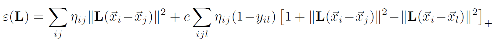
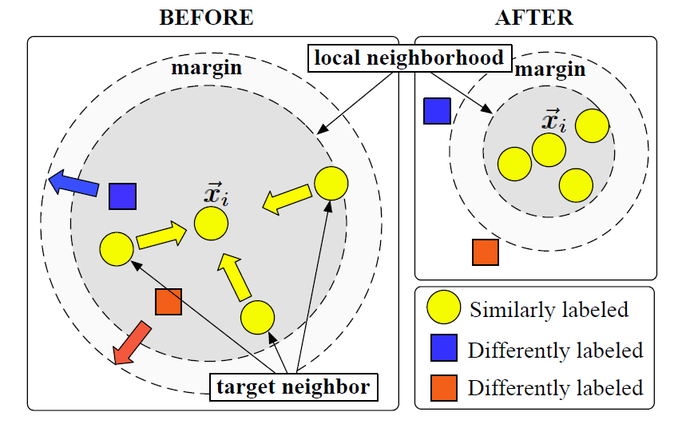

# 度量学习

- [x] [Distance Metric Learning for Large Margin Nearest Neighbor Classification](https://link.zhihu.com/?target=https%3A//papers.nips.cc/paper/2795-distance-metric-learning-for-large-margin-nearest-neighbor-classification.pdf)[:page_facing_up:](D:\Chu\论文整理\度量学习\NIPS-2005-distance-metric-learning-for-large-margin-nearest-neighbor-classification-Paper.pdf)

  > NIPS 2005
  >
  > **Large margin nearest neighbor** (**LMNN**)

  目标：kNN（k-nearest neighbors）始终属于同一类，而不同类的示例被大幅度分隔。

  - 相当于在SVM中，KNN分类取代了线性分类器

  ### Method

  - $n$ labeled examples:$\{(\vec{x_i},y_i)\}^n_{n=1},\vec{x_i}\in R^d,y_i$ is label. 

  - The binary matrix $y_{ij}\in {0,1}$ : indicate whether or not the labels $y_i$ and $y_j$ match

  - Goal: learning a linear transformation $L:R^d \to R^d$,using the following squared distance
    $$
    \mathcal{D}(\vec{x_i},\vec{x_j})=\|L(\vec{x_i}-\vec{x_j})\|^2
    $$

  - Target neighbors: for each input $\vec{x_i}$, we will specify(指定) k “target” neighbors, which have the same label $y_i$, and we will optimize the distance between $\vec{x_i}$ and other neighbors

    - using the binary matrix $\eta_{ij}\in {0,1}$ to indicate whether input $\vec{x_i}$ is a target neighbor of input $\vec{x_j}$

  - Cost function

    

    - the first term penalizes the large distance between each input and its target neighbors ,not all the input with the same label
    - the second term ,focus on max the distance between the instances from different classes, and min the distance between input and target neighbors
    - In the second term, using the max function $[z]_+=\max(z,0)$ to make sure the value is positive.

  - Large margin

    

