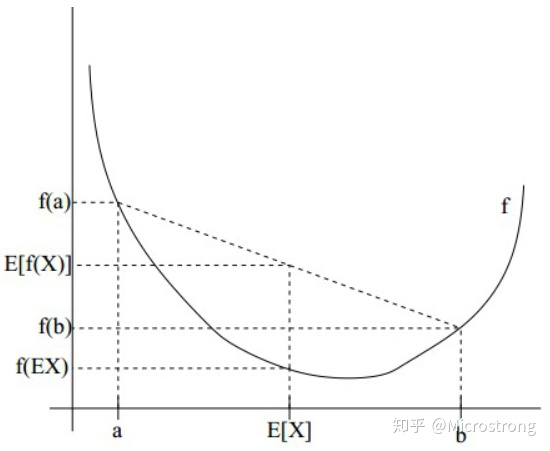
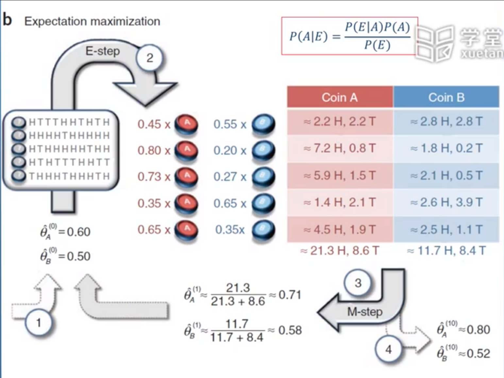
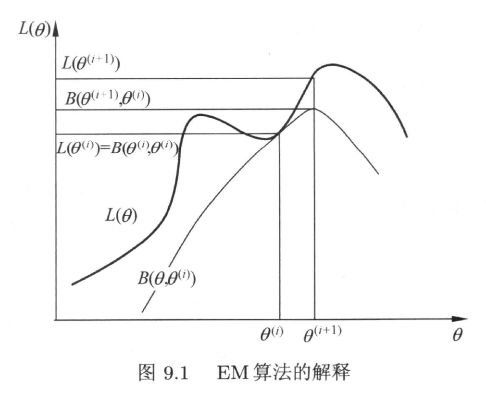

部分理论知识

## 最大似然估计

- 考虑一组含有$m$个样本的数据集$\mathcal{X={x^1,...,x^m}}$，独立地由未知的真实数据生成分布$p_{data}(x)$生成

- $p_{model}(x;\theta)$是一族由$\theta$确定在相同空间上的概率分布。$p_{model}(x;\theta)$将任意的输入$x$映射到实数来估计真实分布$p_{data}(x)$。

  1. 对$\theta$的最大似然估计：

  $$
  \theta=\mathop{\arg\max}\limits_{\theta}\ {p_{model}(\mathcal{X};\theta)}\\=\mathop{\arg\max}\limits_{\theta}\ {\prod_{i=1}^m{p_{model}(x^i;\theta)}}\\=\mathop{\arg\max}\limits_{\theta}\ {\sum_{i=1}^m\log{p_{model}(x^i;\theta)}}
  $$

  2. 因为对目标函数缩放时，$\arg\max$不会改变，所以可以除以$m$得到与训练数据经验分布$\hat{p}_{data}$相关的期望作为准则：
     $$
     \theta=\mathop{\arg\max}\limits_{\theta}\ {E_{x \sim \hat{p}_{data}}{\log{p_{model}(x^i;\theta)}}}\label{eq22}
     $$
     其中，$\hat{p}_{data}$是经验分布，每个采样的样本用$1/n$的频率代表他发生的概率。具体见$\eqref{sam_cal}$

- 理论上，根据已有的数据，可以将每个$X$的统计频率$\tilde{p}(X)$计算出来，可以得到与$\eqref{eq22}$ 等价的形式
  $$
  \theta=\mathop{\arg\max}\limits_{\theta}\ \sum_X{\tilde{p}(X)\log p_\theta(X)}
  $$
  但实际上我们几乎都不可能得到$\tilde{p}(X)$（尤其是对于连续分布），我们能直接算的是关于它的数学期望，也就是$\eqref{eq22}$ 式，因为求期望只需要把每个样本的值算出来，然后求和并除以$n$就行了

## 数值计算和采样计算

- 已知概率密度函数$p(x)$,那么$x$的期望定义为
  $$
  E[x]=\int{xp(x)dx}
  $$

  - 数值计算， 也就是数值积分，可以选取若干个有代表性的点$x_0<x_1<x_2<⋯<x_n$，得到
    $$
    E[x]\approx\sum^n_{i=1}{x_i p(x_i)(x_i-x_{i-1})}  \label{num_cal}
    $$

  - 采样计算。从$p(x)$中采样若干个点$x_1,...x_n$，那么
    $$
    E[x]\approx \frac{1}{n}\sum^n_{i=1}{x_i},\ \ \ x_i\sim p(x)\label{sam_cal}
    $$

  - 在数值计算$\eqref{num_cal}$中包含了**概率**的计算，而在采样计算$\ref{sam_cal}$中只有**$x$**的计算

    因为，在$\eqref{sam_cal}$中的$x_i$是从$p(x)$中依概率采样出来的，概率大的$x_i$出现的次数也多，所以采样的结果已经包含$p(x)$了

  更一般的形式
  $$
  E_{x\sim p(x)}[f(x)]=\int{f(x)p(x)dx}\approx \frac{1}{n}\sum^n_{i=1}{f(x_i)},\ \ \ x_i\sim p(x)
  $$

## KL散度

- 用来衡量两个分布间的相对距离，非对称
  $$
  D_{KL}(\hat{p}_{data}\|p_{model})=E_{x\sim\hat{p}_{data}}[\log{\hat{p}_{data}(x)-\log{p_{model}(x)}}]\\
  =E_{x\sim\hat{p}_{data}}[\log{\hat{p}_{data}(x)]-E_{x\sim\hat{p}_{data}}[\log{p_{model}(x)}}]\\
  =H(\hat{p}_{data})-H(\hat{p}_{data},p_{model})
  $$

  - 假设$x\sim \hat{p}_{data}$，将其带入另一分布$p_{model}$中，所获得的概率比$\frac{\hat{p}_{data}(x)}{p_{model}(x)}$作为两个分布对于同一样本的概率差异的描述。由于$x\sim \hat{p}_{data}$，所以以$\hat{p}_{data}$分布计算熵，所得到的为相对熵，又名KL散度。

- KL存在的问题：当$p_{model}$在某个区域内等于0，而$p_{data}$不为0，KL散度表现出无限大

### 交叉熵

> 当样本的分布已知，交叉熵则可以从KL散度中推导而得

- 如果**假设$X$样本的分布已知**，**即$\hat{p}_{data}$已知**，即$E_{x\sim\hat{p}_{data}}[\log{\hat{p}_{data}(x)}]$为经验分布的熵$H(\hat{p}_{data})$为常数，所以只需要最小化$-E_{x\sim\hat{p}_{data}}{\log{p_{model}(x)}}$,即交叉熵$H(\hat{p}_{data},p_{model})$

  $H(\hat{p}_{data},p_{model})=-E_{x\sim \hat{p}_{data}}{\log{p_{model}(x)}}=H(\hat{p}_{data})+D_{KL}(\hat{p}_{data}\|p_{model})$

- 最小化交叉熵本质上是在最小化KL散度。

## 有监督的模型

## Jenson 不等式

> 如果$f$是凸函数，$X$是随机变量，那么$E[f(X)]\geq f[EX]$,特别的，如果$f$是严格凸函数，那么$E[f(X)]=f(EX)$的充要条件为$P(x=E[X])=1$

- 弦的中点值大于中点的函数值

  

## EM算法

- 解决的问题
  - 样本的所有属性没有被观测到，我们只拿到了一部分，而这个属性可能参与任务计算，我们也需要参考这些属性进行参数估计

记$X$为已观测的变量集，$Z$为隐变量集，$\Theta$为模型参数。若对$\Theta$进行极大似然估计，则应该最大化对数似然
$$
LL(\Theta|X,Z)=\ln{P(X,Z|\Theta)}
$$
由于$Z$为隐变量，该式子无法直接求解。通过对$Z$计算期望，来估计$Z$的同时，最大化已观测数据的对数“边际似然”
$$
LL(\Theta|X)=\ln{P(X|\Theta)=\ln{\sum_Z{P(X,Z|\Theta)}}}\label{Z}
$$

- 若参数$\Theta$己知，则可根据训练数据推断出最优隐变量$Z$的值(E 步) ;反之，若$Z$的值已知，则可方便地对$\Theta$参数做极大似然估计(M 步) .
  - 基于初始值$\Theta^t$推断隐变量$Z$的期望，记为$Z^t$
    - :question:如何计算？
  - 基于已观测变量$X$和$Z^t$对参数$\Theta$做极大似然估计，记为$\Theta^{t+1}$

  

- 没有标签的两个不均匀硬币，每轮进行10次投掷实验。结果如左边所示

1. 初始假设

   - 硬币A，正面概率0.6
   - 硬币B，正面概率0.5

2. 分析实验结果（第一次）

   - 实验为五次正面

   - 根据贝叶斯公式
     $$
     P(A|E)=\frac{P(E|A)P(A)}{P(E)}
     $$

     - $P(A|E)$为事件$E$的条件下，硬币为A的概率
     - $P(E|A)$为在硬币为A的条件下，掷出正面的概率（先验概率），初始为$0.6^5 \cdot 0.4^5$
     - $P(A)$为硬币为A的概率
     - $P(E)$为这次实验，正面向上的概率，第一次为0.5

   - 计算以当前参数下，属于A，B的概率
     $$
     P(E|A)=0.6^5 \cdot 0.4^5,P(E|B)=0.5^5 \cdot 0.5^5\\
     P(A|E)=\frac{P(E|A)}{P(E|A)+P(E|B)}\approx 0.45\\
     P(B|E)\approx 0.55
     $$
     
- 计算从概率上讲，属于A，B的正，反面各有几个
     $$
     H(A)=H\times P(A|E)\\
     =5\times 0.45\\
     \approx 2.2 \\
     H(B)=H\times P(B|E)\\
     =5\times 0.55\\
     \approx 2.8 \\
     T(A)=T\times P(A|E)\\
     =5\times 0.45\\
     \approx 2.2 \\
     T(B)=T\times P(A|E)\\
     =5\times 0.45\\
     \approx 2.8 \\
     $$
   
- 将一个批次的全部统计完，计算经过实验后，属于A，B的正反面总数，并重新计算A，B参数,完成一次更新
     $$
     \theta_A^{(1)}=\frac{21.3}{21.3+8.6}\approx0.71\\
     \theta_B^{(1)}=\frac{11.7}{11.7+8.4}\approx0.58
     $$
   
  > 1. 通过当前的参数，来预测样本的处于哪个分布，即$P(A|E),P(B|E)$
     >    - 当前的样本越符合当前的某个模型，则计算的概率越大，类似最大似然
     >    - $P(A|E),P(B|E)$则为模型的隐变量
     > 2. 根据预测哪个分布的概率，来重新分配样本数据（E步）
     >    - 模型的预测概率越大，则分配的样本数量越多，起到聚类效果
     > 3. 根据分配后的样本数据，来重新计算参数（M步）
     >    - 分配到的样本数量越多，则对其（聚类后同一类的）样本（不是其分布的则占比很少）进行参数优化。
     > 4. 不断迭代至收敛
  
- 推导流程-1

  观察到的随机变量数据$X=(x_1,...,x_n)$，未观察到的隐随机变量的数据$Z=(z_1,z_2,...,z_n)$，此时不能直接做最大似然估计，因为有隐藏的随机变量，只用观测到的数据$X$来拟合模型，是有问题的。
  
  将$X,Z$放在一起的称为完全数据，观测数据$X$称为不完全数据。
  
  我们的目的是：拟合不完全数据$X$的概率，对数似然函数$L(\theta)=\log P(X|\theta)$

  此时我们需要引入$X,Z$的联合概率分布，来建模模型。参考$\eqref{Z}$，采用$X$的边缘分布和联合分布的关系来获得整个模型的完整描述$p(x_i,z_i;\theta)$，我们极大化模型分布的对数似然函数如下：
  $$
  {\theta^*}=\mathop{\arg\max}\limits_{\theta}{\sum_{x_i\in X}}{\log{P(x_i;\theta)}}=\mathop{\arg\max}\limits_{\theta}{\sum_{x_i\in X}}{\log{\sum_{z_i\in Z}{P(x_i,z_i;\theta)}}}
  $$
  - [ ] :question:这个$\theta$是$X$边缘概率的参数，还是$(X,Z)$联合概率密度的参数？
  
  由于$log$里有求和的操作，导致优化很困难，使用Jensen不等式，进行缩放
  $$
  {\sum_{x_i\in X}}{\log{\sum_{z_i\in Z}{P(x_i,z_i;\theta)}}}&=\sum^n_{x_i\in X}{\log{\sum_{z_i\in Z}}{P(z_i|x_i;\theta^k)\frac{P(x_i,z_i;\theta)}{P(z_i|x_i;\theta^k)}}}\\
  &\geq \sum_{x_i\in X}\sum_{z_i\in Z}{P(z_i|x_i;\theta^k)\log{\frac{P(x_i,z_i;\theta)}{P(z_i|x_i;\theta^k)}}}
  $$

  - $P(z_i|x_i;\theta^k)$是根据当前所估计的参数$\theta^k$（当作已知），所确定的一个条件分布

  - $\sum_{z_i\in Z}{P(z_i|x_i;\theta^k)\log{\frac{P(x_i,z_i;\theta)}{P(z_i|x_i;\theta^k)}}}$为$\log{\frac{P(x_i,z_i;\theta)}{P(z_i|x_i;\theta^k)}}$的期望
  
  - 放缩后的结果，可以说是对$\log l(\theta)$求了下界（$l(\theta)={\sum_{x_i\in X}}{\log{P(x_i;\theta)}}$）。
  
    > 关于提取$P(z_i|x_i;\theta)$的原因的猜想
    >
    > 原下界：
    > $$
    > \mathop{\arg\max}\limits_{\theta}{\sum_{x_i\in X}\sum_{z_i\in Z}{q_i(z_i)\log{\frac{p(x_i,z_i;\theta)}{q_i(z_i)}}}}
    > $$
    > 假设$\theta$确定，则$\log l(\theta)$的值取决于$q_i(z_i)和p(x_i,z_i)$，迭代的目标是调整这两个概率使下界不断上升，逼近原$\log{l(\theta)}$的值
    >
    > 满足Jensen不等式的等号成立条件：
    > $$
    > \frac{p(x_i,z_i;\theta)}{q_i(z_i)}=c，c是常数
    > $$
    > 其中，$q_i(z_i)$是一个分布，所以满足：$\sum_{z_i\in Z}{q_i(z_i)}=1$,则至少需要满足（:question:必要条件）
    > $$
    > \sum_{z_i\in Z}{p(x_i,z_i;\theta)}&= c\sum_{z_i\in Z}{q_i(z_i)}\\
    > &= c
    > $$
    > ​	将$c$代入进行代换，得
    > $$
    > \frac{p(x_i,z_i;\theta)}{Q_i(z_i)}=\sum_{z_i\in Z}{p(x_i,z_i;\theta)}\\
    > q_i(z_i)=\frac{p(x_i,z_i;\theta)}{\sum_{z_i\in Z}p(x_i,z_i;\theta)}=\frac{p(x_i,z_i;\theta)}{p(x_i;\theta)}=p(z_i|x_i;\theta)
    > $$

    
  
    所以原优化目标等于
    $$
    \theta^*=\mathop{\arg\max}\limits_{\theta}{\sum_{x_i\in X}}{\log{\sum_{z_i\in Z}{P(x_i,z_i;\theta)}}}\\
    \hat=\mathop{\arg\max}\limits_{\theta}\sum_{x_i\in X}\sum_{z_i\in Z}{P(z_i|x_i;\theta^k)\log{\frac{P(x_i,z_i;\theta)}{P(z_i|x_i;\theta^k)}}}\\
    =\mathop{\arg\max}\limits_{\theta}\sum_{x_i\in X}{(\sum_{z_i\in Z}P(z_i|x_i;\theta^k)\log P(x_i,z_i;\theta)-\sum_{z_i\in Z}P(z_i|x_i;\theta^k)\log P(z_i|x_i;\theta^k))}\\
    =\mathop{\arg\max}\limits_{\theta}\sum_{x_i\in X}\sum_{z_i\in Z}P(z_i|x_i;\theta^k)\log P(x_i,z_i;\theta)
    $$
    后者可以认为是$P(Y|X;\theta^k)$的熵，对于一个确定的分布来说是个常数,所以对于优化项来说无关紧要，原式整理可得：
    $$
    \theta^*=\mathop{\arg\max}\limits_{\theta}\sum_{x_i\in X}\sum_{z_i\in Z}P(z_i|x_i;\theta^k)\log P(x_i,z_i;\theta)\\
    =\mathop{\arg \max}\limits_{\theta}\ \sum_{x_i\in X} Q(\theta,\theta^k)
    $$
  
    > 统计学习与方法中$\sum_{x_i\in X}$省略没写，实际上是多个样本的对数似然相加，此处给他写上
  
    ### Q函数定义
  
    完全数据的对数似然函数$\log\ P(X, Z|\theta) $关于在给定观测数据$X$ 和当前参数$\theta^k$下对未观测数据$Z$ 的条件概率分布$P(Z|X,\theta^k) $的期望称为$Q$
    函数， 即
    $$
    Q(\theta,\theta^k)= E_{z_i\sim P(Z|X;\theta^k)} {\log P(x_i,z_i;\theta^k)}
    $$
    
    - 其中$\theta^k$由上一步EM获得，为一个确定值，所确定的$P(Z|X;\theta^k)$是一个确定的分布，尽管分布形式可能不知道
    - $\theta$为真正优化的值
    
    
    
    ### EM 算法步骤
    
    1. 参数的初值可以随意选择
    
       > 但EM算法对参数的初值敏感
    
    2. E步，求$Q(\theta,\theta^k)$。
    
    3. M步，极大化$Q(\theta,\theta^k)$ ，并进行跌倒
    
    4. 停止迭代，若$\|\theta^{k+1}-\theta^k\|<\epsilon$ 或 $\|Q(\theta^{k+1},\theta^k)-Q(\theta^{k},\theta^k)\|<\epsilon$
    
    ### EM的问题
    
    
    
    - $L(\theta^k)$为代价函数，$B(\theta,\theta^k)$为所对应jenson不等式的下界
    - 使用jenson放缩后的下界来进行优化，虽然可以保证$L(\theta)$在不断的上升，但不能保证找到全局最优解
