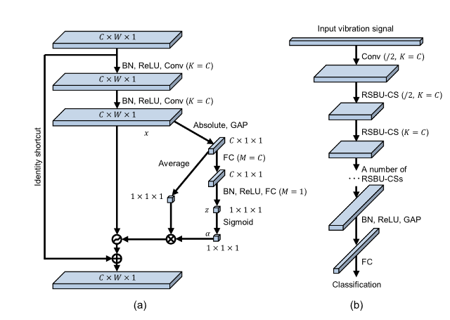
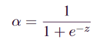
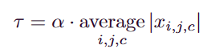
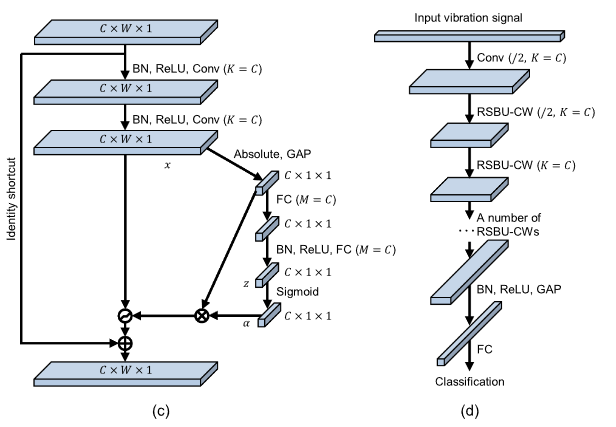

# 监督学习方法

- [x] [Deep Residual Shrinkage Networks for Fault Diagnosis](https://ieeexplore.ieee.org/document/8850096)[:page_facing_up:](C:\Users\smart-dsp\Zotero\storage\52P7XZ9Q\Zhao 等。 - 2020 - Deep Residual Shrinkage Networks for Fault Diagnos.pdf)

> 用于强背景噪声下旋转机械的振动故障诊断
>
> 软阈值、阈值自适应、通道共享阈值（CS）、通道智能阈值（CW）

- CNN需补充知识
  - [ ] BN
  - [ ] GAP
  - [ ] 

- 软阈值

  > 将近零特征转换为零

  

- DRSN-CS

  > 各通道共享阈值

  

  - （a）为基础单元，右侧为参数估计部分

    1. GAP将$C\times W \times1$的通道池化为$C\times 1 \times 1$的数据（只保留通道的维度，即每个通道一个值）

    2. 经过FC映射为相同维度的数据

    3. 经过BN,ReLU,FC，将通道数据映射为一个值$z$

    4. 经过sigmoid函数，将其缩放到$(0,1)$,获得估计值$\alpha$

       

    5. 将其与GAP后的特征平均值相乘，得到估计阈值$\tau$ 

       

    

- DRSN-CW

  > 通道智能阈值
  >
  > 对特征图的每个通道应用了单独的阈值
  >
  > 效果比CS略好

  

  - 将各通道的特征没有分别映射，最后获得各通道的阈值向量