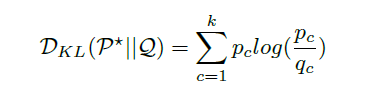
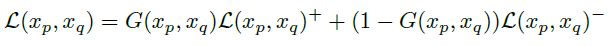
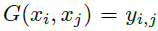
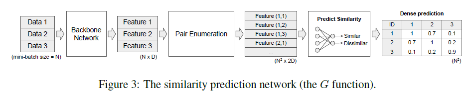
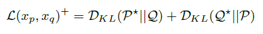
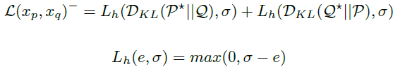

# 迁移学习

- [x] [LEARNING TO CLUSTER IN ORDER TO TRANSFER ACROSS DOMAINS AND TASKS ](http://arxiv.org/abs/1711.10125)[:page_facing_up:](C:\Users\smart-dsp\Zotero\storage\JFJN5EYD\Hsu 等。 - 2018 - Learning to cluster in order to transfer across do.pdf)

> (ICLR2018)

- (pairwise semantic similarity)首先将分类信息简化为成对约束，只考虑两个实例是否属于同一类 

- THE LEARNABLE CLUSTERING OBJECTIVE（LCO）

  - key idea：设计一个学习目标，该目标可以使用（噪声）预测的成对相似性，并受到约束聚类的启发，该聚类涉及在损失函数中使用成对信息。

  - 每个输出节点不必映射到固定的类别，而是每个输出节点代表一个数据点到集群的概率分配。 

  - 使用KL散度来评估两个数据实例的k簇分布的距离

    

  - 使用预测相似性来构建对比损失

    

    - 相似度函数G

      - 将一个分类问题转化为相似度问题，相似与否，取决于标签是否一致

      

      - $y_{i,j}\in Y^R,\{Y^R\}=\{dissimilar,similar\}=\{0,1 \},G$为神经网络模拟的相似度函数

      - 在一个大量标记的数据集上进行预训练

      - $G$函数算法流程

        

    - 两个数据来自同一对（类内距离减小）

    

    - 两个数据来自不同对（类间距离增大）

      