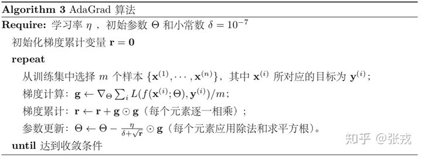

# 最大似然估计

- 考虑一组含有$m$个样本的数据集$\mathcal{X={x^1,...,x^m}}$，独立地由未知的真实数据生成分布$p_{data}(x)$生成

- $p_{model}(x;\theta)$是一族由$\theta$确定在相同空间上的概率分布。$p_{model}(x;\theta)$将任意的输入$x$映射到实数来估计真实分布$p_{data}(x)$。

  1. 对$\theta$的最大似然估计：

  $$
  \theta=\mathop{\arg\max}\limits_{\theta}\ {p_{model}(\mathcal{X};\theta)}\\=\mathop{\arg\max}\limits_{\theta}\ {\prod_{i=1}^m{p_{model}(x^i;\theta)}}\\=\mathop{\arg\max}\limits_{\theta}\ {\sum_{i=1}^m\log{p_{model}(x^i;\theta)}}
  $$

  2. 因为对目标函数缩放时，$\arg\max$不会改变，所以可以除以$m$得到与训练数据经验分布$\hat{p}_{data}$相关的期望作为准则：
     $$
     \theta=\mathop{\arg\max}\limits_{\theta}\ {E_{x \sim \hat{p}_{data}}{\log{p_{model}(x^i;\theta)}}}\label{eq22}
     $$
     其中，$\hat{p}_{data}$是经验分布，每个采样的样本用$1/n$的频率代表他发生的概率。具体见$\eqref{sam_cal}$

- 理论上，根据已有的数据，可以将每个$X$的统计频率$\tilde{p}(X)$计算出来，可以得到与$\eqref{eq22}$ 等价的形式
  $$
  \theta=\mathop{\arg\max}\limits_{\theta}\ \sum_X{\tilde{p}(X)\log p_\theta(X)}
  $$
  但实际上我们几乎都不可能得到$\tilde{p}(X)$（尤其是对于连续分布），我们能直接算的是关于它的数学期望，也就是$\eqref{eq22}$ 式，因为求期望只需要把每个样本的值算出来，然后求和并除以$n$就行了

# 数值计算和采样计算

- 已知概率密度函数$p(x)$,那么$x$的期望定义为
  $$
  E[x]=\int{xp(x)dx}
  $$

  - 数值计算， 也就是数值积分，可以选取若干个有代表性的点$x_0<x_1<x_2<⋯<x_n$，得到
    $$
    E[x]\approx\sum^n_{i=1}{x_i p(x_i)(x_i-x_{i-1})}  \label{num_cal}
    $$

  - 采样计算。从$p(x)$中采样若干个点$x_1,...x_n$，那么
    $$
    E[x]\approx \frac{1}{n}\sum^n_{i=1}{x_i},\ \ \ x_i\sim p(x) \label{sam_cal}
    $$

  - 在数值计算$\eqref{num_cal}$中包含了<strong style="color:red">**概率**</strong>的计算，而在采样计算$\ref{sam_cal}$中只有**$x$**的计算

    因为，在$\eqref{sam_cal}$中的$x_i$是从$p(x)$中依概率采样出来的，概率大的$x_i$出现的次数也多，所以采样的结果已经包含$p(x)$了

  更一般的形式
  $$
  E_{x\sim p(x)}[f(x)]=\int{f(x)p(x)dx}\approx \frac{1}{n}\sum^n_{i=1}{f(x_i)},\ \ \ x_i\sim p(x)
  $$

# KL散度

- 用来衡量两个分布间的相对距离，非对称
  $$
  D_{KL}(\hat{p}_{data}\|p_{model})=E_{x\sim\hat{p}_{data}}[\log{\hat{p}_{data}(x)-\log{p_{model}(x)}}]\\
  =E_{x\sim\hat{p}_{data}}[\log{\hat{p}_{data}(x)]-E_{x\sim\hat{p}_{data}}[\log{p_{model}(x)}}]\\
  =H(\hat{p}_{data})-H(\hat{p}_{data},p_{model})
  $$

  - 假设$x\sim \hat{p}_{data}$，将其带入另一分布$p_{model}$中，所获得的概率比$\frac{\hat{p}_{data}(x)}{p_{model}(x)}$作为两个分布对于同一样本的概率差异的描述。由于$x\sim \hat{p}_{data}$，所以以$\hat{p}_{data}$分布计算熵，所得到的为相对熵，又名KL散度。

- KL存在的问题：当$p_{model}$在某个区域内等于0，而$p_{data}$不为0，KL散度表现出无限大

## 交叉熵

> 当样本的分布已知，交叉熵则可以从KL散度中推导而得

- 如果<strong style="color:red">**假设$X$样本的分布已知**</strong>，**即$\hat{p}_{data}$已知**，即$E_{x\sim\hat{p}_{data}}[\log{\hat{p}_{data}(x)}]$为经验分布的熵$H(\hat{p}_{data})$为常数，所以只需要最小化$-E_{x\sim\hat{p}_{data}}{\log{p_{model}(x)}}$,即交叉熵$H(\hat{p}_{data},p_{model})$

  $H(\hat{p}_{data},p_{model})=-E_{x\sim \hat{p}_{data}}{\log{p_{model}(x)}}=H(\hat{p}_{data})+D_{KL}(\hat{p}_{data}\|p_{model})$

- 最小化交叉熵本质上是在最小化KL散度。

# Jenson 不等式

> 如果$f$是凸函数，$X$是随机变量，那么$E[f(X)]\geq f[EX]$,特别的，如果$f$是严格凸函数，那么$E[f(X)]=f(EX)$的充要条件为$P(x=E[X])=1$

- 弦的中点值大于中点的函数值

  

# EM算法

- 解决的问题
  - 样本的所有属性没有被观测到，我们只拿到了一部分，而这个属性可能参与任务计算，我们也需要参考这些属性进行参数估计

记$X$为已观测的变量集，$Z$为隐变量集，$\Theta$为模型参数。若对$\Theta$进行极大似然估计，则应该最大化对数似然
$$
LL(\Theta|X,Z)=\ln{P(X,Z|\Theta)}
$$
由于$Z$为隐变量，该式子无法直接求解。通过对$Z$计算期望，来估计$Z$的同时，最大化已观测数据的对数“边际似然”
$$
LL(\Theta|X)=\ln{P(X|\Theta)=\ln{\sum_Z{P(X,Z|\Theta)}}}\label{Z}
$$

- 若参数$\Theta$己知，则可根据训练数据推断出最优隐变量$Z$的值(E 步) ;反之，若$Z$的值已知，则可方便地对$\Theta$参数做极大似然估计(M 步) .
  - 基于初始值$\Theta^t$推断隐变量$Z$的期望，记为$Z^t$
    - :question:如何计算？
  - 基于已观测变量$X$和$Z^t$对参数$\Theta$做极大似然估计，记为$\Theta^{t+1}$
  

## 硬币例子

- 没有标签的两个不均匀硬币，每轮进行10次投掷实验。结果如左边所示

1. 初始假设

   - 硬币A，正面概率0.6
   - 硬币B，正面概率0.5

2. 分析实验结果（第一次）

   - 实验为五次正面

   - 根据贝叶斯公式
     $$
     P(A|E)=\frac{P(E|A)P(A)}{P(E)}
     $$

     - $P(A|E)$为事件$E$的条件下，硬币为A的概率
     - $P(E|A)$为在硬币为A的条件下，掷出正面的概率（先验概率），初始为$0.6^5 \cdot 0.4^5$
     - $P(A)$为硬币为A的概率
     - $P(E)$为这次实验，正面向上的概率，第一次为0.5

   - 计算以当前参数下，属于A，B的概率
     $$
     P(E|A)=0.6^5 \cdot 0.4^5,P(E|B)=0.5^5 \cdot 0.5^5\\
     P(A|E)=\frac{P(E|A)}{P(E|A)+P(E|B)}\approx 0.45\\
     P(B|E)\approx 0.55
     $$
     
- 计算从概率上讲，属于A，B的正，反面各有几个
     $$
     H(A)=H\times P(A|E)\\
     =5\times 0.45\\
     \approx 2.2 \\
     H(B)=H\times P(B|E)\\
     =5\times 0.55\\
     \approx 2.8 \\
     T(A)=T\times P(A|E)\\
     =5\times 0.45\\
     \approx 2.2 \\
     T(B)=T\times P(A|E)\\
     =5\times 0.45\\
     \approx 2.8 \\
     $$

- 将一个批次的全部统计完，计算经过实验后，属于A，B的正反面总数，并重新计算A，B参数,完成一次更新
  $$
  \theta_A^{(1)}=\frac{21.3}{21.3+8.6}\approx0.71\\
  \theta_B^{(1)}=\frac{11.7}{11.7+8.4}\approx0.58
  $$

  > 1. 通过当前的参数，来预测样本的处于哪个分布，即$P(A|E),P(B|E)$
  >    - 当前的样本越符合当前的某个模型，则计算的概率越大，类似最大似然
  >    - $P(A|E),P(B|E)$则为模型的隐变量
  > 2. 根据预测哪个分布的概率，来重新分配样本数据（E步）
  >    - 模型的预测概率越大，则分配的样本数量越多，起到聚类效果
  > 3. 根据分配后的样本数据，来重新计算参数（M步）
  >    - 分配到的样本数量越多，则对其（聚类后同一类的）样本（不是其分布的则占比很少）进行参数优化。
  > 4. 不断迭代至收敛

## 推导流程-1

观察到的随机变量数据$X=(x_1,...,x_n)$，未观察到的隐随机变量的数据$Z=(z_1,z_2,...,z_n)$，此时不能直接做最大似然估计，因为有隐藏的随机变量，只用观测到的数据$X$来拟合模型，是有问题的。

将$X,Z$放在一起的称为完全数据，观测数据$X$称为不完全数据。

我们的目的是：拟合不完全数据$X$的概率，对数似然函数$L(\theta)=\log P(X|\theta)$

此时我们需要引入$X,Z$的联合概率分布，来建模模型。参考$\eqref{Z}$，采用$X$的边缘分布和联合分布的关系来获得整个模型的完整描述$p(x_i,z_i;\theta)$，我们极大化模型分布的对数似然函数如下：
$$
{\theta^*}=\mathop{\arg\max}\limits_{\theta}{\sum_{x_i\in X}}{\log{P(x_i;\theta)}}=\mathop{\arg\max}\limits_{\theta}{\sum_{x_i\in X}}{\log{\sum_{z_i\in Z}{P(x_i,z_i;\theta)}}}
$$
- [ ] :question:这个$\theta$是$X$边缘概率的参数，还是$(X,Z)$联合概率密度的参数？

由于$log$里有求和的操作，导致优化很困难，使用Jensen不等式，进行缩放
$$
{\sum_{x_i\in X}}{\log{\sum_{z_i\in Z}{P(x_i,z_i;\theta)}}}&=\sum^n_{x_i\in X}{\log{\sum_{z_i\in Z}}{P(z_i|x_i;\theta^i)\frac{P(x_i,z_i;\theta)}{P(z_i|x_i;\theta^i)}}}\\
&\geq \sum_{x_i\in X}\sum_{z_i\in Z}{P(z_i|x_i;\theta^i)\log{\frac{P(x_i,z_i;\theta)}{P(z_i|x_i;\theta^i)}}}
$$

- $P(z_i|x_i;\theta^i)$是根据当前所估计的参数$\theta^i$（当作已知），所确定的一个条件分布

- $\sum_{z_i\in Z}{P(z_i|x_i;\theta^i)\log{\frac{P(x_i,z_i;\theta)}{P(z_i|x_i;\theta^i)}}}$为$\log{\frac{P(x_i,z_i;\theta)}{P(z_i|x_i;\theta^i)}}$的期望

- 放缩后的结果，可以说是对$\log l(\theta)$求了下界（$l(\theta)={\sum_{x_i\in X}}{\log{P(x_i;\theta)}}$）。

  > 关于提取$P(z_i|x_i;\theta)$的原因的猜想
  >
  > 原下界：
  > $$
  > \mathop{\arg\max}\limits_{\theta}{\sum_{x_i\in X}\sum_{z_i\in Z}{q_i(z_i)\log{\frac{p(x_i,z_i;\theta)}{q_i(z_i)}}}}
  > $$
  > 假设$\theta$确定，则$\log l(\theta)$的值取决于$q_i(z_i)和p(x_i,z_i)$，迭代的目标是调整这两个概率使下界不断上升，逼近原$\log{l(\theta)}$的值
  >
  > 满足Jensen不等式的等号成立条件：
  > $$
  > \frac{p(x_i,z_i;\theta)}{q_i(z_i)}=c，c是常数
  > $$
  > 其中，$q_i(z_i)$是一个分布，所以满足：$\sum_{z_i\in Z}{q_i(z_i)}=1$,则至少需要满足（:question:必要条件）
  > $$
  > \sum_{z_i\in Z}{p(x_i,z_i;\theta)}&= c\sum_{z_i\in Z}{q_i(z_i)}\\
  > &= c
  > $$
  > ​	将$c$代入进行代换，得
  > $$
  > \frac{p(x_i,z_i;\theta)}{Q_i(z_i)}=\sum_{z_i\in Z}{p(x_i,z_i;\theta)}\\
  > q_i(z_i)=\frac{p(x_i,z_i;\theta)}{\sum_{z_i\in Z}p(x_i,z_i;\theta)}=\frac{p(x_i,z_i;\theta)}{p(x_i;\theta)}=p(z_i|x_i;\theta)
  > $$

  

  所以原优化目标等于
  $$
  \theta^*=\mathop{\arg\max}\limits_{\theta}{\sum_{x_i\in X}}{\log{\sum_{z_i\in Z}{P(x_i,z_i;\theta)}}}\\
  \hat=\mathop{\arg\max}\limits_{\theta}\sum_{x_i\in X}\sum_{z_i\in Z}{P(z_i|x_i;\theta^i)\log{\frac{P(x_i,z_i;\theta)}{P(z_i|x_i;\theta^i)}}}\\
  =\mathop{\arg\max}\limits_{\theta}\sum_{x_i\in X}{(\sum_{z_i\in Z}P(z_i|x_i;\theta^i)\log P(x_i,z_i;\theta)-\sum_{z_i\in Z}P(z_i|x_i;\theta^i)\log P(z_i|x_i;\theta^i))}\\
  =\mathop{\arg\max}\limits_{\theta}\sum_{x_i\in X}\sum_{z_i\in Z}P(z_i|x_i;\theta^i)\log P(x_i,z_i;\theta)
  $$
  后者可以认为是$P(Y|X;\theta^i)$的熵，对于一个确定的分布来说是个常数,所以对于优化项来说无关紧要，原式整理可得：
  $$
  \theta^*=\mathop{\arg\max}\limits_{\theta}\sum_{x_i\in X}\sum_{z_i\in Z}P(z_i|x_i;\theta^i)\log P(x_i,z_i;\theta)\\
  =\mathop{\arg \max}\limits_{\theta}\ \sum_{x_i\in X} Q(\theta,\theta^i)
  $$

  > 统计学习与方法中$\sum_{x_i\in X}$省略没写，实际上是多个样本的对数似然相加，此处给他写上

## Q函数定义

完全数据的对数似然函数$\log\ P(X, Z|\theta) $关于在给定观测数据$X$ 和当前参数$\theta^i$下对未观测数据$Z$ 的条件概率分布$P(Z|X,\theta^i) $的期望称为$Q$
函数， 即
$$
Q(\theta,\theta^i)= E_{z_i\sim P(Z|X;\theta^i)} {\log P(x_i,z_i;\theta^i)}
$$

- 其中$\theta^i$由上一步EM获得，为一个确定值，所确定的$P(Z|X;\theta^i)$是一个确定的分布，尽管分布形式可能不知道
- $\theta$为真正优化的值

> 也有将$P(Z|X;\theta^i)$定义为$Q(\theta,\theta^i)$的需注意

## EM 算法步骤

1. 参数的初值可以随意选择

   > 但EM算法对参数的初值敏感

2. E步，求$Q(\theta,\theta^i)$。

3. M步，极大化$Q(\theta,\theta^i)$ ，并进行跌倒

4. 停止迭代，若$\|\theta^{i+1}-\theta^i\|<\epsilon$ 或 $\|Q(\theta^{i+1},\theta^i)-Q(\theta^{k},\theta^i)\|<\epsilon$

## EM存在的问题

- $L(\theta^i)$为代价函数，$B(\theta,\theta^i)$为所对应jenson不等式的下界
- 使用jenson放缩后的下界来进行优化，虽然可以保证$L(\theta)$在不断的上升，但不能保证找到全局最优解

## EM算法与高斯混合模型结合

- 高斯混合模型
  $$
  P(y|\theta)=\sum^K_{k=1}\alpha_k\phi(y|\theta_k)
  $$

  - 其中$\alpha_k$是系数，$\sum_{k=1}^K \alpha_k=1$；概率化最后的输出

  - $\phi(y|\theta_k)$是高斯分布密度，$\theta_k=(\mu_k,\sigma_k^2)$
    $$
    \phi(y|\theta_k)=\frac{1}{\sqrt{2\pi}\sigma_k}\exp(-\frac{(y-\mu_k)^2}{2\sigma_k^2})
    $$
    称为第k个分模型

- EM算法

  - 假设观测数据$y_1,...,y_N$由高斯混合模型生成
    $$
    P(y|\theta)=\sum^K_{k=1}\alpha_k\phi(y|\theta_k)
    $$
    其中$\theta = (\alpha_1,...,\alpha_k; \theta_1,... ，\theta_K)$

  1. 明确隐变量，写出完全数据的对数似然函数

     我们可以观察到多个高斯分布中的某个分布的输出（对应于原型学习里，从某个原型中输出的特征），即$y_j$，其（对应的哪个原型输出的）概率由随机变量$\alpha_k$​刻画。反映观测数据的来自第$k$个分模型的数据是未知的，$k=1,2,...,K$，以隐变量$\gamma_{jk}$表示，定义如下：
     $$
     \gamma_{jk}=1, 第j个观测来自第k个分模型\\
     \gamma_{jk}=0,否则
     $$
     有了观测数据$y_j$及为观测数据$\gamma_{jk}$，完全数据是
     $$
     (y_j,\gamma_{j1},...,\gamma_{jK})，j=1,2,...,N
     $$
     完全数据的似然函数：
     $$
     P(y,\gamma|\theta)=\prod_{j=1}^N {P(y_j,\gamma_{j1},\gamma_{j2},...,\gamma_{j_K}|\theta)}\\
     =\prod_{k=1}^K\prod_{j=1}^N[\alpha_k\phi(y_j|\theta_k)]^{\gamma_{jk}}\\
     =\prod_{k=1}^K {\alpha_k^{n_k}} \prod_{j=1}^N[\phi(y_j|\theta_k)]^{\gamma_{jk}}\\
     =\prod_{k=1}^K {\alpha_k^{n_k}} \prod_{j=1}^N[{\frac{1}{\sqrt{2\pi}\sigma_k}\exp(-\frac{(y-\mu_k)^2}{2\sigma_k^2})}]^{\gamma_{jk}}
     $$
     其中，$n_k=\sum_{j=1}^N\gamma_{jk},\sum_{k=1}^Kn_k=N$

     完全函数的对数似然函数为
     $$
     \log{P(y,\gamma|\theta)}=\sum_{k=1}^K\log({\alpha_k^{n_k}}\prod_{j=1}^N[{\frac{1}{\sqrt{2\pi}\sigma_k}\exp(-\frac{(y-\mu_k)^2}{2\sigma_k^2})}]^{\gamma_{jk}})\\
     =\sum_{k=1}^K {n_k}\log{\alpha_k}+\sum_{k=1}^K\log(\prod_{j=1}^N[{\frac{1}{\sqrt{2\pi}\sigma_k}\exp(-\frac{(y-\mu_k)^2}{2\sigma_k^2})}]^{\gamma_{jk}})\\
     =\sum_{k=1}^K {n_k}\log{\alpha_k}+\sum_{k=1}^K \sum_{j=1}^N {\gamma_{jk}} \log([{\frac{1}{\sqrt{2\pi}\sigma_k}\exp(-\frac{(y-\mu_k)^2}{2\sigma_k^2})}])\\
     =\sum_{k=1}^K {n_k}\log{\alpha_k}+\sum_{k=1}^K \sum_{j=1}^N \{{\gamma_{jk}} \log {\frac{1}{\sqrt{2\pi}\sigma_k}\exp(-\frac{(y-\mu_k)^2}{2\sigma_k^2})}\}\\
     =\sum_{k=1}^K {n_k}\log{\alpha_k}+\sum_{k=1}^K \sum_{j=1}^N \{{\gamma_{jk}} (\log {\frac{1}{\sqrt{2\pi}}-\log \sigma_k -\frac{(y-\mu_k)^2}{2\sigma_k^2}))}\}\\
     =\sum_{k=1}^K \{{n_k}\log{\alpha_k}+ \sum_{j=1}^N {\gamma_{jk}} [\log {\frac{1}{\sqrt{2\pi}}-\log \sigma_k -\frac{(y-\mu_k)^2}{2\sigma_k^2})]}\}\\
     $$

  2. EM算法，E步
     $$
     Q(\theta,\theta^i)=E[\log P(y,\gamma|\theta)|y,\theta^i]\\
     =E\{\sum_{k=1}^K \{{n_k}\log{\alpha_k}+ \sum_{j=1}^N {\gamma_{jk}} [\log {\frac{1}{\sqrt{2\pi}}-\log \sigma_k -\frac{(y-\mu_k)^2}{2\sigma_k^2})]}\}\}\\ \label{E_1}
     $$
     计算$E[{n_k}\log {\alpha_k}]$,由于$y$作为条件，已经定了，所以$j$不再变化。
     $$
     E[{n_k}\log {\alpha_k}]=\sum_{k=1,k\ for\ \gamma_{jk}}^K P(\gamma_{jk}|\theta,y)\sum_{j=1}^N\gamma_{jk} \log \alpha_k\\
     = \log {\alpha_k}\sum_{j=1}^N \sum_{k=1,k\ for\ \gamma_{jk}}^K P(\gamma_{jk}|\theta,y)\gamma_{jk}\\
     =\sum_{j=1}^N [E(\gamma_{jk}|y,\theta)]\ \log \alpha_k
     $$
      所以可得
     $$
     Q(\theta,\theta^i)=\sum_{k=1}^K \{\sum_{j=1}^N [E(\gamma_{jk}|y,\theta)]\ \log \alpha_k+ \sum_{j=1}^N E[{\gamma_{jk}|y,\theta}] [\log {\frac{1}{\sqrt{2\pi}}-\log \sigma_k -\frac{(y-\mu_k)^2}{2\sigma_k^2})]}\}\label{E_2}
     $$
     计算$E(\gamma_{jk}|y,\theta)$，记为$\hat{\gamma}_{jk}$
     $$
     \hat{\gamma}_{jk}=E[\gamma_{jk}|y,\theta]=P(\gamma_{jk}=1|y,\theta)\\
     =\frac{P(\gamma_{jk}=1,y_j|\theta)}{\sum_{k=1}^KP(\gamma_{jk}=1,y_j|\theta)}\\
     =\frac{P(y_j|\theta,\gamma_{jk}=1)P(\gamma_{jk}=1|\theta)}{\sum_{k=1}^KP(y_j|\theta,\gamma_{jk}=1)P(\gamma_{jk}=1,|\theta)}\\
     =\frac{\alpha_k\phi(y_j|\theta_k)}{\sum_{k=1}^K\alpha_k\phi(y_j|\theta_k)}
     $$
     其中，$\alpha_k$就是第j次观测来自第k个分布的概率$P(\gamma_{jk}=1|\theta_k)$，$\hat{\gamma}_{jk}$为第j次观测来自第k个模型的概率，类似于上面例子中的0.45，称为分模型k对观测数据$y_j$的响应度。

     将$\hat{\gamma}_{jk}=E[\gamma_{jk}],n_k=\sum_{j=1}^NE[\gamma_{jk}]$带入$\eqref{E_2}$中，可得
     $$
     Q(\theta,\theta^i)=\sum_{k=1}^K \{{n_k}\log{\alpha_k}+ \sum_{j=1}^N {\hat{\gamma}_{jk}} [\log {\frac{1}{\sqrt{2\pi}}-\log \sigma_k -\frac{(y-\mu_k)^2}{2\sigma_k^2})]}\}\\
     $$

  3. 计算EM，M步

  

  

[:page_facing_up:](C:\Users\smart-dsp\Documents\WeChat Files\liketomeet\FileStorage\File\2021-12\讲稿.pdf)

# 线性回归

给定数据集$D=\{(x_1,y_1),(x_2,y_2),...,(x_m,y_m)\}$,其中$x_i=(x_{i1};x_{i2};...;x_{xp}),y_i\in \R$为单个数据，及其向量展开（p个维度）。“线性回归”视图学一个线性模型尽可能准确地预测实值输出标记。

- $X$为N行p列的矩阵，其中有N个样本，每个样本有p个维度（特征），$x_i\in R^p,(i=1,...,N)$，矩阵表示如下
  $$
  X=(x_1,x_2,...,x_N)^T=\left [\begin{matrix}x_{11} & x_{12}& ... & x_{1p}\\x_{21} & x_{22} & ... & x_{2p}\\... & ... & ... & ...\\x_{N1} & x_{N2} & ... & x_{Np}\end{matrix}\right]_{N\times p}
  $$

- $Y$为N行1列的矩阵，共有N个样本。$y_i\in R,(i=1,2,...,N)$,$Y$的矩阵表示如下：
  $$
  Y=\left [\begin{matrix}y_1\\y_2\\...\\y_N \end{matrix}\right]_{N\times1}
  $$
  

$$
y=x\beta+b \ \ when \  y\in R^n,x\in R^{n \times p}
$$

- $y$为输出

- $x$为输入

- $\beta$为线性变换，需要拟合的参数

- $b$为噪声，观测值偏离预测值得大小

  

- 模型
  $$
  f(x)=x^T\beta=\beta^Tx
  $$

## 最小二乘法

- [ ] [矩阵求导](https://zhuanlan.zhihu.com/p/24709748)

- 思想：使得重构误差$\|X^T\beta-y\|^2$最小：
  $$
  L:\hat{\beta}=\mathop{\arg\min}\limits_{\beta}\|X\beta-y\|\\
  =\mathop{\arg\min}\limits_{\beta}(X\beta-y)^T(X\beta-y)\\
  =\mathop{\arg\min}\limits_{\beta}\ {E_\beta}
  $$

  - $X\in\R^{m\times n}，m行每行为一个n维的样本$
  - $y\in \R^{m\times 1},\beta\in \R^{n\times 1}$
  - $m$为样本数，$n$为特征数

- 求解

  对$E_\beta$求导：
  $$
  d{E_\beta}=(X d\beta)^T(X\beta-y)+(X\beta-y)^T(Xd\beta)\\
  =(X\beta-y)^T(Xd\beta)+(X\beta-y)^T(Xd\beta)\\
  =2(X\beta-y)^T Xd\beta
  $$
  由于

  - [ ] [矩阵微分与求导](https://zhuanlan.zhihu.com/p/90802394)

  $$
  dE_\beta=\frac{\partial{E_\beta}}{\partial \beta}^Td\beta
  $$

  得到 
  $$
  \frac{\partial E_\beta}{\part \beta}=2X^T(X\beta-y)
  $$
  

  - 如果$X$为非奇异矩阵,求极值
    $$
    \frac{\partial E_\beta}{\part \beta}=2X^T(X\beta-y)=0\\
    X^TX\beta=X^Ty\\
    \hat \beta = (X^TX)^{-1}X^Ty
    $$

  - 如果$X$为奇异矩阵，$X$不可逆，则需要其他方法

## 几何解释

- 以两个变量为例，代价函数可以理解为一个抛物面
- 面上的点对应的值便是对应的L2误差

# 岭回归——权重衰减

https://www.jianshu.com/p/1677d27e08a7

- 多重共线性，

  - $(X^TX)$不为满秩，逆矩阵不存在，不能用最小二乘法的解析解

  - 多重共线性是一种统计现象，是指线性模型中的特征（解释变量）之间由于存在精确相关关系或高度相关关系，多重共线性的存在会使模型无法建立，或者估计失真。多重共线性使用指标方差膨胀因子(variance inflation factor,VIF)来进行衡量,通常当提到“共线性"，都特指多重共线性。

- 相关性
  - 衡量两个或多个变量一起波动的程度的指标，它可以是正的，负的或者0。当说变量之间具有相关性，通常是指线性相关性，线性相关一般由皮尔逊相关系数进行衡量，非线性相关可以使用斯皮尔曼相关系数或者互信息法进行衡量。

## 优化目标

$$
\min \quad \sum(x_i^T\beta-y)^2\\
\mbox{s.t.} \quad \|\beta\|_2^2<t \label{ling_1}
$$

用Lagrangian乘子，将有约束问题转为无约束问题
$$
L(\beta,\lambda)=\|y-X\beta\|^2_2+\lambda\|\beta\|^2_2-\lambda t\\
=\|y-X\beta\|^2_2+\lambda\|\beta\|^2_2
$$

- $x_i^T\in \R^{1\times m}$为第i个样本的行向量
- $t$为一个阈值,常数对于优化没有影响

## Loss及优化

$$
l(\beta)=\sum(x_i^T\beta-y)^2+\lambda\|\beta\|_2^2\\
=(X\beta-y)^T(X\beta-y)+\lambda\beta^T\beta
$$

对其求导：
$$
dl=(Xd\beta)^T(X\beta-y)+(X\beta-y)^T(Xd\beta)+2\lambda\beta^T d\beta\\
=2(X\beta-y)^TXd\beta+2\lambda\beta^T d\beta\\
=2[(X\beta-y)^TX+\lambda\beta^T]d\beta
$$

$$
\frac{\part l}{\part \beta}=2[(X\beta-y)^TX+\lambda\beta^T]^T
$$
求极值
$$
\frac{\part l}{\part \beta}=2[(X\beta-y)^TX+\lambda\beta]^T=0\\
X^T(X\beta-y)+\lambda\beta=0\\
X^TX\beta-X^Ty+\lambda\beta=0\\
\hat\beta=(X^TX+\lambda I)^{-1}X^Ty
$$

### 重要性质

1. $(X^TX+\lambda I)$保证了满秩
2. 放弃无偏性，降低精度为代价
3. <strong style="color:red">权重衰减</strong>
   - $\lambda$约束$\beta$向原点压缩
     - 当$\lambda$越大时，则$\beta$估计趋向于0,
     - 当$\lambda$趋于0时，$\beta$的值趋于不稳定
     - 当$\lambda=0$，解为不带正则项的线性问题的最小二乘解（若有的话）

## 几何解释

- $t$即为$\eqref{ling_1}$中的不等式约束参数
- 交点对应的$\beta_1,\beta_2$即为最优的参数值
- 岭回归很难将变量去除，倾向于在相关特征之间均匀分布权重

等高线图为

## $\lambda$的选择（待补充）

。。。

# Hessian矩阵

**黑塞矩阵（Hessian Matrix）**，是一个多元函数的二阶偏导数构成的方阵，描述了函数的局部曲率。

## 定义：

一个实值的多元函数$f(x_1,x_2,...,x_n)$，如果$f$的二阶偏导数都存在，则定义$f$的Hessian矩阵为
$$
H_{i,j}(f(\vec x))=D_iD_jf(\vec x)
$$
其中$D_i$表示对第$i$个微分算子，$\vec x = (x_1,...,x_n)$，矩阵形式为：
$$
H(f)=\left[\matrix{
\frac{\part^2{f}}{\part x_1^2} & \frac{\part^2{f}}{\part x_1 \part x_2} & ... & \frac{\part^2{f}}{\part x_1 \part x_n}\\
\frac{\part^2{f}}{\part x_2 \part x_1} & \frac{\part^2{f}}{\part x_2^2} & ... & \frac{\part^2{f}}{\part x_2 \part x_n}\\
... & ... & ... & ...\\
\frac{\part^2{f}}{\part x_1 \part x_n} & \frac{\part^2{f}}{\part x_1 \part x_2} & ... & \frac{\part^2{f}}{\part x_n^2}\\
}

\right]
$$

## 性质

- 对称性：$H(f)$为对称矩阵

- 多元极值的判定：

  一阶导数$\Delta f(X^{(0)})=0$

  - $H(X^{(0)})$是正定矩阵，则$\vec x_0$为一个局部极小值
  - $H(X^{(0)})$是负定矩阵，则$\vec x_0$为一个局部极大值
  - $H(X^{(0)})$是不定矩阵，则$\vec x_0$不是极值

## 应用

多元函数$f(X)在X^{(0)}$处Taylor展开为
$$
f(X)=f(X)+\grad f(X^{(0)}\Delta X+\frac 1 2 [\frac{\part^2f}{\part x_1^2}|X^{(0)}\Delta x_1^2+\frac{\part^2f}{\part x_1 \part x_2}|X^{(0)}\Delta x_1\Delta x_2 +...+\frac{\part^2f}{\part x_n^2}|X^{(0)}\Delta x_n^2]+O(\Delta X^3)\\
=f(X)+\grad f(X^{(0)}\Delta X+\frac 1 2 \Delta X H(X^{(0)})\Delta X^T+O(\Delta X^3)
$$

# 正定矩阵

## 定义

- 广义定义：设$M$是$n$阶方阵，如果对任何非零向量$Z$，都有$Z^TMZ> 0$，其中$Z^T$表示$Z$的转置，就称$M$为正定矩阵。
- 狭义定义：一个*n*阶的实对称矩阵*M*是正定的的条件是当且仅当对于所有的非零实系数向量$Z$，都有$Z^TMZ> 0$。其中$Z^T$表示*$Z$*的转置。

# 梯度下降法

## 多元函数的梯度和Taylor级数

多元函数定义如下：
$$
f(\vec x)=f(x_1,...,x_n)
$$
其梯度：
$$
\grad f(\vec x)=(\frac{\part f}{\part x_1}(\vec i_1),...,\frac{\part{f}}{\part x_n}(\vec i_n))
$$

- 其中$i_n$为第$n$维上的单位向量

$f(X)$在点$x_0$上的二阶Taylor展开为：
$$
f(X)=f(^{(0)})+\grad f(X^{(0)})\Delta X+\frac 1 2 \Delta X^TH(X^{(0)})(\Delta X)+O(\Delta X)
$$

- $\Delta X=(\Delta x_1,...,\Delta x_n)^T$
- 其中$H$表示Hessian矩阵
- 当$\grad f(X^{(0)})=0,H(X^{(0)})$正定，达到局部最小值

## Method及变式

$$
x_1^{(i+1)}=x_1^{(i)}+\eta\cdot\frac{\part f}{\part x_1}(X^{(i)})\\
...\\
x_n^{(i+1)}=x_n^{(i)}+\eta\cdot\frac{\part f}{\part x_n}(X^{(i)})\\
$$

- $\eta$为学习率，步长，为负时，梯度下降；为正时，梯度上升

# 次梯度

https://blog.csdn.net/lansatiankongxxc/article/details/46386341

- 解决不可导梯度的问题
- 收敛较慢

## 定义

次梯度是指对于函数$f$上的点$x$满足一下条件的$g\in\R^n$:
$$
f(y)\ge f(x)+g^T(y-x)
$$

- 若$f$为凸，且在$x$可导，则存在唯一的次梯度$g=\grad f(x)$
- $g$相当于一个下界

## 例子

$f(x)=|x|$，在$x=0$处不可微

- 对于$x\ne 0$，其次梯度唯一
  $$
  g=sign(x)=\left\{
  \begin{aligned}
  1 , x>0\\
  -1,x<0
  \end{aligned}
  \right.\label{soft_1}
  $$

- 对于$x= 0$，次梯度$g\in [-1,1]$

## 次微分

凸函数$f$的所有亚梯度组成的集合叫做次微分（subdifferential）
$$
∂f={g∈R^n :g\ \mbox{is\ a\ subgradient\ of}\ f\ at\ x}
$$
次微分的一些性质：

- 非空（仅仅对于凸函数）；
- $\partial f(x)$是封闭且凸的（即使对于非凸函数也成立）；
- 如果$f$ 在$x$点是可微的，则$\partial f(x)=\{\nabla f(x)\}$；
- :question:如果$\partial f(x)=\{g\}$，那么$f$在$x$点是可微的，且$\nabla f(x)=g$

## 最优化条件

对于任意$f$（无论是不是凸函数）都有，
$$
f(x^*)=\min_x f(x)⇔0∈∂f(x^* )
$$

- $x^*$是最小值点当且仅当0是$f$在$x^*$点的一个亚梯度。

## 次梯度法

一个定义域为$dim(f)=R^n$的凸函数$f$，可以不可微，将梯度法的梯度换为次梯度即可
$$
x^{(k)}=x^{(k-1)}-t_k\cdot g^{(k-1)}
$$

- 收敛较慢

# 近端梯度法

对于一个不可微分的目标函数，我们可以用次梯度法，但收敛较慢，但如果可以把目标函数分解为可微分和不可微分两部分，则可以使用近端梯度法

## 可分解的目标函数

一个目标函数可以分解为如下形式的两个函数：
$$
f(x)=g(x)+h(x)
$$

- 其中$g(x)$凸，可微分，$h(x)$凸，不可微分

## 近端投影

# LASSO问题——稀疏性

岭回归中的惩罚项从L2变为L1（绝对值之和），将一些不重要的系数优化为0，达到剔除变量的目的

## 优化目标

$$
\min \|y-X\beta\|_2^2\\
\mbox{s.t.} \|\beta\|_1<t
$$

使用拉格朗日乘子转换为无约束：
$$
l(\beta)=\sum(x_i^T\beta-y)^2+\lambda\|\beta\|_1\\
=(X\beta-y)^T(X\beta-y)+\lambda\|\beta\|_1\\
=ESS(\beta)+\lambda\|\beta\|_1
$$

## 几何解释

- L1正则项加入会使最优值在顶点处渠道，则$w^1$=0，即稀疏性
- 有偏估计

## 求解

对于$l(\theta)$进行微分
$$
\frac{\part l}{\part \beta}=2X^T(X\beta-y)+\lambda\frac{\part \|\beta\|_1}{\part \beta}\label{LASSO_1},\lambda>0
$$
对$L1$范数不可微，不可直接使用梯度下降法

### 软阈值法（解析解）

令$X=I$简化问题，$\eqref{LASSO_1}$如下：
$$
0\in \part l =\beta-y+\lambda\part\|\beta\|_1
$$
由$\eqref{soft_1}$ 和$\part \|\beta\|_1<1$可得：
$$
\left\{
\begin{aligned}
& y-\beta=\lambda\cdot sign(\beta)\ \ & if \ \beta \ne 0\\
& |y-\beta|\le \lambda &if \ \beta=0
\end{aligned}
\right.
$$
$\beta$最优解为：
$$
\hat\beta=S_{\lambda}(y)=\left\{
\begin{aligned}
 & y-\lambda &if \ y>\lambda\\
 & 0&if\ -\lambda\le y \le \lambda\\
 &y+\lambda & if \ y<-\lambda

\end{aligned}
\right.
$$

- $S_\lambda$被称为软阈值算子

# 充分统计量

https://zhuanlan.zhihu.com/p/87520809

## 定义：

> 若给定统计量的值，样本联合密度的条件分布与未知参数无关，则这个统计量为充分统计量。

- $F_\theta(X|T=t)$是一个与$\theta$无关的分布，只要统计量$T$给定了，样本的条件概率就不会变了。
- **若T是充分统计量，则当我们知道T的值时，就可以通过一个随机化机制得到一组样本，而这个样本所包含的参数信息和原样本包含的一样。**
  - 比如抛3次硬币服从分布$B(1,p)$，$t=T(X)=T(X_1,X_2,X_3)=\sum X=2$,则通过统计量$t$，即可推断出只有三种等概率的情况$(0,1,1),(1,0,1),(1,1,0),即p(X|t)=1/3$,这个结果与参数$p$无关,即$t$为分布$B$的一个充分统计量。

## 因子分解定理（待完善）

> 设总体概率函数为$f(x;\theta)$，$x_1,...,x_n$为样本，那么$T=T(x_1,...,x_n)$为充分统计量的充要条件为：存在函数$g(t,\theta)$与$h(x_1,...,x_n)$使得对任意的$\theta$和任意一组的观测值$(x_1,...,x_n)$，都有$f(x_1,...,x_n;\theta)=g(T(x_1,...,x_n),\theta)h(x_1,...,x_n)$

## 极小充分统计量

> 若 $T^*=T^*(X)$ 为充分统计量，并且对于任意的充分统计量 $T=T(X)$，存在映射 $\varphi$ ，使得$T^*(X)=\varphi(T(X))$ 。

- 任何一个充分统计量$T$都可以经过映射（压缩）得到极小充分统计量$T^*$，即它的信息量在所有的充分统计量中是最小的，但仍然是充分的。

  - > 映射（压缩），只能得到小于（有损）等于（无损）自身信息量的结果

