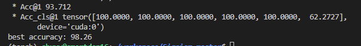

# 实验记录

:date: 2022年2月26日

B007_DE，B007_FE互换标签

- acc：84.86
- 100epoch，32batchsize

- [x] 是否恢复？

R0 :23 99.8

R1:50 98.88

R2:50  93.78

R3:50 84.82


(256x8192 and 512x7)


- PCL
  - conv1 input torch.Size([256, 1, 1800, 1])
  - 动量编码器的大小必须小于等于簇的大小
  - 数据大小必须是动量编码器大小的整数倍
  - val样本的数据必须大于

- sigsiam
  - conv1 

- 0.01
  - 监督对比：96，94
  - $\beta$=0.999 91
    - 0.5 94 
    - 0.3 93.4 
    - 0.1 95.53 
    - 0.7 92.576 
    - 0.8 94.015 
    - 0.01 94.167 
  - 平均 最好
    - 0：90.985，93.79；93.864，96.21*
    - 0.05：94.697，96.29；92.652，94.62*
    - 0.1 ：92.879，95.08；97.652，97.8；93.561，96.89*；94.394，97.05
    - 0.3：95.682，96.52；94.545，95.91*
    - 0.5：94.621，95.91；92.121，96.29*
    - 0.7：94.242，95.76；92.879，94.39*
    - 0.9：95.152，95.45；93.712，95.08*
    - 
    - 0.1:92.727
    - 0.5:93.03
    - 0.7:92.955

- sigsiam + mix=0 1000epoch

  

- sigsiam + mix=0.8 1000epoch

- 

  

- sigsiam + mix=0.8 1500epoch

  - 

    

    

- sigsiam + eg + mix = 0 1000epoch

  

  

- sigsiam +eg + mix=0.8 1000epoch

  


- sigsiam +eg+mix=0.8 + mix v2 1000epoch

  - 

  

- 不用软阈值网络，mixup=0.8，decoder

  ```
  /home/chuxy/workspace/Sigsiam-master/save/class_imbalance_imb_0.01/simsiam/XMU_Motor_signal_models/drsn_simsiam_XMU_Motor_signal_lr_0.05_decay_0.0001_bsz_512_temp_0.8_trial_0_04-04-14-10_alpha_0.8_warm
  ```

  

- 不用软阈值网络，mixup=0.8，不加decoder

  ```
  /home/chuxy/workspace/Sigsiam-master/save/class_imbalance_imb_0.01/SigSiam/XMU_Motor_signal_models/drsn_SigSiam_XMU_Motor_signal_lr_0.05_decay_0.0001_bsz_512_temp_0.8_trial_0_04-04-15-32_alpha_0.8_warm
  ```


- 不用软阈值网络，mixup=0，加decoder

  ```
  save/class_imbalance_imb_0.01/simsiam/XMU_Motor_signal_models/drsn_simsiam_XMU_Motor_signal_lr_0.05_decay_0.0001_bsz_512_temp_0.8_trial_0_04-04-19-17_alpha_0_warm/last.pth
  ```

  

- 不用软阈值网络，mixup=0，不加decoder

  ```
  save/class_imbalance_imb_0.01/SigSiam/XMU_Motor_signal_models/drsn_SigSiam_XMU_Motor_signal_lr_0.05_decay_0.0001_bsz_512_temp_0.8_trial_0_04-04-20-06_alpha_0_warm/last.pth
  ```

  

- 不用软阈值网络，mixup=0，不加decoder，简化网络

  ```
  /home/chuxy/workspace/Sigsiam-master/save/class_imbalance_imb_0.01/SigSiam/XMU_Motor_signal_models/drsn_SigSiam_XMU_Motor_signal_lr_0.05_decay_0.0001_bsz_512_temp_0.8_trial_0_04-04-20-48_alpha_0_warm/last.pth
  ```


- 不用软阈值网络，mixup=0，加decoder，简化网络

  ```
  save/class_imbalance_imb_0.01/simsiam/XMU_Motor_signal_models/drsn_simsiam_XMU_Motor_signal_lr_0.05_decay_0.0001_bsz_512_temp_0.8_trial_0_04-04-21-22_alpha_0_warm/last.pth
  ```

  

- 不用软阈值网络，mixup=0.8，加decoder，简化网络

  ```
  save/class_imbalance_imb_0.01/simsiam/XMU_Motor_signal_models/drsn_simsiam_XMU_Motor_signal_lr_0.05_decay_0.0001_bsz_512_temp_0.8_trial_0_04-04-22-47_alpha_0.8_warm/last.pth
  ```

  

- 不用软阈值网络，mixup=0，加decoder，简化网络, 降采0.4

  ```
  save/class_imbalance_imb_0.01/simsiam/XMU_Motor_signal_models/drsn_simsiam_XMU_Motor_signal_lr_0.05_decay_0.0001_bsz_512_temp_0.8_trial_0_04-05-13-31_alpha_0ds_0.4_warm/last.pth
  ```

  

- 不用软阈值网络，mixup=0，加decoder，简化网络 添加同等映射层

  ```
  save/class_imbalance_imb_0.01/simsiam/XMU_Motor_signal_models/drsn_simsiam_XMU_Motor_signal_lr_0.05_decay_0.0001_bsz_512_temp_0.8_trial_0_04-05-20-47_alpha_0_warm/last.pth
  ```

  

- 不用软阈值网络，mixup=0，加decoder，简化网络 添加同等映射层,decoder 添加同等映射层

```
save/class_imbalance_imb_0.01/simsiam/XMU_Motor_signal_models/drsn_simsiam_XMU_Motor_signal_lr_0.05_decay_0.0001_bsz_512_temp_0.8_trial_0_04-05-22-33_alpha_0_warm/last.pth
```


- 不用软阈值网络，mixup=0，加decoder，简化网络 添加同等映射层,decoder 添加同等映射层，decoder跟同源对比

  ```
  save/class_imbalance_imb_0.01/simsiam/XMU_Motor_signal_models/drsn_simsiam_XMU_Motor_signal_lr_0.05_decay_0.0001_bsz_512_temp_0.8_trial_0_04-05-23-15_alpha_0_warm/last.pth
  ```

  

- 不用软阈值网络，mixup=0，加decoder，完整网络,decoder 添加三层映射层，decoder跟同源对比

  ```
  save/class_imbalance_imb_0.01/simsiam/XMU_Motor_signal_models/drsn_simsiam_XMU_Motor_signal_lr_0.05_decay_0.0001_bsz_512_temp_0.8_trial_0_04-06-00-02_alpha_0_warm/last.pth
  ```

  

- 不用软阈值网络，mixup=0，downsample = 0.4,加decoder，完整网络,decoder 添加三层映射层，decoder跟同源对比

  ```
  save/class_imbalance_imb_0.01/simsiam/XMU_Motor_signal_models/drsn_simsiam_XMU_Motor_signal_lr_0.05_decay_0.0001_bsz_512_temp_0.8_trial_0_04-07-21-54_alpha_0ds_0.4_warm/last.pth
  ```

  

- 不用软阈值网络，mixup=0，downsample = 0.4,加decoder，完整网络,decoder 添加三层映射层，decoder跟同源对比,去除其余增强

  ```
  save/class_imbalance_imb_0.01/simsiam/XMU_Motor_signal_models/drsn_simsiam_XMU_Motor_signal_lr_0.05_decay_0.0001_bsz_512_temp_0.8_trial_0_04-08-00-35_alpha_0ds_0.4_warm/last.pth
  ```

  

- 不用软阈值网络，mixup=0，downsample = 0.6,加decoder，完整网络,decoder 添加三层映射层，decoder跟同源对比,去除其余增强

  ```
  save/class_imbalance_imb_0.01/simsiam/XMU_Motor_signal_models/drsn_simsiam_XMU_Motor_signal_lr_0.05_decay_0.0001_bsz_512_temp_0.8_trial_0_04-08-01-45_alpha_0ds_0.6withoutothers_warm/last.pth
  ```

  

- 不用软阈值网络，mixup=0，downsample = 0.6,加decoder，完整网络,decoder 添加三层映射层，decoder跟同源对比,使用其余增强

  ```
  save/class_imbalance_imb_0.01/simsiam/XMU_Motor_signal_models/drsn_simsiam_XMU_Motor_signal_lr_0.05_decay_0.0001_bsz_512_temp_0.8_trial_0_04-08-01-46_alpha_0ds_0.6withothers_warm/last.pth
  ```

  

- 不用软阈值网络，mixup=0，downsample = 0.5,加decoder，完整网络,decoder 添加三层映射层，decoder跟同源对比,使用其余增强

  ```
  save/class_imbalance_imb_0.01/simsiam/XMU_Motor_signal_models/drsn_simsiam_XMU_Motor_signal_lr_0.05_decay_0.0001_bsz_512_temp_0.8_trial_0_04-08-11-45_alpha_0ds_0.5withothers_warm/last.pth
  ```

  

- 不用软阈值网络，mixup=0，downsample = 0,加decoder，完整网络,decoder-unet 添加三层映射层，decoder跟同源对比,使用其余增强

  ```
  save/class_imbalance_imb_0.01/simsiam/XMU_Motor_signal_models/drsn_simsiam_XMU_Motor_signal_lr_0.05_decay_0.0001_bsz_512_temp_0.8_trial_0_04-08-12-56_alpha_0_warm/last.pth
  ```

  

- 不用软阈值网络，mixup=0，downsample = 0.4, 加decoder unet，完整网络,decoder 添加三层映射层，decoder跟同源对比

  ```
  save/class_imbalance_imb_0.01/simsiam/XMU_Motor_signal_models/drsn_simsiam_XMU_Motor_signal_lr_0.05_decay_0.0001_bsz_512_temp_0.8_trial_0_04-08-13-55_alpha_0ds_0.4withothers_warm/last.pth
  ```

  

- 不用软阈值网络，mixup=0，downsample = 0.6,加decoder，完整网络,decoder 添加三层映射层，decoder跟同源对比,使用其余增强3000轮

  ```
  save/class_imbalance_imb_0.01/simsiam/XMU_Motor_signal_models/drsn_simsiam_XMU_Motor_signal_lr_0.05_decay_0.0001_bsz_512_temp_0.8_trial_0_04-08-17-09_alpha_0ds_0.6withothers_warm/last.pth
  ```

  

- 不用软阈值网络，mixup=0，downsample = 0.6,加decoder，完整网络，去掉梯度停止,decoder 添加三层映射层，decoder跟同源对比,使用其余增强2000轮

  ```
  save/class_imbalance_imb_0.01/SIMCLR/XMU_Motor_signal_models/drsn_simsiam_XMU_Motor_signal_lr_0.05_decay_0.0001_bsz_512_temp_0.8_trial_0_04-14-22-22_alpha_0withdecoder_warm/ckpt_epoch_2000.pth
  ```

  

  

## paper01

- 不用软阈值网络，mixup=0，downsample = 0,加decoder，完整网络，去掉梯度停止、预测层,decoder 添加三层映射层，decoder跟同源对比,使用其余增强1500轮 $\lambda=1$ 没有进行梯度停止
